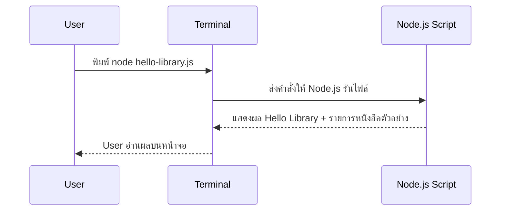

# Day 1: Programming Basics + Hello Library

<p align="center">
  
</p>

เริ่มต้น คอร์ส Non-Degree Node.js + Express.js สำหรับผู้ที่ยังไม่เคยมีพื้นฐานการเขียนโค้ดมาก่อน ลักษณะการเรียนการสอนจะค่อยเป็นค่อยไป อธิบายอย่างชัดเจนทีละขั้น พร้อมมีโค้ช (TA) คอยดูแลและพาลงมือทำ

เมื่อจบบทที่ 1 ผู้เรียนจะได้ไฟล์ `hello-library.js` ซึ่งเป็นโปรแกรมเล็ก ๆ สำหรับทำความรู้จัก Node.js และ ระบบห้องสมุด โดยจะแสดงรายการหนังสือที่เก็บอยู่ในหน่วยความจำ ถือเป็นก้าวแรกของการเริ่มต้นพัฒนาแอปด้วย Node.js

---

## 1. ภาพรวม
- วัน: Day 1
- โฟกัส: Mindset โปรแกรมคืออะไร, Web Request/Response, Terminal, รัน JavaScript ผ่าน Node.js
- Output หลัก: สคริปต์ `hello-library.js`, โครงสร้างโฟลเดอร์ `library-system`, โน้ตใน `README.md`, Git commit แรก
- ทักษะรอง: คำสั่งพื้นฐานใน Terminal, การอ่าน error message, การเพิ่มข้อมูลใน Array, การนับจำนวนรายการ

---

## 2. วัตถุประสงค์การเรียนรู้ (Learning Objectives)
1. อธิบายความหมายของคำว่า “โปรแกรม” ผ่านอุปมาเช่นสูตรทำอาหารได้
2. เข้าใจบทบาท User → Terminal → Node.js → Output ในมุมมอง Request/Response
3. เปิด Terminal, ย้ายโฟลเดอร์, และรันคำสั่งง่าย ๆ เช่น `node file.js`
4. สร้างโฟลเดอร์โปรเจกต์ `library-system` พร้อมไฟล์ `package.json`, `README.md`, `hello-library.js`
5. เขียนโค้ด JavaScript พื้นฐานเพื่อแสดงข้อความ, เก็บข้อมูลใน Array, และใช้ `forEach`
6. ทำ Git commit แรกเพื่อเก็บผลงาน

---

## 3. Concepts สำหรับมือใหม่

### 3.1 โปรแกรมคืออะไร?
- เปรียบเหมือน “สูตรทำอาหาร” ที่เราเขียนเป็นลำดับขั้น
- คอมพิวเตอร์จะทำตามคำสั่งทีละบรรทัด ไม่มีการเดา
- Node.js คือโปรแกรมที่ช่วยให้เราเขียน JavaScript แล้วสั่งให้เครื่องรันในฝั่ง Backend ได้

### 3.2 Web Overview (User → Server → Response)
- User ใช้ Browser หรือ Terminal เพื่อส่งคำขอ (Request)
- Server คือเครื่องที่รัน Node.js เพื่อตอบกลับ (Response)
- ในโครงการ Library Management System เราจะมี User, Backend, Database, และ Frontend สื่อสารกัน
- วันนี้เริ่มจากขั้นที่ง่ายที่สุด: User ใช้ Terminal ขอคำตอบจากสคริปต์ `hello-library.js`

### 3.3 Terminal คืออะไร?
- Terminal คือหน้าต่างพิมพ์คำสั่ง ให้ความรู้สึกเหมือน LINE Chat ระหว่างเรากับคอมพิวเตอร์
- พิมพ์คำสั่ง 1 บรรทัด → กด Enter → ได้ผลลัพธ์ทันที
- คำสั่งพื้นฐาน: `pwd`, `ls`, `mkdir`, `cd`, `node file.js`
- หากเกิด error ให้ค่อย ๆ อ่านข้อความทีละบรรทัด แล้วแก้ตามคำแนะนำ

### 3.4 โครงสร้างไฟล์แรกของ Library System
```
library-system/
├─ README.md          # บันทึกสิ่งที่เรียน + checkpoint
├─ package.json       # ข้อมูลโปรเจกต์ที่ npm สร้างให้
└─ hello-library.js   # สคริปต์หลักของ Day 1
```
- จุดสำคัญคือทุกบทเรียนถัดไปจะต่อยอดจากโฟลเดอร์นี้
- สอนให้นักเรียนจัดระเบียบไฟล์ตั้งแต่วันแรกเพื่อสร้างนิสัยที่ดี

### 3.5 The JavaScript Revolution
- **จุดเริ่มต้น**: ยุคแรก JavaScript มีหน้าที่ทำให้เว็บ “ขยับได้” เช่น เปิด/ปิดเมนู, ตรวจฟอร์มบน Browser เท่านั้น
- **ยุคปัจจุบัน**: Node.js ทำให้ภาษาเดียวกันนี้ย้ายมาวิ่งบน Backend ได้ พอรวมกับ React Native, Electron เราจึงใช้ JavaScript สร้าง Mobile App หรือ Desktop App ได้ด้วย
- **ตัวอย่างสถานการณ์**  
  1. Startup ต้องการสร้างระบบจองห้องสมุด + แอป mobile → ใช้ React ทำหน้าเว็บ, ใช้ Node/Express ทำ API, ใช้ React Native ทำแอปมือถือ ทั้งหมดใช้ JavaScript หมด  
  2. ทีม Data สร้าง Script จัดการไฟล์ CSV ด้วย Node.js แล้วเอาโค้ดบางส่วนไปใช้แสดงผลบน Browser ได้ทันที
- **Ecosystem ใหญ่**: npm มีแพ็กเกจกว่า 2 ล้าน ถัดจาก Day 1 นักเรียนจะได้ลอง `nodemon` (รีรันอัตโนมัติ), `express` (สร้าง API), `mysql2`/`prisma` (คุยกับฐานข้อมูล), `dotenv` (จัดการ environment)
- **เชื่อมกลับโปรเจกต์เรา**: วันนี้แค่ Array + `console.log` แต่ Day 3 จะมี API `/books`, Day 6 เชื่อม Database, Day 8 เชื่อม Frontend ทั้งหมดด้วยภาษาเดียว → นี่แหละคือ “JavaScript Revolution”

### 3.6 Introducing Express
- **Express คืออะไร?** Framework บน Node.js ที่ทำให้การสร้าง Web Server เหมือนต่อบล็อกเลโก้ มี Route, Middleware, Error Handling ให้พร้อม
- **Mini Demo (อ่านเฉย ๆ ยังไม่ต้องพิมพ์)**:
  ```javascript
  import express from "express";
  const app = express();

  // route ที่ส่งรายการหนังสือแบบ hard-coded
  app.get("/books", (req, res) => {
    res.json([
      { id: 1, title: "Clean Code" },
      { id: 2, title: "Node.js in Action" },
    ]);
  });

  app.listen(3000, () => {
    console.log("Library API ready on http://localhost:3000");
  });
  ```
  - เส้นทาง `/books` จะส่ง JSON กลับให้ Browser หรือ Postman ทันที
- **แนวคิดหลัก**  
  - *Routing*: บอกว่า URL ไหนตอบอะไร เช่น `GET /books`, `POST /members`  
  - *Middleware*: ตัวคั่นกลาง เช่น ตรวจ Token, แปลง JSON, log request  
  - *Response*: `res.json()`, `res.send()`, `res.status()` เพื่อสื่อสารผลลัพธ์/ข้อผิดพลาด
- **โยงกับ Day 1**: เราเริ่มจากสคริปต์เดี่ยว ๆ ให้ชินกับ JavaScript ก่อน พอถึง Day 3 เราจะ wrap ความรู้เหล่านี้เข้า Express แล้วได้ API จริงสำหรับระบบห้องสมุด

### 3.7 Server-Side และ Client-Side Applications
- **Server-Side (Backend / หลังบ้าน)**  
  - โค้ดรันบน Server เช่น Node.js ที่อยู่ในเครื่องผู้เรียนหรือบน Cloud  
  - ทำงานหนัก ๆ เช่น ตรวจสอบสิทธิ์, เชื่อม Database, คำนวณค่าปรับ, ป้องกันข้อมูล  
  - ตัวอย่าง: Endpoint `/borrow` รับ memberId + bookId → ตรวจว่ามีเล่มเหลือไหม → บันทึกการยืม → ส่งผลกลับว่าประสบความสำเร็จหรือไม่
- **Client-Side (Frontend / หน้าบ้าน)**  
  - โค้ดรันใน Browser หรือ Mobile App เช่น React, Vue, Expo  
  - เน้น UI/UX แสดงข้อมูลจาก Server และส่ง input จากผู้ใช้  
  - ตัวอย่าง: หน้า “My Books” ดึงข้อมูลจาก `/borrowed` แล้วเรนเดอร์เป็นการ์ดสวย ๆ พร้อมปุ่มคืนหนังสือ
- **Flow เปรียบเทียบ**:
  ```
  1. User คลิกปุ่ม "ยืมหนังสือ" บนหน้าเว็บ (Client)
  2. Browser ส่ง HTTP Request → Server (Express)
  3. Server ตรวจ member status + update Database (Server)
  4. Server ส่ง Response { status: "success", dueDate: "2025-01-10" }
  5. Client แสดง Toast "ยืมสำเร็จ! คืนภายใน 10 ม.ค."
  ```
- **เหตุผลที่ Day 1 เน้น Server**: เริ่มจาก Terminal ช่วยให้เห็นภาพ “คำสั่ง → ผลลัพธ์” ชัดเจน เมื่อไปถึง Day 4–5 ที่มีหน้าเว็บจริง นักเรียนจะเข้าใจทันทีว่าปุ่มบน Client ก็แค่ส่งคำสั่งเดิม ๆ ไปยัง Server ที่เราทำความรู้จักตั้งแต่วันแรก

---

## 4. System & Flow Diagram

### 4.1 API Sequence Diagram


> ยังไม่มีการสื่อสารกับ Browser หรือ Database เน้นให้ผู้เรียนรู้จักวงจร Request → Process → Output ผ่าน Terminal ก่อน

### 4.2 UI Flow Diagram
- วันนี้ยังไม่มี UI บนเว็บไซต์
- ผู้เรียนโต้ตอบกับโปรแกรมผ่าน Terminal เท่านั้น → ช่วยโฟกัสที่ logic และข้อความเอาต์พุต

---

## 5. ตารางเวลา 8 ชั่วโมง (พร้อมกิจกรรม)

| ชั่วโมง | เนื้อหา/กิจกรรม | วิธีการสอน | Output / Checkpoint |
| --- | --- | --- | --- |
| 1 | เปิดค่าย, เป้าหมาย Library System, Buddy Pair | Icebreaker + สไลด์ + Q&A | นักเรียนรู้ชื่อเพื่อน, เข้าใจโครงงานปลายค่าย |
| 2 | Mindset Programmers + สูตรทำอาหาร + Web Overview | เล่าเรื่อง + วาดภาพ Input → Process → Output บนไวท์บอร์ด | นักเรียนอธิบายได้ว่า Request/Response คืออะไร |
| 3 | Terminal Basics + ตรวจ Node.js | Live demo + ให้ทุกคนพิมพ์ตาม → ทีมโค้ชเดินดูทีละคน | ทุกคนเปิด Terminal ได้, รู้ `pwd`, `ls`, `node -v` |
| 4 | ตั้งค่าโฟลเดอร์ `library-system`, `npm init -y`, เปิด VS Code | Code-along + เอกสาร step-by-step | มีโครงสร้างไฟล์ครบ + README เริ่มต้น |
| 5 | Lecture JavaScript Basics: `const/let`, Array, `console.log`, Template Literal | ใช้ตัวอย่างหนังสือ + ใบงานสั้น ๆ | นักเรียนเข้าใจวิธีเก็บ string, number, array |
| 6 | Lab 2: เขียน `hello-library.js`, ทดลองเพิ่มหนังสือ + `forEach` | ให้เวลาลงมือ 45 นาที + โค้ชช่วยแก้ error | เห็นผลลัพธ์ “สวัสดีจาก ...” และรายการหนังสือ |
| 7 | Review โค้ด, เพิ่ม logic นับจำนวนหนังสือ + Tip เรื่อง `books.length` | สาธิตบนจอ + ให้นักเรียนอัปเดตไฟล์ตัวเอง | Output แสดงจำนวนเล่มถูกต้อง, นักเรียนมั่นใจ |
| 8 | Lab 3: Git init + Commit, Recap ทั้งวัน, Preview Day 2 | Live demo + ให้ทุกคนลองเอง + สรุปเป็น bullet | มี commit `feat: hello library`, มีโน้ตสิ่งที่เรียน และรู้ว่า Day 2 จะเจอ function/operator |

> ทุกชั่วโมงมีช่วงพักสั้น ๆ สอดแทรก ให้ผู้เรียนไม่ล้า เช่น พัก 5 นาทีหลังชั่วโมง 2, 4, 6

---

## 6. Hands-on Labs

### Lab 1 — ตั้งค่าโฟลเดอร์ Library System
1. เปิด Terminal
2. พิมพ์ `mkdir library-system && cd library-system`
3. พิมพ์ `npm init -y` (อธิบายว่าไฟล์ `package.json` เก็บข้อมูลโปรเจกต์ เช่น ชื่อ, เวอร์ชัน, สคริปต์)
4. สร้างไฟล์ `README.md` แล้วให้ผู้เรียนจด bullet “สิ่งที่ได้เรียนวันนี้”
5. เปิดโฟลเดอร์ใน VS Code (`code .`)

### Lab 2 — เขียนโค้ด Hello Library (Code-along + ทดลองเพิ่มเอง)
```javascript
// hello-library.js
const libraryName = "Library Management System"; // เก็บชื่อระบบไว้ reuse
const books = [
  "Clean Code",
  "Designing Data-Intensive Applications",
  "Node.js in Action",
]; // รายการหนังสือทดลอง

console.log("สวัสดีจาก", libraryName);
console.log("วันนี้มีหนังสือในระบบ", books.length, "เล่ม");
console.log("รายการหนังสือ:");

books.forEach((book, index) => {
  console.log(index + 1 + ".", book);
});
```
1. รัน `node hello-library.js`
2. ให้ผู้เรียนลองเพิ่มหนังสืออีก 1 รายการแล้วรันใหม่ เพื่อดูผลเปลี่ยนแปลง
3. สอนให้ใส่คอมเมนต์สั้น ๆ บอกหน้าที่ เพื่อสร้างนิสัยการอธิบายโค้ด

### Lab 3 — Git Snapshot แรก
1. ยืนยันว่าทุกไฟล์บันทึกแล้ว พิมพ์ `git init`
2. `git status` → อธิบายสีแดง/เขียว
3. `git add .`
4. `git commit -m "feat: hello library"`
5. บันทึกใน README.md ว่าการ commit คือการ “ถ่ายรูป” งานเก็บไว้ย้อนกลับได้

---

## 7. Project Progression (เชื่อมต่อบทถัดไป)
- มีโฟลเดอร์ `library-system` ที่จะใช้ต่อเนื่องทุกวัน
- ผู้เรียนได้สัมผัส Array, Loop, Console ซึ่งจะถูกใช้ซ้ำใน Day 2 ตอนเริ่มสร้าง logic เพิ่ม
- การมี commit แรกช่วยให้พรุ่งนี้สามารถเปรียบเทียบการเปลี่ยนแปลงได้ง่าย
- ทุกคนเริ่มเห็นภาพว่าระบบห้องสมุดจะเติบโตจากข้อมูลในหน่วยความจำ → เชื่อม Database → มี REST API → มี Frontend

---

## 8. Summary & Next Day Preview
- ทุกคนเข้าใจความหมายของคำว่า “โปรแกรม” และวงจร Request/Response แบบง่าย
- สามารถเปิด Terminal, สร้างโฟลเดอร์, รัน `node hello-library.js`, และแก้ไขไฟล์ใน VS Code ได้
- โค้ด `hello-library.js` แสดงข้อความทักทาย + นับจำนวนหนังสือ + รายการหนังสือเรียบร้อย
- มี Git commit `feat: hello library` และบันทึกสิ่งที่เรียนใน README.md
- **Preview Day 2:** เจาะไวยากรณ์ JavaScript เพิ่ม (Operators, Function, Control Flow) เพื่อเตรียมสร้าง logic จัดการหนังสือและสมาชิกในระบบ Library Management System
