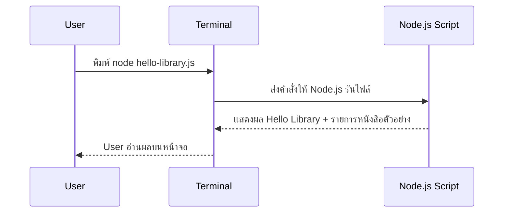

# Day 1: Programming Basics + Hello Library

<p align="center">
  
</p>

เริ่มต้น คอร์ส Non-Degree Node.js + Express.js สำหรับผู้ที่ยังไม่เคยมีพื้นฐานการเขียนโค้ดมาก่อน ลักษณะการเรียนการสอนจะค่อยเป็นค่อยไป อธิบายอย่างชัดเจนทีละขั้น พร้อมมีโค้ช (TA) คอยดูแลและพาลงมือทำ

เมื่อจบบทที่ 1 ผู้เรียนจะได้ไฟล์ `hello-library.js` ซึ่งเป็นโปรแกรมเล็ก ๆ สำหรับทำความรู้จัก Node.js และ ระบบห้องสมุด โดยจะแสดงรายการหนังสือที่เก็บอยู่ในหน่วยความจำ ถือเป็นก้าวแรกของการเริ่มต้นพัฒนาแอปด้วย Node.js

---

## 1. ภาพรวม

- **วันเรียน:** Day 1  
- **โฟกัสหลัก:**  
  - เข้าใจหลักการทำงานของโปรแกรม
  - แนวคิดพื้นฐานของ Web: Request / Response  
  - การใช้งาน Terminal  
  - การรัน JavaScript ด้วย Node.js  

- **Output ที่ต้องได้เมื่อจบวัน:**  
  - สคริปต์ `hello-library.js`  
  - โครงสร้างโฟลเดอร์โปรเจกต์ `library-system`  
  - ไฟล์บันทึกความเข้าใจใน `README.md`  
  - Git commit แรกของชีวิตโปรแกรมเมอร์  

- **ทักษะเสริมที่ได้ฝึก:**  
  - คำสั่งพื้นฐานใน Terminal ที่ใช้จริง  
  - การอ่านและทำความเข้าใจ error message  
  - การเพิ่มข้อมูลลงใน Array  
  - การนับจำนวนรายการข้อมูลแบบง่าย ๆ  

---

## 2. วัตถุประสงค์การเรียนรู้ (Learning Objectives)

1. อธิบายการทำงานของ “โปรแกรม”
2. เข้าใจภาพรวมการทำงานของ **User → Terminal → Node.js → Output** ในมุมมองแบบ Request / Response  
3. ใช้งาน Terminal เบื้องต้นได้ เช่น เปิดใช้งาน ย้ายโฟลเดอร์ และรันคำสั่งง่าย ๆ อย่าง `node file.js`  
4. สร้างโฟลเดอร์โปรเจกต์ `library-system` พร้อมไฟล์พื้นฐาน ได้แก่ `package.json`, `README.md` และ `hello-library.js`  
5. เขียนโค้ด JavaScript พื้นฐานเพื่อ  
   - แสดงข้อความบนหน้าจอ  
   - เก็บข้อมูลใน Array  
   - วนลูปด้วย `forEach`  
6. ทำ Git commit แรกเพื่อบันทึก Repository สำหรับรองรับ Version control


---

## 3. Concepts สำหรับมือใหม่

### 3.1 หลักการทำงานของโปรแกรม
- โปรแกรมคือ “ชุดคำสั่ง” ที่เราบอกคอมพิวเตอร์ให้ทำทีละขั้นเหมือนเราเขียนขั้นตอนการทำอาหาร  
- โครงสร้างคิดแบบง่าย: **Input → Process → Output**  
  - *Input*: สิ่งที่ผู้ใช้หรือไฟล์ส่งเข้ามา เช่น รายชื่อหนังสือ  
  - *Process*: logic ที่เราประมวลผล เช่น นับจำนวนหนังสือ, จัดเรียงชื่อ  
  - *Output*: ผลลัพธ์ที่แสดงให้ผู้ใช้ เช่น ข้อความ “วันนี้มี 3 เล่ม”  
- Node.js ทำหน้าที่อ่านคำสั่งภาษา JavaScript แล้วประมวลผลฝั่ง Backend

### 3.2 Web Overview (User → Server → Response)

  <p align="center">
    
  </p>

- **User / Client**: ตัวอย่างคือ Browser, โทรศัพท์, หรือ Terminal ที่เราจะใช้ใน Day 1 หน้าที่คือส่งคำสั่งไปหา Server เช่น “ขอดูรายการหนังสือใหม่”  
- **Request**: ข้อมูลที่ Client ส่งไปบนช่องทาง HTTP เช่น `GET /books` หรือ `POST /borrow` ซึ่งอาจบรรจุข้อมูล (body) เพิ่มด้วย  
- **Server**: เครื่องที่รัน Node.js + Express มี logic ตรวจสอบสิทธิ์ คุยกับ Database และสร้างคำตอบ  
- **Response**: ผลลัพธ์ที่ Server ส่งกลับ เช่น JSON รายชื่อหนังสือหรือข้อความแจ้งสถานะ  
- **Database**: ฐานข้อมูล กล่องเก็บข้อมูลจริง (เราจะเริ่มเชื่อมในช่วง Day 6) แต่ Day 1 ยังใช้ Array จำลองแทน  
- **Flow ง่าย ๆ ในโปรเจกต์เรา**  
  1. ผู้ใช้ (User) เปิด Terminal แล้วพิมพ์ `node hello-library.js`  
  2. Terminal ส่งคำสั่งไปให้ Node.js ทำงาน  
  3. Node.js ใช้ข้อมูลจาก Array รายชื่อหนังสือ → ประมวลผล → สร้างข้อความ  
  4. Node.js ส่งข้อความกลับมาที่ Terminal  
  5. ผู้ใช้อ่านผลลัพธ์บนหน้าจอ  
- เมื่อเข้าใจ flow นี้แล้ว พอถึง Day 3–4 เราจะแค่เปลี่ยน Client เป็น Browser และแยก Server เป็น Express API ที่ตอบกับ Frontend ได้เหมือนกัน

### 3.3 Terminal คืออะไร?
- Terminal คือหน้าต่างพิมพ์คำสั่ง ให้ความรู้สึกเหมือน LINE Chat ระหว่างเรากับคอมพิวเตอร์
- พิมพ์คำสั่ง 1 บรรทัด → กด Enter → ได้ผลลัพธ์ทันที
- คำสั่งพื้นฐาน: `pwd`, `ls`, `mkdir`, `cd`, `node file.js`
- หากเกิด error ให้ค่อย ๆ อ่านข้อความทีละบรรทัด แล้วแก้ตามคำแนะนำ

### 3.4 โครงสร้างไฟล์แรกของ Library System
```
library-system/
├─ README.md          # บันทึกสิ่งที่เรียน + checkpoint
├─ package.json       # ข้อมูลโปรเจกต์ที่ npm สร้างให้
└─ hello-library.js   # สคริปต์หลักของ Day 1
```
- จุดสำคัญคือทุกบทเรียนถัดไปจะต่อยอดจากโฟลเดอร์นี้
- สอนให้นักเรียนจัดระเบียบไฟล์ตั้งแต่วันแรกเพื่อสร้างนิสัยที่ดี

### 3.5 The JavaScript Revolution
- **จุดเริ่มต้น**: ยุคแรก JavaScript มีหน้าที่ทำให้เว็บ “ขยับได้” เช่น เปิด/ปิดเมนู, ตรวจฟอร์มบน Browser เท่านั้น
- **ยุคปัจจุบัน**: Node.js ทำให้ภาษาเดียวกันนี้ย้ายมาวิ่งบน Backend ได้ พอรวมกับ React Native, Electron เราจึงใช้ JavaScript สร้าง Mobile App หรือ Desktop App ได้ด้วย
- **เพื่อให้เห็นภาพชัดเจนยิ่งขึ้น**  
  สมมติว่าเราต้องการสร้างระบบห้องสมุดดิจิทัล เราสามารถใช้ JavaScript ในการพัฒนาส่วนประกอบทั้งหมดของระบบได้เลย:
  1.  **Web Application (Frontend):** พัฒนาด้วย React เพื่อให้ผู้ใช้มีประสบการณ์การใช้งานที่ดี
  2.  **Backend API:** พัฒนาด้วย Node.js และ Express เพื่อเป็นแกนกลางของระบบ
  3.  **Mobile Application:** พัฒนาด้วย React Native เพื่อให้ใช้งานบนมือถือได้
  จะเห็นว่าเราสามารถใช้ภาษาเดียวในการพัฒนาระบบที่ครอบคลุมได้ทั้งหมดครับ
- **Ecosystem ใหญ่**: npm มีแพ็กเกจกว่า 2 ล้าน ถัดจาก Day 1 นักเรียนจะได้ลอง `nodemon` (รีรันอัตโนมัติ), `express` (สร้าง API), `mysql2`/`prisma` (คุยกับฐานข้อมูล), `dotenv` (จัดการ environment)
- **เชื่อมกลับโปรเจกต์เรา**: วันนี้แค่ Array + `console.log` แต่ Day 3 จะมี API `/books`, Day 6 เชื่อม Database, Day 8 เชื่อม Frontend ทั้งหมดด้วยภาษาเดียว → นี่แหละคือ “JavaScript Revolution”

### 3.6 Introducing Express
- **Express คืออะไร?** Framework บน Node.js ที่ทำให้การสร้าง Web Server เหมือนต่อบล็อกเลโก้ มี Route, Middleware, Error Handling ให้พร้อม
- **Example**:
  ```javascript
  import express from "express";
  const app = express();

  // return list of books
  app.get("/books", (req, res) => {
    res.json([
      { id: 1, title: "Clean Code" },
      { id: 2, title: "Node.js in Action" },
    ]);
  });

  app.listen(3000, () => {
    console.log("Library API ready on http://localhost:3000");
  });
  ```
  - เส้นทาง `/books` จะส่ง JSON กลับให้ Browser หรือ Postman ทันที
- **แนวคิดหลัก**  
  - *Routing*: บอกว่า URL ไหนตอบอะไร เช่น `GET /books`, `POST /members`  
  - *Middleware*: ตัวคั่นกลาง เช่น ตรวจ Token, แปลง JSON, log request  
  - *Response*: `res.json()`, `res.send()`, `res.status()` เพื่อสื่อสารผลลัพธ์/ข้อผิดพลาด
- **สรุป** 

  <p align="center">
    
  </p>

  - **เรียบง่ายและทรงพลัง (Minimal)**  
    หัวใจของ Express คือความเรียบง่ายครับ โค้ดเริ่มต้นมีเพียงไม่กี่บรรทัดและไม่มีฟีเจอร์ที่ซับซ้อนติดตั้งมาล่วงหน้า ทำให้ผู้เริ่มต้นอย่างเราสามารถเข้าใจภาพรวมและควบคุมการทำงานได้ง่าย

  - **ยืดหยุ่นสูง (Flexible)**  
    ความยืดหยุ่นคือจุดเด่นสำคัญ Express ถูกออกแบบมาเพื่อจัดการ Request และ Response เป็นหลัก ดังนั้นเราจึงสามารถนำไปใช้สร้าง API ให้กับแอปพลิเคชันได้หลากหลายรูปแบบ ไม่ว่าจะเป็น Web Frontend, แอปพลิเคชันบนมือถือ หรือแม้กระทั่งให้ระบบอื่น ๆ เชื่อมต่อเข้ามา

  <p align="center">
    
  </p>

  - **เฟรมเวิร์กสำหรับฝั่ง Server (Backend Framework)**  
    ในยุคที่ Web Application นิยมใช้ Frontend Framework อย่าง React, เราจำเป็นต้องมี API ที่ทำหน้าที่เป็น 'หลังบ้าน' เพื่อจัดการข้อมูลและ Logic ต่างๆ ซึ่ง Express ก็คือเครื่องมือที่ได้รับความนิยมอย่างสูงในการสร้าง API ส่วนนี้ครับ

  - **ประสิทธิภาพและความเป็นอิสระ (Fast & Unopinionated)**  
    เรื่องประสิทธิภาพ Express ได้รับการยอมรับและใช้งานในองค์กรชั้นนำมากมาย นอกจากนี้การที่มันเป็นแบบ Unopinionated ยังให้อิสระกับนักพัฒนาในการเลือกใช้เครื่องมือเสริม (Middleware) ที่เหมาะสมกับโปรเจกต์ได้เอง โดยไม่มีการบังคับโครงสร้างที่ตายตัว

### 3.7 Server-Side และ Client-Side Applications
- **ทำไมต้องแยกสองฝั่ง?**  
  - **เพื่อแบ่งขอบเขตความรับผิดชอบ (Separation of Concerns):** การแยกส่วนกันช่วยให้ทีม Frontend สามารถมุ่งเน้นการพัฒนาประสบการณ์ผู้ใช้ (UX/UI) ได้เต็มที่ ในขณะที่ทีม Backend ก็จะดูแลเรื่องความปลอดภัย, การจัดการข้อมูล และ Business Logic ที่ซับซ้อนครับ
  - **เพิ่มความสะดวกในการพัฒนาและดูแลรักษา:** เมื่อแบ่งส่วนกันชัดเจน ทีมสามารถทำงานขนานกันไปได้ และการปรับปรุงแก้ไขในฝั่งหนึ่ง จะไม่ส่งผลกระทบที่รุนแรงต่ออีกฝั่งหนึ่ง ทำให้การดูแลรักษาระบบในระยะยาวทำได้ง่ายขึ้น
  - **รองรับการขยายระบบในอนาคต:** เมื่อเรามี API ที่เป็นระเบียบแล้ว การจะเพิ่มช่องทางใหม่ๆ เช่น สร้างแอปพลิเคชันบนมือถือ ก็สามารถเชื่อมต่อกับ API เดิมของ Server ได้ทันที

- **Server-Side (Backend / หลังบ้าน)**  
  - **หน้าที่หลัก**: รับ Request, ตรวจสอบข้อมูล, ติดต่อ Database, ประมวลผล, ส่ง Response  
  - **ตัวอย่างงานใน Library System**  
    - `POST /members` → ตรวจว่ามีข้อมูลซ้ำไหม แล้วบันทึกสมาชิกใหม่  
    - `POST /borrow` → ตรวจว่าหนังสือเล่มนั้นว่างและสมาชิกไม่มีค่าปรับ ก่อนบันทึก Transaction  
    - `GET /dashboard` → รวมสถิติ เช่น จำนวนหนังสือคงเหลือ, จำนวนสมาชิกที่ยืมอยู่  
  - **เทคโนโลยีที่ใช้**: Node.js + Express, ORM เช่น Prisma, และฐานข้อมูล MySQL/PostgreSQL ผ่าน Docker  
  - **ความรับผิดชอบเพิ่มเติม**: Logging request, ป้องกัน SQL Injection, สร้าง error message ให้เข้าใจง่าย

- **Client-Side (Frontend / หน้าบ้าน)**  
  - **หน้าที่หลัก**: แสดงข้อมูลสวยงาม, รับ input จากผู้ใช้, ส่ง Request กลับไปยัง Server  
  - **ตัวอย่างงานใน Library System**  
    - หน้าเว็บ “Book List” ใช้ Fetch API ขอข้อมูลจาก `/books` แล้วทำเป็นตาราง/การ์ด  
    - หน้าฟอร์ม “Borrow Book” ส่ง `POST /borrow` พร้อมข้อมูลสมาชิกและหนังสือ  
    - Notification หรือ Toast แจ้งผู้ใช้เมื่อยืมสำเร็จหรือเกิด error  
  - **เทคโนโลยีที่ใช้ในคอร์สนี้**: เริ่มจาก HTML/EJS, CSS นิด ๆ, และ JavaScript ฝั่ง Browser เพื่อเรียก API

  <p align="center">
    
  </p>

- **Flow เปรียบเทียบ (ยืมหนังสือ 1 ครั้ง)**:
  ```
  1. User เปิดหน้า My Books (Client) → เห็นปุ่ม "ยืมเล่มนี้"
  2. เมื่อคลิกปุ่ม Browser ส่ง HTTP POST ไปยัง /borrow พร้อมข้อมูล { memberId, bookId } (Request)
  3. Server (Express) รับข้อมูล → ตรวจสอบเงื่อนไข → บันทึกลง Database (Process)
  4. Server ตอบกลับ { status: "success", dueDate: "2025-01-10" } (Response)
  5. Client รับ Response → แสดง Toast "ยืมสำเร็จ! คืนภายใน 10 ม.ค." และอัปเดต UI (Output)
  ```
  > หากเงื่อนไขไม่ผ่าน (เช่น หนังสือถูกยืมแล้ว) Server ก็จะส่งข้อความ error กลับมา ให้ Client แจ้งผู้ใช้ต่อ

- **ตัวอย่างอื่น ๆ ที่เห็นได้ทุกวัน**  
  - สั่งอาหารผ่านแอป → Client คือแอปบนโทรศัพท์, Server คือระบบร้านอาหารที่ตรวจคำสั่งและยิงไปยังครัว  
  - โอนเงินผ่าน Mobile Banking → Client คือแอปธนาคาร, Server ทำหน้าที่เช็กยอดเงินและบันทึกประวัติ  
  - Live score ฟุตบอล → Client คือเว็บ/แอปที่เราเปิดดู, Server ดึงข้อมูลจากระบบสถิติสดแล้วส่งให้ทุกคนพร้อมกัน

---

## 4. ปูพื้นฐาน JavaScript ให้แน่นก่อนลุย (JavaScript Fundamentals)

ก่อนที่เราจะดำดิ่งลงไปในส่วนของแล็บ เรามาสร้างรากฐาน JavaScript ให้แข็งแกร่งกันก่อนครับ ลองนึกภาพว่าสิ่งเหล่านี้คือไวยากรณ์และคำศัพท์ที่จำเป็นต้องรู้ ก่อนที่เราจะเริ่มเขียนเรื่องราวหรือบทกวีชิ้นแรกของเรา

### 4.1 ตัวแปร (Variables): กล่องเก็บข้อมูลของโปรแกรม

ในการเขียนโปรแกรม เราต้องการพื้นที่สำหรับจัดเก็บและจัดการข้อมูล "ตัวแปร" ก็คือกล่องเก็บของสารพัดประโยชน์ของเรานั่นเอง ใน JavaScript ยุคใหม่ เรามีวิธีสร้างกล่องหลัก ๆ 2 แบบคือ `const` และ `let` (ส่วน `var` เป็นวิธีเก่าที่ไม่ค่อยนิยมแล้ว)

-   **`const` (Constant - ค่าคงที่):** ใช้สำหรับเก็บข้อมูลที่เรารู้ว่าจะ **ไม่เปลี่ยนแปลงค่า** ตลอดการทำงานของโปรแกรม เหมือนกล่องที่เมื่อปิดผนึกแล้ว จะไม่เปลี่ยนของข้างในอีก
    ```javascript
    // สร้างกล่องเก็บชื่อห้องสมุด ซึ่งจะไม่เปลี่ยน
    const libraryName = "My Awesome Library";
    
    // libraryName = "Another Library"; // หากลองทำแบบนี้ โปรแกรมจะ error ทันที!
    ```

-   **`let` (Let it change -ปล่อยให้เปลี่ยนได้):** ใช้สำหรับข้อมูลที่ **อาจมีการเปลี่ยนแปลงค่า** ในภายหลังได้ เช่น จำนวนผู้เข้าชม, คะแนน, หรือสถานะต่างๆ
    ```javascript
    // สร้างกล่องเก็บจำนวนผู้เข้าชม ซึ่งอาจเพิ่มขึ้น
    let visitorCount = 10;
    
    visitorCount = 11; // สามารถเปลี่ยนค่าได้ ไม่มีปัญหา
    console.log("ตอนนี้มีผู้เข้าชม", visitorCount, "คน"); // แสดงผล 11
    ```
> **เกร็ดความรู้:** ในการเขียนโค้ดที่ดี เราควรเริ่มต้นด้วย `const` เสมอ และจะเปลี่ยนไปใช้ `let` ก็ต่อเมื่อเรามั่นใจจริง ๆ ว่าค่าในกล่องนั้นจำเป็นต้องถูกเปลี่ยนในอนาคต

### 4.2 ประเภทข้อมูล (Data Types): ของในกล่องมีอะไรได้บ้าง?

ตัวแปรแต่ละตัวจะเก็บข้อมูลได้หลากหลายประเภท มาดูกันว่าประเภทข้อมูลพื้นฐานที่เราจะเจอบ่อย ๆ มีอะไรบ้าง

-   **String (ข้อความ):** ข้อมูลที่เป็นตัวอักษรหรือข้อความ จะต้องอยู่ภายใต้เครื่องหมายคำพูดเสมอ (`"..."`, `'...'`, หรือ `` `...` ``)
    ```javascript
    const message = "สวัสดีชาวโลก!";
    const bookTitle = 'Clean Code';
    ```

-   **Number (ตัวเลข):** ตัวเลขทุกชนิด ไม่ว่าจะเป็นจำนวนเต็มหรือทศนิยม
    ```javascript
    const bookCount = 25;
    const price = 199.99;
    ```

-   **Boolean (ค่าความจริง):** มีค่าได้แค่ 2 อย่างคือ `true` (จริง) หรือ `false` (เท็จ) มีประโยชน์อย่างมหาศาลในการสร้างเงื่อนไขเพื่อตัดสินใจ
    ```javascript
    const isLibraryOpen = true;
    const isBookOverdue = false;
    ```

-   **Array (รายการ):** ใช้เก็บข้อมูลหลายๆ ชิ้นเรียงต่อกันเป็นรายการ อยู่ในเครื่องหมาย `[`...`]`.
    ```javascript
    const bookCategories = ["Programming", "Science Fiction", "History"];
    console.log(bookCategories[0]); // "Programming" (การนับลำดับใน Array เริ่มจาก 0)
    ```

-   **Object (วัตถุ):** ใช้เก็บข้อมูลที่ซับซ้อนขึ้น โดยจัดกลุ่มข้อมูลที่เกี่ยวข้องกันเป็นคู่ `key: value` อยู่ในเครื่องหมาย `{`...`}`.
    ```javascript
    const bookDetails = {
      title: "Clean Code",
      author: "Robert C. Martin",
      pages: 464,
      isAvailable: true
    };
    
    console.log(bookDetails.title); // "Clean Code"
    console.log(bookDetails.author); // "Robert C. Martin"
    ```

### 4.3 เครื่องหมายและการดำเนินการ (Operators): สั่งให้โปรแกรมทำงาน

Operators คือสัญลักษณ์ที่ใช้ในการทำบางสิ่งบางอย่างกับตัวแปรของเรา เช่น การคำนวณ หรือการเปรียบเทียบ

-   **เครื่องหมายทางคณิตศาสตร์ (Arithmetic):** `+` (บวก), `-` (ลบ), `*` (คูณ), `/` (หาร)
    ```javascript
    let totalBooks = 10 + 5; // ได้ 15
    let remainingBooks = 20 - 8; // ได้ 12
    ```

-   **เครื่องหมายเปรียบเทียบ (Comparison):** `===` (เท่ากันเป๊ะๆ), `!==` (ไม่เท่ากันเป๊ะๆ), `>` (มากกว่า), `<` (น้อยกว่า) ผลลัพธ์จากการเปรียบเทียบจะเป็น `Boolean` (`true` หรือ `false`) เสมอ
    ```javascript
    console.log(10 === 10);      // true
    console.log("apple" === "orange"); // false
    console.log(20 > 15);        // true
    ```
    > **เคล็ดลับโปร:** พยายามใช้ `===` (สามเท่า) แทน `==` (สองเท่า) เสมอ เพราะ `===` จะตรวจสอบทั้ง "ค่า" และ "ประเภทข้อมูล" ซึ่งช่วยป้องกันข้อผิดพลาดที่คาดไม่ถึงได้

-   **เครื่องหมายทางตรรกะ (Logical):** `&&` (และ), `||` (หรือ), `!` (ไม่) ใช้สำหรับรวมเงื่อนไข Boolean เข้าด้วยกัน
    ```javascript
    const hasFines = false; // ไม่มีค่าปรับ
    const isMember = true;  // เป็นสมาชิก
    
    // จะยืมหนังสือได้ ก็ต่อเมื่อ เป็นสมาชิก "และ" ไม่มีค่าปรับ
    const canBorrow = isMember && !hasFines; // true && !false  ->  true && true  ->  true
    console.log("สามารถยืมได้:", canBorrow);
    ```

### 4.4 ฟังก์ชัน (Functions): สูตรอาหารที่ใช้ซ้ำได้

ฟังก์ชันคือ "ชุดคำสั่ง" ที่เราตั้งชื่อให้มัน และสามารถเรียกใช้งานซ้ำที่ไหนก็ได้เมื่อต้องการ ช่วยให้เราไม่ต้องเขียนโค้ดเดิม ๆ ซ้ำไปซ้ำมา และทำให้โค้ดอ่านง่ายขึ้นมาก

```javascript
// สร้างฟังก์ชันสำหรับทักทาย
// "name" คือ "parameter" หรือข้อมูลที่เราจะส่งเข้าไปในฟังก์ชัน
function greet(name) {
  console.log("สวัสดี, คุณ " + name + "!");
}

// เรียกใช้งานฟังก์ชัน (Calling the function)
greet("สมชาย"); // พิมพ์ "สวัสดี, คุณ สมชาย!"
greet("สมศรี"); // พิมพ์ "สวัสดี, คุณ สมศรี!"
```

### 4.5 ฟังก์ชันลูกศร (Arrow Functions): สูตรอาหารฉบับย่อ

ใน JavaScript สมัยใหม่ มีวิธีเขียนฟังก์ชันที่สั้นและกระชับกว่าเดิม เรียกว่า "ฟังก์ชันลูกศร" (Arrow Function) ซึ่งได้รับความนิยมอย่างสูง เพราะช่วยให้โค้ดดูสะอาดตาและอ่านง่ายขึ้น

ลองเปรียบเทียบฟังก์ชัน `greet` แบบเดิมกับแบบ Arrow Function กันครับ

```javascript
// ฟังก์ชันแบบดั้งเดิม (Traditional Function)
function greet(name) {
  return "สวัสดี, คุณ " + name;
}

// แปลงร่างเป็น Arrow Function
const greetArrow = (name) => {
  return "สวัสดี, คุณ " + name;
};

// และถ้าในฟังก์ชันมีแค่คำสั่ง return อย่างเดียว เราสามารถย่อได้อีก!
const greetShort = (name) => "สวัสดี, คุณ " + name;

// ผลลัพธ์เหมือนกันทุกประการ
console.log(greet("สมปอง"));      // "สวัสดี, คุณ สมปอง"
console.log(greetArrow("สมปอง")); // "สวัสดี, คุณ สมปอง"
console.log(greetShort("สมปอง"));  // "สวัสดี, คุณ สมปอง"
```

> **ข้อดี:** นอกจากจะสั้นลงแล้ว Arrow Function ยังมีประโยชน์ในเรื่องการจัดการ `this` ซึ่งเป็นคอนเซ็ปต์ที่ซับซ้อนขึ้นไปอีกขั้น แต่ในเบื้องต้น ให้เราจำไว้ว่ามันคือวิธีเขียนฟังก์ชันสุดเท่ที่โปรแกรมเมอร์รุ่นใหม่นิยมใช้กันครับ

### 4.6 Array Methods: map, filter, reduce (ตัวช่วยจัดการข้อมูลใน Array)

JavaScript มีฟังก์ชันที่มีประโยชน์ในตัว (built-in functions) หลายตัวสำหรับจัดการข้อมูลใน Array โดยเฉพาะ 3 ตัวนี้ `map`, `filter`, และ `reduce` เป็นเครื่องมือที่ทรงพลังและใช้บ่อยมาก ช่วยให้เราเขียนโค้ดได้กระชับและอ่านง่ายขึ้น

#### 4.6.1 `map()`: แปลงร่างทุกไอเท็มใน Array

`map()` ใช้สำหรับ "แปลง" หรือ "เปลี่ยนรูปแบบ" ข้อมูลทุกชิ้นใน Array เดิม ให้กลายเป็น Array ใหม่ โดยที่ Array เดิมไม่ถูกเปลี่ยนแปลง

```javascript
const books = [
  "Clean Code",
  "Designing Data-Intensive Applications",
  "Node.js in Action",
];

// สมมติเราอยากได้ Array ใหม่ที่เป็นชื่อหนังสือพร้อมคำว่า "ยอดเยี่ยม!" ต่อท้าย
const awesomeBooks = books.map((book) => {
  return book + " ยอดเยี่ยม!";
});

console.log(awesomeBooks);
// ผลลัพธ์: ["Clean Code ยอดเยี่ยม!", "Designing Data-Intensive Applications ยอดเยี่ยม!", "Node.js in Action ยอดเยี่ยม!"]

console.log(books); // Array เดิมยังคงอยู่: ["Clean Code", "Designing Data-Intensive Applications", "Node.js in Action"]
```

#### 4.6.2 `filter()`: คัดกรองไอเท็มที่ต้องการ

`filter()` ใช้สำหรับ "คัดกรอง" หรือ "เลือก" เฉพาะไอเท็มใน Array ที่ตรงตามเงื่อนไขที่เรากำหนด แล้วสร้างเป็น Array ใหม่ขึ้นมา

```javascript
const libraryBooks = [
  { id: 1, title: "Clean Code", available: true },
  { id: 2, title: "Node.js for Dummies", available: false },
  { id: 3, title: "The Pragmatic Programmer", available: true },
];

// ต้องการเฉพาะหนังสือที่ "พร้อมให้ยืม" (available: true)
const availableBooks = libraryBooks.filter((book) => {
  return book.available === true;
});

console.log(availableBooks);
// ผลลัพธ์: [{ id: 1, title: "Clean Code", available: true }, { id: 3, title: "The Pragmatic Programmer", available: true }]
```

#### 4.6.3 `reduce()`: ย่อรวม Array ให้เป็นค่าเดียว

`reduce()` เป็นฟังก์ชันที่ทรงพลังที่สุดในสามตัวนี้ ใช้สำหรับ "ย่อรวม" หรือ "สรุป" ค่าทั้งหมดใน Array ให้เหลือเพียงค่าเดียว ไม่ว่าจะเป็นผลรวม, ค่าเฉลี่ย, หรือ Object ใหม่

```javascript
const bookPrices = [150, 200, 120, 300];

// ต้องการหา "ผลรวม" ของราคาหนังสือทั้งหมด
const totalPrice = bookPrices.reduce((accumulator, currentPrice) => {
  return accumulator + currentPrice;
}, 0); // 0 คือค่าเริ่มต้นของ accumulator

console.log(totalPrice); // ผลลัพธ์: 770
```
-   `accumulator`: คือค่าสะสมที่ได้จากการดำเนินการในรอบก่อนหน้า (ในรอบแรกคือค่าเริ่มต้นที่เรากำหนดให้, ในที่นี้คือ `0`)
-   `currentPrice`: คือไอเท็มปัจจุบันใน Array ที่กำลังถูกประมวลผล

`map`, `filter`, และ `reduce` เป็นแนวคิดที่สำคัญมากในการเขียน JavaScript สมัยใหม่ (Functional Programming) การทำความเข้าใจและฝึกใช้บ่อยๆ จะช่วยให้คุณเขียนโค้ดที่สะอาด มีประสิทธิภาพ และจัดการข้อมูลได้ดียิ่งขึ้นครับ

### 4.7 การวนซ้ำ (Loops): สั่งให้ทำงานเดิมๆ ไม่รู้เบื่อ

Loop คือเครื่องมือที่ทรงพลังที่สุดอย่างหนึ่งในการเขียนโปรแกรม มันช่วยให้เราสั่งคอมพิวเตอร์ให้ทำงานบางอย่างซ้ำๆ ตามจำนวนรอบหรือเงื่อนไขที่เรากำหนด โดยไม่ต้องเขียนโค้ดเดิมซ้ำๆ เอง

`for` loop คือ Loop แบบคลาสสิกที่ใช้กันอย่างแพร่หลายที่สุด มีโครงสร้างที่ชัดเจน 3 ส่วน

```javascript
// โครงสร้าง: for ( [จุดเริ่มต้น]; [เงื่อนไขให้ทำต่อ]; [สิ่งที่ทำเมื่อจบรอบ] )

for (let i = 1; i <= 5; i++) {
  console.log("นี่คือรอบที่ " + i);
}
// ผลลัพธ์:
// นี่คือรอบที่ 1
// นี่คือรอบที่ 2
// นี่คือรอบที่ 3
// นี่คือรอบที่ 4
// นี่คือรอบที่ 5
```

เราสามารถใช้ `for` loop เพื่อวนอ่านค่าจาก Array ได้เช่นกัน:

```javascript
const bookCategories = ["Programming", "Science Fiction", "History"];

for (let i = 0; i < bookCategories.length; i++) {
  // i คือ index ที่เริ่มจาก 0
  // bookCategories[i] คือการเข้าถึงข้อมูลใน Array ณ ตำแหน่งนั้น
  console.log("หมวดหมู่: " + bookCategories[i]);
}
// ผลลัพธ์:
// หมวดหมู่: Programming
// หมวดหมู่: Science Fiction
// หมวดหมู่: History
```
นอกจาก `for` แล้ว ยังมี Loop แบบอื่นๆ เช่น `while` หรือ `forEach` (ที่เราได้เห็นในตัวอย่าง Lab) ซึ่งแต่ละแบบก็มีสไตล์การใช้งานที่เหมาะกับสถานการณ์ต่างกันไปครับ

### 4.8 เงื่อนไข (Conditional Logic): การตัดสินใจของโปรแกรม

บ่อยครั้งที่โปรแกรมต้องตัดสินใจว่าจะทำอะไรต่อไปตามสถานการณ์ที่แตกต่างกัน เราใช้ `if...else` เพื่อสร้างเงื่อนไขเหล่านี้

```javascript
const hour = 14;

if (hour < 12) {
  console.log("สวัสดีตอนเช้า!");
} else if (hour < 18) {
  console.log("สวัสดีตอนบ่าย!");
} else {
  console.log("สวัสดีตอนเย็น!");
}
// ผลลัพธ์: "สวัสดีตอนบ่าย!" เพราะ 14 น้อยกว่า 18
```

เมื่อเรามีพื้นฐานเหล่านี้แล้ว การอ่านและเขียนโค้ดในแล็บถัดไปจะกลายเป็นเรื่องที่ง่ายและสนุกขึ้นเยอะเลยครับ!

---

## 5. System & Flow Diagram

### 5.1 API Sequence Diagram


> ยังไม่มีการสื่อสารกับ Browser หรือ Database เน้นให้ผู้เรียนรู้จักวงจร Request → Process → Output ผ่าน Terminal ก่อน

### 5.2 UI Flow Diagram
- วันนี้ยังไม่มี UI บนเว็บไซต์
- ผู้เรียนโต้ตอบกับโปรแกรมผ่าน Terminal เท่านั้น → ช่วยโฟกัสที่ logic และข้อความเอาต์พุต

---


## 6. Hands-on Labs

### Lab 1 — ตั้งค่าโฟลเดอร์ Library System
1. เปิด Terminal
2. พิมพ์ `mkdir library-system && cd library-system`
3. พิมพ์ `npm init -y` (อธิบายว่าไฟล์ `package.json` เก็บข้อมูลโปรเจกต์ เช่น ชื่อ, เวอร์ชัน, สคริปต์)
4. สร้างไฟล์ `README.md` แล้วให้ผู้เรียนจด bullet “สิ่งที่ได้เรียนวันนี้”
5. เปิดโฟลเดอร์ใน VS Code (`code .`)

### Lab 2 — เขียนโค้ด Hello Library (Code-along + ทดลองเพิ่มเอง)

ได้เวลาเขียนโค้ด JavaScript แรกกันแล้ว! เปิดไฟล์ `hello-library.js` ใน VS Code แล้วพิมพ์โค้ดต่อไปนี้ตามได้เลยครับ เราจะมาทำความเข้าใจความหมายของแต่ละส่วนไปพร้อม ๆ กัน

```javascript
// hello-library.js

// --- 1. การประกาศตัวแปรและเก็บข้อมูล ---

// ใช้ const เพื่อสร้าง "กล่อง" เก็บข้อมูลที่ค่าจะไม่เปลี่ยน
// libraryName คือชื่อกล่อง ในที่นี้เก็บข้อความ (String)
const libraryName = "My Awesome Library";

// books คือกล่องที่เก็บ "รายการ" ของข้อมูล (Array)
// ในที่นี้คือรายการชื่อหนังสือ
const books = [
  "Clean Code",
  "Designing Data-Intensive Applications",
  "Node.js in Action",
  "The Pragmatic Programmer",
];

// --- 2. การแสดงผลลัพธ์ออกทางหน้าจอ ---

// console.log() คือคำสั่ง "พิมพ์" ข้อความออกไปที่ Terminal
// เราสามารถส่งข้อมูลไปได้หลายชิ้น โดยคั่นด้วยลูกน้ำ (,)
console.log("สวัสดีจาก", libraryName);

// .length คือการ "นับจำนวน" ไอเท็มใน Array
// books.length จะได้ผลลัพธ์เป็น 4
console.log("วันนี้มีหนังสือในระบบ", books.length, "เล่ม");
console.log("--- รายการหนังสือทั้งหมด ---");

// --- 3. การวนลูปเพื่อแสดงผลทุกรายการ ---

// .forEach() คือคำสั่ง "ทำซ้ำกับทุกไอเท็ม" ใน Array
// มันจะหยิบหนังสือมาทีละเล่ม (book) พร้อมกับลำดับของมัน (index)
books.forEach((book, index) => {
  // index เริ่มจาก 0 เราจึง +1 เพื่อให้คนอ่านเข้าใจง่าย (เริ่มนับจาก 1)
  // จากนั้นนำมาต่อกัน (Concatenate) เพื่อสร้างข้อความที่สมบูรณ์
  console.log(index + 1 + ". " + book);
});
```

#### ทำความเข้าใจโค้ดทีละส่วน

<details>
<summary>1. ตัวแปรและประเภทข้อมูล (Variables & Data Types)</summary>

-   **`const`**: คำสั่งสำหรับสร้าง "ตัวแปร" หรือ "กล่องเก็บข้อมูล" แบบค่าคงที่ (Constant) หมายความว่าเมื่อเรากำหนดค่าให้มันครั้งแรกแล้ว จะไม่สามารถเปลี่ยนค่าได้อีก เหมาะสำหรับข้อมูลที่เราไม่ต้องการให้เปลี่ยน เช่น ชื่อระบบ, ค่า pi (3.14)
-   **`libraryName`**: นี่คือ "ชื่อ" ของตัวแปรที่เราตั้งขึ้นเอง เพื่อให้เราจำได้ว่ามันเก็บข้อมูลอะไร
-   **`"My Awesome Library"`**: ข้อมูลประเภท "ข้อความ" (String) จะต้องอยู่ภายในเครื่องหมายคำพูด `""` หรือ `''` เสมอ
-   **`books`**: ชื่อตัวแปรอีกตัวหนึ่ง
-   **`[...]`**: ข้อมูลประเภท "อาร์เรย์" (Array) หรือ "รายการ" ใช้สำหรับเก็บข้อมูลหลายชิ้นไว้ในที่เดียว โดยแต่ละชิ้นจะคั่นด้วยเครื่องหมายลูกน้ำ `,`

</details>

<details>
<summary>2. การแสดงผล (Output)</summary>

-   **`console.log()`**: เป็นฟังก์ชันพื้นฐานที่สุดในการแสดงผลลัพธ์ออกมาทาง "คอนโซล" (ในที่นี้คือ Terminal ของเรา) เพื่อให้เราตรวจสอบได้ว่าโปรแกรมทำงานถึงไหน หรือมีค่าอะไรอยู่บ้าง
-   **`books.length`**: อาร์เรย์ทุกตัวจะมีความสามารถพิเศษติดตัวมาคือ `.length` ซึ่งใช้สำหรับนับจำนวนข้อมูลที่อยู่ข้างใน ในตัวอย่างนี้ `books` มี 4 รายการ `books.length` จึงให้ผลเป็นตัวเลข `4`

</details>

<details>
<summary>3. การวนซ้ำ (Looping)</summary>

-   **`books.forEach(...)`**: นี่คือการใช้ "เมธอด" (Method) หรือ "ความสามารถพิเศษ" ของอาร์เรย์ที่ชื่อว่า `forEach` เพื่อสั่งให้มันทำงานบางอย่างกับข้อมูลทุกชิ้นในอาร์เรย์
-   **`((book, index) => { ... })`**: ส่วนนี้เรียกว่า "Arrow Function" เป็นการเขียนฟังก์ชันแบบย่อ ๆ เพื่อบอกว่า `forEach` จะต้องทำอะไรในแต่ละรอบ
    -   `book`: คือตัวแปรชั่วคราวที่ `forEach` สร้างขึ้นเพื่อเก็บค่าของไอเท็มในรอบนั้น ๆ (เช่น "Clean Code" ในรอบแรก)
    -   `index`: คือตัวแปรชั่วคราวที่เก็บ "ลำดับที่" ของไอเท็มนั้น ๆ (ลำดับเริ่มนับจาก 0)
-   **`index + 1 + ". " + book`**: นี่คือการ "ต่อข้อความ" (String Concatenation) เข้าด้วยกัน
    -   `index + 1`: เราบวก 1 เพื่อให้ลำดับที่แสดงผลเริ่มจาก 1, 2, 3... ซึ่งคนทั่วไปคุ้นเคยมากกว่า 0, 1, 2...
    -   จากนั้นนำไปต่อกับ `". "` และชื่อหนังสือ (`book`) เพื่อให้ได้ผลลัพธ์ที่สวยงาม เช่น `"1. Clean Code"`

</details>

#### ลงมือทำและทดลอง

1.  **รันโปรแกรม:** กลับไปที่ Terminal แล้วพิมพ์คำสั่ง:
    ```bash
    node hello-library.js
    ```
    คุณควรจะเห็นผลลัพธ์แสดงรายการหนังสือออกมา

2.  **ทดลองแก้ไข:** ลองเพิ่มชื่อหนังสือที่คุณชอบเข้าไปในอาร์เรย์ `books` อีก 1-2 เล่ม จากนั้นบันทึกไฟล์ (Save) แล้วรันโปรแกรมอีกครั้ง คุณจะเห็นว่าจำนวนหนังสือและรายการจะอัปเดตอัตโนมัติ!

3.  **ความสำคัญของคอมเมนต์:** สังเกตบรรทัดที่ขึ้นต้นด้วย `//` สิ่งนี้เรียกว่า "คอมเมนต์" (Comment) ซึ่งคอมพิวเตอร์จะไม่อ่าน แต่มีไว้เพื่อให้โปรแกรมเมอร์เขียนโน้ตอธิบายโค้ดส่วนนั้น ๆ เป็นการฝึกนิสัยที่ดีในการเขียนโค้ดที่คนอื่น (หรือตัวเราในอนาคต) เข้าใจง่าย

### Lab 3 — Git Snapshot แรก
1. ยืนยันว่าทุกไฟล์บันทึกแล้ว พิมพ์ `git init`
2. `git status` → อธิบายสีแดง/เขียว
3. `git add .`
4. `git commit -m "feat: hello library"`
5. บันทึกใน README.md ว่าการ commit คือการ “ถ่ายรูป” งานเก็บไว้ย้อนกลับได้

---

## 7. Project Progression (เชื่อมต่อบทถัดไป)
- มีโฟลเดอร์ `library-system` ที่จะใช้ต่อเนื่องทุกวัน
- ผู้เรียนได้สัมผัส Array, Loop, Console ซึ่งจะถูกใช้ซ้ำใน Day 2 ตอนเริ่มสร้าง logic เพิ่ม
- การมี commit แรกช่วยให้พรุ่งนี้สามารถเปรียบเทียบการเปลี่ยนแปลงได้ง่าย
- ทุกคนเริ่มเห็นภาพว่าระบบห้องสมุดจะเติบโตจากข้อมูลในหน่วยความจำ → เชื่อม Database → มี REST API → มี Frontend

---

## 8. Summary & Next Day Preview
- ทุกคนเข้าใจความหมายของคำว่า “โปรแกรม” และวงจร Request/Response แบบง่าย
- สามารถเปิด Terminal, สร้างโฟลเดอร์, รัน `node hello-library.js`, และแก้ไขไฟล์ใน VS Code ได้
- โค้ด `hello-library.js` แสดงข้อความทักทาย + นับจำนวนหนังสือ + รายการหนังสือเรียบร้อย
- มี Git commit `feat: hello library` และบันทึกสิ่งที่เรียนใน README.md
- **Preview Day 2:** เจาะไวยากรณ์ JavaScript เพิ่ม (Operators, Function, Control Flow) เพื่อเตรียมสร้าง logic จัดการหนังสือและสมาชิกในระบบ Library Management System
