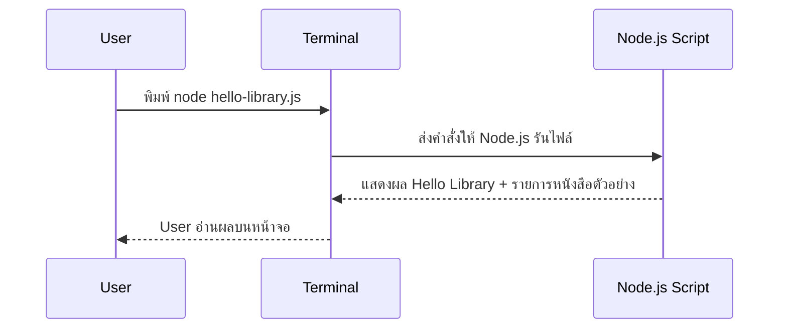

# Day 1: Programming Basics + Hello Library

<p align="center">
  
</p>

เริ่มต้น คอร์ส Non-Degree Node.js + Express.js สำหรับผู้ที่ยังไม่เคยมีพื้นฐานการเขียนโค้ดมาก่อน ลักษณะการเรียนการสอนจะค่อยเป็นค่อยไป อธิบายอย่างชัดเจนทีละขั้น พร้อมมีโค้ช (TA) คอยดูแลและพาลงมือทำ

เมื่อจบบทที่ 1 ผู้เรียนจะได้ไฟล์ `hello-library.js` ซึ่งเป็นโปรแกรมเล็ก ๆ สำหรับทำความรู้จัก Node.js และ ระบบห้องสมุด โดยจะแสดงรายการหนังสือที่เก็บอยู่ในหน่วยความจำ ถือเป็นก้าวแรกของการเริ่มต้นพัฒนาแอปด้วย Node.js

---

## 1. ภาพรวม

- **วันเรียน:** Day 1  
- **โฟกัสหลัก:**  
  - เข้าใจหลักการทำงานของโปรแกรม
  - แนวคิดพื้นฐานของ Web: Request / Response  
  - การใช้งาน Terminal  
  - การรัน JavaScript ด้วย Node.js  

- **Output ที่ต้องได้เมื่อจบวัน:**  
  - สคริปต์ `hello-library.js`  
  - โครงสร้างโฟลเดอร์โปรเจกต์ `library-system`  
  - ไฟล์บันทึกความเข้าใจใน `README.md`  
  - Git commit แรกของชีวิตโปรแกรมเมอร์  

- **ทักษะเสริมที่ได้ฝึก:**  
  - คำสั่งพื้นฐานใน Terminal ที่ใช้จริง  
  - การอ่านและทำความเข้าใจ error message  
  - การเพิ่มข้อมูลลงใน Array  
  - การนับจำนวนรายการข้อมูลแบบง่าย ๆ  

---

## 2. วัตถุประสงค์การเรียนรู้ (Learning Objectives)

1. อธิบายการทำงานของ “โปรแกรม”
2. เข้าใจภาพรวมการทำงานของ **User → Terminal → Node.js → Output** ในมุมมองแบบ Request / Response  
3. ใช้งาน Terminal เบื้องต้นได้ เช่น เปิดใช้งาน ย้ายโฟลเดอร์ และรันคำสั่งง่าย ๆ อย่าง `node file.js`  
4. สร้างโฟลเดอร์โปรเจกต์ `library-system` พร้อมไฟล์พื้นฐาน ได้แก่ `package.json`, `README.md` และ `hello-library.js`  
5. เขียนโค้ด JavaScript พื้นฐานเพื่อ  
   - แสดงข้อความบนหน้าจอ  
   - เก็บข้อมูลใน Array  
   - วนลูปด้วย `forEach`  
6. ทำ Git commit แรกเพื่อบันทึก Repository สำหรับรองรับ Version control


---

## 3. Concepts สำหรับมือใหม่

### 3.1 หลักการทำงานของโปรแกรม
- โปรแกรมคือ “ชุดคำสั่ง” ที่เราบอกคอมพิวเตอร์ให้ทำทีละขั้นเหมือนเราเขียนขั้นตอนการทำอาหาร  
- โครงสร้างคิดแบบง่าย: **Input → Process → Output**  
  - *Input*: สิ่งที่ผู้ใช้หรือไฟล์ส่งเข้ามา เช่น รายชื่อหนังสือ  
  - *Process*: logic ที่เราประมวลผล เช่น นับจำนวนหนังสือ, จัดเรียงชื่อ  
  - *Output*: ผลลัพธ์ที่แสดงให้ผู้ใช้ เช่น ข้อความ “วันนี้มี 3 เล่ม”  
- Node.js ทำหน้าที่อ่านคำสั่งภาษา JavaScript แล้วประมวลผลฝั่ง Backend

### 3.2 Web Overview (User → Server → Response)

  <p align="center">
    
  </p>

- **User / Client**: ตัวอย่างคือ Browser, โทรศัพท์, หรือ Terminal ที่เราจะใช้ใน Day 1 หน้าที่คือส่งคำสั่งไปหา Server เช่น “ขอดูรายการหนังสือใหม่”  
- **Request**: ข้อมูลที่ Client ส่งไปบนช่องทาง HTTP เช่น `GET /books` หรือ `POST /borrow` ซึ่งอาจบรรจุข้อมูล (body) เพิ่มด้วย  
- **Server**: เครื่องที่รัน Node.js + Express มี logic ตรวจสอบสิทธิ์ คุยกับ Database และสร้างคำตอบ  
- **Response**: ผลลัพธ์ที่ Server ส่งกลับ เช่น JSON รายชื่อหนังสือหรือข้อความแจ้งสถานะ  
- **Database**: ฐานข้อมูล กล่องเก็บข้อมูลจริง (เราจะเริ่มเชื่อมในช่วง Day 6) แต่ Day 1 ยังใช้ Array จำลองแทน  
- **Flow ง่าย ๆ ในโปรเจกต์เรา**  
  1. ผู้ใช้ (User) เปิด Terminal แล้วพิมพ์ `node hello-library.js`  
  2. Terminal ส่งคำสั่งไปให้ Node.js ทำงาน  
  3. Node.js ใช้ข้อมูลจาก Array รายชื่อหนังสือ → ประมวลผล → สร้างข้อความ  
  4. Node.js ส่งข้อความกลับมาที่ Terminal  
  5. ผู้ใช้อ่านผลลัพธ์บนหน้าจอ  
- เมื่อเข้าใจ flow นี้แล้ว พอถึง Day 3–4 เราจะแค่เปลี่ยน Client เป็น Browser และแยก Server เป็น Express API ที่ตอบกับ Frontend ได้เหมือนกัน

### 3.3 Terminal คืออะไร?
- Terminal คือหน้าต่างพิมพ์คำสั่ง ให้ความรู้สึกเหมือน LINE Chat ระหว่างเรากับคอมพิวเตอร์
- พิมพ์คำสั่ง 1 บรรทัด → กด Enter → ได้ผลลัพธ์ทันที
- คำสั่งพื้นฐาน: `pwd`, `ls`, `mkdir`, `cd`, `node file.js`
- หากเกิด error ให้ค่อย ๆ อ่านข้อความทีละบรรทัด แล้วแก้ตามคำแนะนำ

### 3.4 โครงสร้างไฟล์แรกของ Library System
```
library-system/
├─ README.md          # บันทึกสิ่งที่เรียน + checkpoint
├─ package.json       # ข้อมูลโปรเจกต์ที่ npm สร้างให้
└─ hello-library.js   # สคริปต์หลักของ Day 1
```
- จุดสำคัญคือทุกบทเรียนถัดไปจะต่อยอดจากโฟลเดอร์นี้
- สอนให้นักเรียนจัดระเบียบไฟล์ตั้งแต่วันแรกเพื่อสร้างนิสัยที่ดี

### 3.5 The JavaScript Revolution
- **จุดเริ่มต้น**: ยุคแรก JavaScript มีหน้าที่ทำให้เว็บ “ขยับได้” เช่น เปิด/ปิดเมนู, ตรวจฟอร์มบน Browser เท่านั้น
- **ยุคปัจจุบัน**: Node.js ทำให้ภาษาเดียวกันนี้ย้ายมาวิ่งบน Backend ได้ พอรวมกับ React Native, Electron เราจึงใช้ JavaScript สร้าง Mobile App หรือ Desktop App ได้ด้วย
- **ตัวอย่างสถานการณ์**  
  1. Startup ต้องการสร้างระบบจองห้องสมุด + แอป mobile → ใช้ React ทำหน้าเว็บ, ใช้ Node/Express ทำ API, ใช้ React Native ทำแอปมือถือ ทั้งหมดใช้ JavaScript หมด  
  2. ทีม Data สร้าง Script จัดการไฟล์ CSV ด้วย Node.js แล้วเอาโค้ดบางส่วนไปใช้แสดงผลบน Browser ได้ทันที
- **Ecosystem ใหญ่**: npm มีแพ็กเกจกว่า 2 ล้าน ถัดจาก Day 1 นักเรียนจะได้ลอง `nodemon` (รีรันอัตโนมัติ), `express` (สร้าง API), `mysql2`/`prisma` (คุยกับฐานข้อมูล), `dotenv` (จัดการ environment)
- **เชื่อมกลับโปรเจกต์เรา**: วันนี้แค่ Array + `console.log` แต่ Day 3 จะมี API `/books`, Day 6 เชื่อม Database, Day 8 เชื่อม Frontend ทั้งหมดด้วยภาษาเดียว → นี่แหละคือ “JavaScript Revolution”

### 3.6 Introducing Express
- **Express คืออะไร?** Framework บน Node.js ที่ทำให้การสร้าง Web Server เหมือนต่อบล็อกเลโก้ มี Route, Middleware, Error Handling ให้พร้อม
- **Example**:
  ```javascript
  import express from "express";
  const app = express();

  // return list of books
  app.get("/books", (req, res) => {
    res.json([
      { id: 1, title: "Clean Code" },
      { id: 2, title: "Node.js in Action" },
    ]);
  });

  app.listen(3000, () => {
    console.log("Library API ready on http://localhost:3000");
  });
  ```
  - เส้นทาง `/books` จะส่ง JSON กลับให้ Browser หรือ Postman ทันที
- **แนวคิดหลัก**  
  - *Routing*: บอกว่า URL ไหนตอบอะไร เช่น `GET /books`, `POST /members`  
  - *Middleware*: ตัวคั่นกลาง เช่น ตรวจ Token, แปลง JSON, log request  
  - *Response*: `res.json()`, `res.send()`, `res.status()` เพื่อสื่อสารผลลัพธ์/ข้อผิดพลาด
- **สรุป** 

  <p align="center">
    
  </p>

  - **Minimal (เบาและคล่องตัว)**  
    Express ถูกออกแบบมาให้เป็นเหมือน “ชั้นบาง ๆ ระหว่างโค้ดกับเซิร์ฟเวอร์” เริ่มต้นได้ด้วยโค้ดไม่กี่บรรทัด แล้วค่อย ๆ เติม middleware หรือเครื่องมือที่จำเป็นเข้าไปตามการใช้งานจริง ไม่ยัดฟีเจอร์ที่ไม่จำเป็นมาให้ตั้งแต่แรก เหมาะกับผู้เริ่มต้นที่อยากเข้าใจและควบคุมทุกส่วนด้วยตัวเอง  

  - **Flexible (ยืดหยุ่น ใช้ได้หลากหลาย)**  
    หน้าที่หลักของ Express คือรับ HTTP Request และส่ง HTTP Response ดังนั้นไม่ว่าจะเป็น Browser, Mobile App, Server ตัวอื่น หรือแม้แต่ IoT device ก็สามารถใช้งานร่วมกันได้ ขอแค่สื่อสารผ่าน HTTP  

  <p align="center">
    
  </p>

  - **Web Application Framework ฝั่ง Server**  
    ในยุคที่เว็บส่วนใหญ่เป็น Single-Page Application อย่าง React, Angular หรือ Vue เราจำเป็นต้องมี API สำหรับแลกเปลี่ยนข้อมูล ซึ่ง Express สามารถทำหน้าที่ฝั่ง Server ได้อย่างตรงจุด หรือหากต้องการทำเว็บที่เรนเดอร์จากฝั่ง Server ทั้งหมด Express ก็รองรับได้เช่นกัน  

  - **Fast (เร็วและรองรับโหลดสูง)**  
    Express ถูกใช้งานจริงในองค์กรขนาดใหญ่ ทำให้มีการพัฒนาและปรับปรุงด้าน performance อย่างต่อเนื่อง ปัจจุบันสามารถรองรับ request จำนวนมากได้อย่างมีประสิทธิภาพ  

  - **Unopinionated**  
    ด้วย ecosystem ของ JavaScript ที่ใหญ่มาก Express จึงไม่กำหนดวิธีทำงานตายตัว แต่เปิดให้เราเลือก middleware หรือแพ็กเกจที่เหมาะกับงานเอง เช่น body parser, logger หรือ security หากไม่ถูกใจก็สามารถเปลี่ยนได้ทันทีโดยไม่กระทบโครงสร้างหลัก

### 3.7 Server-Side และ Client-Side Applications
- **ทำไมต้องแยกสองฝั่ง?**  
  - เพื่อแบ่งงานตามความถนัด: ฝั่ง Server ดูแลความปลอดภัยและตรรกะหนัก ๆ ส่วน Client ดูแลประสบการณ์การใช้งาน  
  - การแยกหน้าที่แบบนี้ทำให้ทีมนักพัฒนากระจายงานง่าย และสามารถอัปเดตแต่ละส่วนได้โดยไม่กระทบอีกฝั่งมากนัก  
  - เมื่อจะขยายระบบ เช่น เพิ่มหน้าเว็บใหม่ หรือเพิ่มแอปมือถือ ก็ใช้ API เดิมจาก Server ได้เลย

- **Server-Side (Backend / หลังบ้าน)**  
  - **หน้าที่หลัก**: รับ Request, ตรวจสอบข้อมูล, ติดต่อ Database, ประมวลผล, ส่ง Response  
  - **ตัวอย่างงานใน Library System**  
    - `POST /members` → ตรวจว่ามีข้อมูลซ้ำไหม แล้วบันทึกสมาชิกใหม่  
    - `POST /borrow` → ตรวจว่าหนังสือเล่มนั้นว่างและสมาชิกไม่มีค่าปรับ ก่อนบันทึก Transaction  
    - `GET /dashboard` → รวมสถิติ เช่น จำนวนหนังสือคงเหลือ, จำนวนสมาชิกที่ยืมอยู่  
  - **เทคโนโลยีที่ใช้**: Node.js + Express, ORM เช่น Prisma, และฐานข้อมูล MySQL/PostgreSQL ผ่าน Docker  
  - **ความรับผิดชอบเพิ่มเติม**: Logging request, ป้องกัน SQL Injection, สร้าง error message ให้เข้าใจง่าย

- **Client-Side (Frontend / หน้าบ้าน)**  
  - **หน้าที่หลัก**: แสดงข้อมูลสวยงาม, รับ input จากผู้ใช้, ส่ง Request กลับไปยัง Server  
  - **ตัวอย่างงานใน Library System**  
    - หน้าเว็บ “Book List” ใช้ Fetch API ขอข้อมูลจาก `/books` แล้วทำเป็นตาราง/การ์ด  
    - หน้าฟอร์ม “Borrow Book” ส่ง `POST /borrow` พร้อมข้อมูลสมาชิกและหนังสือ  
    - Notification หรือ Toast แจ้งผู้ใช้เมื่อยืมสำเร็จหรือเกิด error  
  - **เทคโนโลยีที่ใช้ในคอร์สนี้**: เริ่มจาก HTML/EJS, CSS นิด ๆ, และ JavaScript ฝั่ง Browser เพื่อเรียก API

  <p align="center">
    
  </p>

- **Flow เปรียบเทียบ (ยืมหนังสือ 1 ครั้ง)**:
  ```
  1. User เปิดหน้า My Books (Client) → เห็นปุ่ม "ยืมเล่มนี้"
  2. เมื่อคลิกปุ่ม Browser ส่ง HTTP POST ไปยัง /borrow พร้อมข้อมูล { memberId, bookId } (Request)
  3. Server (Express) รับข้อมูล → ตรวจสอบเงื่อนไข → บันทึกลง Database (Process)
  4. Server ตอบกลับ { status: "success", dueDate: "2025-01-10" } (Response)
  5. Client รับ Response → แสดง Toast "ยืมสำเร็จ! คืนภายใน 10 ม.ค." และอัปเดต UI (Output)
  ```
  > หากเงื่อนไขไม่ผ่าน (เช่น หนังสือถูกยืมแล้ว) Server ก็จะส่งข้อความ error กลับมา ให้ Client แจ้งผู้ใช้ต่อ

- **ตัวอย่างอื่น ๆ ที่เห็นได้ทุกวัน**  
  - สั่งอาหารผ่านแอป → Client คือแอปบนโทรศัพท์, Server คือระบบร้านอาหารที่ตรวจคำสั่งและยิงไปยังครัว  
  - โอนเงินผ่าน Mobile Banking → Client คือแอปธนาคาร, Server ทำหน้าที่เช็กยอดเงินและบันทึกประวัติ  
  - Live score ฟุตบอล → Client คือเว็บ/แอปที่เราเปิดดู, Server ดึงข้อมูลจากระบบสถิติสดแล้วส่งให้ทุกคนพร้อมกัน

---

## 4. System & Flow Diagram

### 4.1 API Sequence Diagram


> ยังไม่มีการสื่อสารกับ Browser หรือ Database เน้นให้ผู้เรียนรู้จักวงจร Request → Process → Output ผ่าน Terminal ก่อน

### 4.2 UI Flow Diagram
- วันนี้ยังไม่มี UI บนเว็บไซต์
- ผู้เรียนโต้ตอบกับโปรแกรมผ่าน Terminal เท่านั้น → ช่วยโฟกัสที่ logic และข้อความเอาต์พุต

---

## 5. ตารางเวลา 8 ชั่วโมง (พร้อมกิจกรรม)

| ชั่วโมง | เนื้อหา/กิจกรรม | วิธีการสอน | Output / Checkpoint |
| --- | --- | --- | --- |
| 1 | เปิดค่าย, เป้าหมาย Library System, Buddy Pair | Icebreaker + สไลด์ + Q&A | นักเรียนรู้ชื่อเพื่อน, เข้าใจโครงงานปลายค่าย |
| 2 | Mindset Programmers + สูตรทำอาหาร + Web Overview | เล่าเรื่อง + วาดภาพ Input → Process → Output บนไวท์บอร์ด | นักเรียนอธิบายได้ว่า Request/Response คืออะไร |
| 3 | Terminal Basics + ตรวจ Node.js | Live demo + ให้ทุกคนพิมพ์ตาม → ทีมโค้ชเดินดูทีละคน | ทุกคนเปิด Terminal ได้, รู้ `pwd`, `ls`, `node -v` |
| 4 | ตั้งค่าโฟลเดอร์ `library-system`, `npm init -y`, เปิด VS Code | Code-along + เอกสาร step-by-step | มีโครงสร้างไฟล์ครบ + README เริ่มต้น |
| 5 | Lecture JavaScript Basics: `const/let`, Array, `console.log`, Template Literal | ใช้ตัวอย่างหนังสือ + ใบงานสั้น ๆ | นักเรียนเข้าใจวิธีเก็บ string, number, array |
| 6 | Lab 2: เขียน `hello-library.js`, ทดลองเพิ่มหนังสือ + `forEach` | ให้เวลาลงมือ 45 นาที + โค้ชช่วยแก้ error | เห็นผลลัพธ์ “สวัสดีจาก ...” และรายการหนังสือ |
| 7 | Review โค้ด, เพิ่ม logic นับจำนวนหนังสือ + Tip เรื่อง `books.length` | สาธิตบนจอ + ให้นักเรียนอัปเดตไฟล์ตัวเอง | Output แสดงจำนวนเล่มถูกต้อง, นักเรียนมั่นใจ |
| 8 | Lab 3: Git init + Commit, Recap ทั้งวัน, Preview Day 2 | Live demo + ให้ทุกคนลองเอง + สรุปเป็น bullet | มี commit `feat: hello library`, มีโน้ตสิ่งที่เรียน และรู้ว่า Day 2 จะเจอ function/operator |

> ทุกชั่วโมงมีช่วงพักสั้น ๆ สอดแทรก ให้ผู้เรียนไม่ล้า เช่น พัก 5 นาทีหลังชั่วโมง 2, 4, 6

---

## 6. Hands-on Labs

### Lab 1 — ตั้งค่าโฟลเดอร์ Library System
1. เปิด Terminal
2. พิมพ์ `mkdir library-system && cd library-system`
3. พิมพ์ `npm init -y` (อธิบายว่าไฟล์ `package.json` เก็บข้อมูลโปรเจกต์ เช่น ชื่อ, เวอร์ชัน, สคริปต์)
4. สร้างไฟล์ `README.md` แล้วให้ผู้เรียนจด bullet “สิ่งที่ได้เรียนวันนี้”
5. เปิดโฟลเดอร์ใน VS Code (`code .`)

### Lab 2 — เขียนโค้ด Hello Library (Code-along + ทดลองเพิ่มเอง)
```javascript
// hello-library.js
const libraryName = "Library Management System"; // เก็บชื่อระบบไว้ reuse
const books = [
  "Clean Code",
  "Designing Data-Intensive Applications",
  "Node.js in Action",
]; // รายการหนังสือทดลอง

console.log("สวัสดีจาก", libraryName);
console.log("วันนี้มีหนังสือในระบบ", books.length, "เล่ม");
console.log("รายการหนังสือ:");

books.forEach((book, index) => {
  console.log(index + 1 + ".", book);
});
```
1. รัน `node hello-library.js`
2. ให้ผู้เรียนลองเพิ่มหนังสืออีก 1 รายการแล้วรันใหม่ เพื่อดูผลเปลี่ยนแปลง
3. สอนให้ใส่คอมเมนต์สั้น ๆ บอกหน้าที่ เพื่อสร้างนิสัยการอธิบายโค้ด

### Lab 3 — Git Snapshot แรก
1. ยืนยันว่าทุกไฟล์บันทึกแล้ว พิมพ์ `git init`
2. `git status` → อธิบายสีแดง/เขียว
3. `git add .`
4. `git commit -m "feat: hello library"`
5. บันทึกใน README.md ว่าการ commit คือการ “ถ่ายรูป” งานเก็บไว้ย้อนกลับได้

---

## 7. Project Progression (เชื่อมต่อบทถัดไป)
- มีโฟลเดอร์ `library-system` ที่จะใช้ต่อเนื่องทุกวัน
- ผู้เรียนได้สัมผัส Array, Loop, Console ซึ่งจะถูกใช้ซ้ำใน Day 2 ตอนเริ่มสร้าง logic เพิ่ม
- การมี commit แรกช่วยให้พรุ่งนี้สามารถเปรียบเทียบการเปลี่ยนแปลงได้ง่าย
- ทุกคนเริ่มเห็นภาพว่าระบบห้องสมุดจะเติบโตจากข้อมูลในหน่วยความจำ → เชื่อม Database → มี REST API → มี Frontend

---

## 8. Summary & Next Day Preview
- ทุกคนเข้าใจความหมายของคำว่า “โปรแกรม” และวงจร Request/Response แบบง่าย
- สามารถเปิด Terminal, สร้างโฟลเดอร์, รัน `node hello-library.js`, และแก้ไขไฟล์ใน VS Code ได้
- โค้ด `hello-library.js` แสดงข้อความทักทาย + นับจำนวนหนังสือ + รายการหนังสือเรียบร้อย
- มี Git commit `feat: hello library` และบันทึกสิ่งที่เรียนใน README.md
- **Preview Day 2:** เจาะไวยากรณ์ JavaScript เพิ่ม (Operators, Function, Control Flow) เพื่อเตรียมสร้าง logic จัดการหนังสือและสมาชิกในระบบ Library Management System
