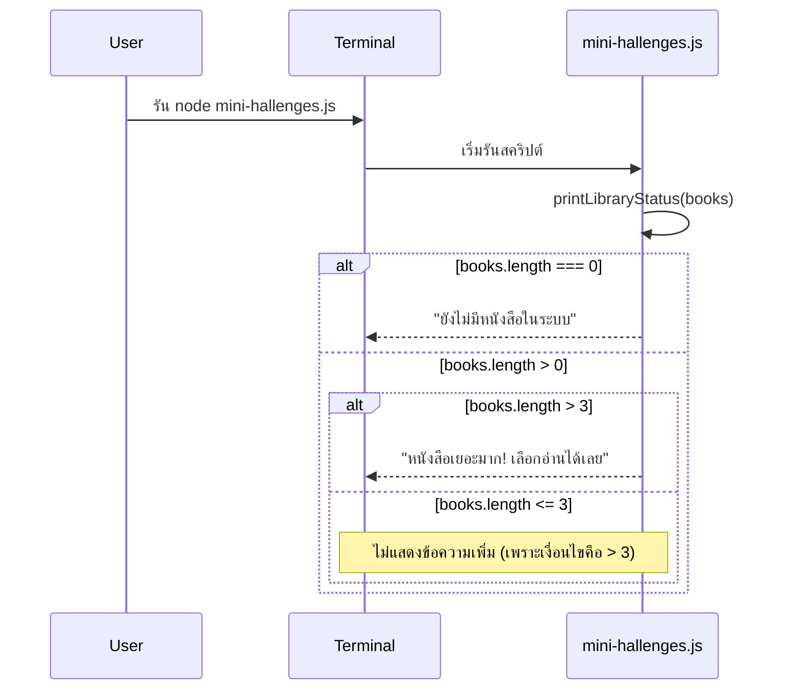
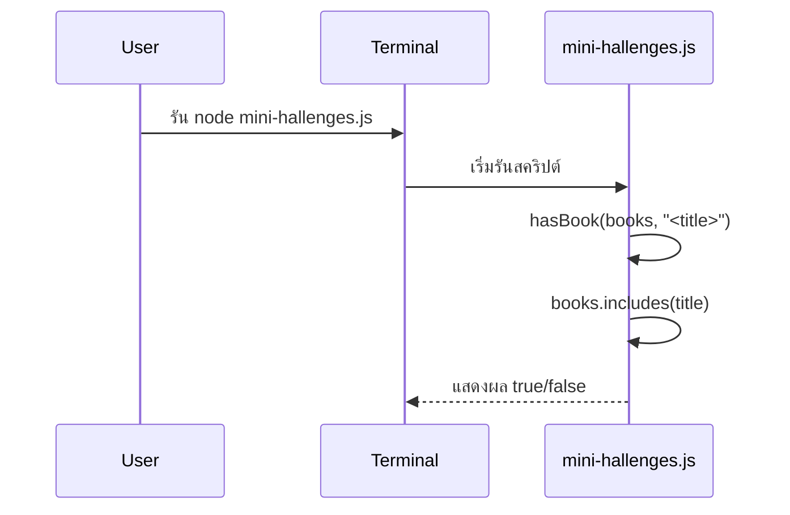

# Part 4 — Hands-on Labs

## ก่อนเริ่ม (Prerequisites)

เพื่อให้แล็บลื่นขึ้น แนะนำให้เช็กเครื่องมือให้พร้อมก่อน:

```bash
node -v
npm -v
git --version
code .
```

- ถ้า `code .` ใช้ไม่ได้ แปลว่ายังไม่ได้ติดตั้งคำสั่ง `code` สำหรับ VS Code (ดูหัวข้อ Troubleshooting ท้ายหน้า)

## Lab 1 — ตั้งค่าโฟลเดอร์ Library System

1. เปิด Terminal
2. พิมพ์ `mkdir library-system && cd library-system`
3. พิมพ์ `npm init -y` (อธิบายว่าไฟล์ `package.json` เก็บข้อมูลโปรเจกต์ เช่น ชื่อ, เวอร์ชัน, สคริปต์)
4. สร้างไฟล์ `.gitignore` และใส่บรรทัดนี้ (อธิบายว่าเราไม่ commit ของที่ติดตั้งใหม่ได้เสมอ และใหญ่เกินจำเป็น):
   ```
   node_modules/
   ```
5. สร้างไฟล์ `README.md` แล้วให้ผู้เรียนจด bullet “สิ่งที่ได้เรียนวันนี้”
6. เปิดโฟลเดอร์ใน VS Code (`code .`)

---

## Lab 2 — เขียนโค้ด Hello Library (Code-along + ทดลองเพิ่มเอง)

ได้เวลาเขียนโค้ด JavaScript แรกกันแล้ว! เปิดไฟล์ `hello-library.js` ใน VS Code แล้วพิมพ์โค้ดต่อไปนี้ตามได้เลยครับ เราจะมาทำความเข้าใจความหมายของแต่ละส่วนไปพร้อม ๆ กัน

```javascript
// hello-library.js

// --- 1. การประกาศตัวแปรและเก็บข้อมูล ---

// ใช้ const เพื่อสร้าง "กล่อง" เก็บข้อมูลที่ค่าจะไม่เปลี่ยน
// libraryName คือชื่อกล่อง ในที่นี้เก็บข้อความ (String)
const libraryName = "My Awesome Library";

// books คือกล่องที่เก็บ "รายการ" ของข้อมูล (Array)
// ในที่นี้คือรายการชื่อหนังสือ
const books = [
  "Clean Code",
  "Designing Data-Intensive Applications",
  "Node.js in Action",
  "The Pragmatic Programmer",
];

// --- 2. การแสดงผลลัพธ์ออกทางหน้าจอ ---

// console.log() คือคำสั่ง "พิมพ์" ข้อความออกไปที่ Terminal
// เราสามารถส่งข้อมูลไปได้หลายชิ้น โดยคั่นด้วยลูกน้ำ (,)
console.log("สวัสดีจาก", libraryName);

// .length คือการ "นับจำนวน" ไอเท็มใน Array
// books.length จะได้ผลลัพธ์เป็น 4
console.log("วันนี้มีหนังสือในระบบ", books.length, "เล่ม");
console.log("--- รายการหนังสือทั้งหมด ---");

// --- 3. การวนลูปเพื่อแสดงผลทุกรายการ ---

// .forEach() คือคำสั่ง "ทำซ้ำกับทุกไอเท็ม" ใน Array
// มันจะหยิบหนังสือมาทีละเล่ม (book) พร้อมกับลำดับของมัน (index)
books.forEach((book, index) => {
  // index เริ่มจาก 0 เราจึง +1 เพื่อให้คนอ่านเข้าใจง่าย (เริ่มนับจาก 1)
  // จากนั้นนำมาต่อกัน (Concatenate) เพื่อสร้างข้อความที่สมบูรณ์
  console.log(index + 1 + ". " + book);
});
```

### ทำความเข้าใจโค้ดทีละส่วน

<details>
<summary>1. ตัวแปรและประเภทข้อมูล (Variables & Data Types)</summary>

- **`const`**: คำสั่งสำหรับสร้าง "ตัวแปร" หรือ "กล่องเก็บข้อมูล" แบบค่าคงที่ (Constant) หมายความว่าเมื่อเรากำหนดค่าให้มันครั้งแรกแล้ว จะไม่สามารถเปลี่ยนค่าได้อีก เหมาะสำหรับข้อมูลที่เราไม่ต้องการให้เปลี่ยน เช่น ชื่อระบบ, ค่า pi (3.14)
- **`libraryName`**: นี่คือ "ชื่อ" ของตัวแปรที่เราตั้งขึ้นเอง เพื่อให้เราจำได้ว่ามันเก็บข้อมูลอะไร
- **`"My Awesome Library"`**: ข้อมูลประเภท "ข้อความ" (String) จะต้องอยู่ภายในเครื่องหมายคำพูด `""` หรือ `''` เสมอ
- **`books`**: ชื่อตัวแปรอีกตัวหนึ่ง
- **`[...]`**: ข้อมูลประเภท "อาร์เรย์" (Array) หรือ "รายการ" ใช้สำหรับเก็บข้อมูลหลายชิ้นไว้ในที่เดียว โดยแต่ละชิ้นจะคั่นด้วยเครื่องหมายลูกน้ำ `,`

</details>

<details>
<summary>2. การแสดงผล (Output)</summary>

- **`console.log()`**: เป็นฟังก์ชันพื้นฐานที่สุดในการแสดงผลลัพธ์ออกมาทาง "คอนโซล" (ในที่นี้คือ Terminal ของเรา) เพื่อให้เราตรวจสอบได้ว่าโปรแกรมทำงานถึงไหน หรือมีค่าอะไรอยู่บ้าง
- **`books.length`**: อาร์เรย์ทุกตัวจะมีความสามารถพิเศษติดตัวมาคือ `.length` ซึ่งใช้สำหรับนับจำนวนข้อมูลที่อยู่ข้างใน ในตัวอย่างนี้ `books` มี 4 รายการ `books.length` จึงให้ผลเป็นตัวเลข `4`

</details>

<details>
<summary>3. การวนซ้ำ (Looping)</summary>

- **`books.forEach(...)`**: นี่คือการใช้ "เมธอด" (Method) หรือ "ความสามารถพิเศษ" ของอาร์เรย์ที่ชื่อว่า `forEach` เพื่อสั่งให้มันทำงานบางอย่างกับข้อมูลทุกชิ้นในอาร์เรย์
- **`((book, index) => { ... })`**: ส่วนนี้เรียกว่า "Arrow Function" เป็นการเขียนฟังก์ชันแบบย่อ ๆ เพื่อบอกว่า `forEach` จะต้องทำอะไรในแต่ละรอบ
  - `book`: คือตัวแปรชั่วคราวที่ `forEach` สร้างขึ้นเพื่อเก็บค่าของไอเท็มในรอบนั้น ๆ (เช่น "Clean Code" ในรอบแรก)
  - `index`: คือตัวแปรชั่วคราวที่เก็บ "ลำดับที่" ของไอเท็มนั้น ๆ (ลำดับเริ่มนับจาก 0)
- **`index + 1 + ". " + book`**: นี่คือการ "ต่อข้อความ" (String Concatenation) เข้าด้วยกัน
  - `index + 1`: เราบวก 1 เพื่อให้ลำดับที่แสดงผลเริ่มจาก 1, 2, 3... ซึ่งคนทั่วไปคุ้นเคยมากกว่า 0, 1, 2...
  - จากนั้นนำไปต่อกับ `". "` และชื่อหนังสือ (`book`) เพื่อให้ได้ผลลัพธ์ที่สวยงาม เช่น `"1. Clean Code"`

</details>

### ลงมือทำและทดลอง

1. **รันโปรแกรม:** กลับไปที่ Terminal แล้วพิมพ์คำสั่ง:

```bash
node hello-library.js
```

คุณควรจะเห็นผลลัพธ์ประมาณนี้:

```text
สวัสดีจาก My Awesome Library
วันนี้มีหนังสือในระบบ 4 เล่ม
--- รายการหนังสือทั้งหมด ---
1. Clean Code
2. Designing Data-Intensive Applications
3. Node.js in Action
4. The Pragmatic Programmer
```

2. **ทดลองแก้ไข:** ลองเพิ่มชื่อหนังสือที่คุณชอบเข้าไปในอาร์เรย์ `books` อีก 1-2 เล่ม จากนั้นบันทึกไฟล์ (Save) แล้วรันโปรแกรมอีกครั้ง คุณจะเห็นว่าจำนวนหนังสือและรายการจะอัปเดตอัตโนมัติ!

3. **ความสำคัญของคอมเมนต์:** สังเกตบรรทัดที่ขึ้นต้นด้วย `//` สิ่งนี้เรียกว่า "คอมเมนต์" (Comment) ซึ่งคอมพิวเตอร์จะไม่อ่าน แต่มีไว้เพื่อให้โปรแกรมเมอร์เขียนโน้ตอธิบายโค้ดส่วนนั้น ๆ เป็นการฝึกนิสัยที่ดีในการเขียนโค้ดที่คนอื่น (หรือตัวเราในอนาคต) เข้าใจง่าย

### Mini Challenges

ลองปรับโค้ดเพิ่มเล็กน้อยเพื่อฝึก “เงื่อนไข”:

1. ทำฟังก์ชัน `printLibraryStatus(books)`:
   - ถ้า `books.length === 0` ให้แสดง `"ยังไม่มีหนังสือในระบบ"`
2. ใน `printLibraryStatus(books)` เดิม:
   - ถ้า `books.length > 3` ให้แสดงเพิ่ม `"หนังสือเยอะมาก! เลือกอ่านได้เลย"` (ถ้ามี 3 เล่มพอดี จะไม่แสดงบรรทัดนี้ เพราะเงื่อนไขคือ `> 3`)
3. ทำฟังก์ชัน `hasBook(books, title)` เพื่อเช็คว่า “มีหนังสือนี้อยู่ในระบบไหม” (ใบ้: ใช้ `books.includes(title)`)

#### Sequence Diagram

**อ่านสัญลักษณ์ใน Diagram**
- `alt` (alternative) = เงื่อนไขแบบ `if/else` (ต้องเลือกเกิด “ทางใดทางหนึ่ง”) เช่น `books.length === 0` vs `books.length > 0`
- `opt` (optional) = เงื่อนไขแบบ `if` อย่างเดียว (เกิด “เฉพาะเมื่อเงื่อนไขเป็นจริง” และไม่มี `else` ก็ได้)

> เพื่อไม่ให้สับสน ในตัวอย่างนี้ใช้ `alt` ให้เห็นทั้งกรณี “เข้าเงื่อนไข” และ “ไม่เข้าเงื่อนไข” ชัด ๆ

##### Flow 1: `printLibraryStatus(books)`


##### Flow 2: `hasBook(books, title)`


### แยกไฟล์เป็น Module

ถ้าอยากลอง “export / import” แบบง่ายสุด ให้ทำ 2 ไฟล์นี้:

```javascript
// book-utils.js
function hasBook(books, title) {
  return books.includes(title);
}

module.exports = { hasBook };
```

```javascript
// hello-library.js
const { hasBook } = require("./book-utils");

// ใช้ books ตัวเดิมจากแล็บ หรือจะประกาศใหม่ก็ได้
// const books = ["Clean Code", "Node.js in Action"];
console.log("มี Clean Code ไหม:", hasBook(books, "Clean Code"));
```

---

## Lab 3 — Git Snapshot แรก

> ถ้ายังไม่มั่นใจเรื่องคำสั่ง/แนวคิด แนะนำอ่านหน้า [Git Basics](./git-basics.md) ก่อนเริ่ม

1. ยืนยันว่าทุกไฟล์บันทึกแล้ว พิมพ์ `git init`
2. `git status` → อธิบายสีแดง/เขียว (ไฟล์ที่ยังไม่ถูก track / ไฟล์ที่ถูก stage แล้ว)
3. `git diff` → ดูว่ามีอะไรเปลี่ยนไปจากเดิมบ้าง (ก่อนจะถ่าย snapshot)
4. `git add .`
5. `git status` อีกรอบเพื่อเช็กว่าไฟล์ขึ้นเป็น staged แล้ว
6. `git commit -m "feat: add hello-library script"`
7. `git log --oneline` เพื่อดูว่า commit ถูกบันทึกแล้วจริง
8. บันทึกใน `README.md` ว่าการ commit คือการ “ถ่ายรูป” งานเก็บไว้ย้อนกลับได้

### ลองทำบน Branch

ถ้าอยากฝึก workflow แบบทีม ให้ลองสร้าง branch ก่อน commit:

```bash
git checkout -b feature/hello-library
```

จากนั้นค่อย `git add` และ `git commit` ตามขั้นตอนด้านบน

---

## Troubleshooting (ปัญหาที่พบบ่อย)

- `code: command not found`: เปิด VS Code → กด `Cmd+Shift+P` → ค้นหา `Shell Command: Install 'code' command in PATH` แล้วลองใหม่
- `git commit` แล้วขึ้นให้ตั้งค่า user:
  ```bash
  git config --global user.name "Your Name"
  git config --global user.email "you@example.com"
  ```
- `node: command not found` หรือเวอร์ชันไม่ตรง: ติดตั้ง/อัปเดต Node.js แล้วเปิด Terminal ใหม่ จากนั้นเช็กด้วย `node -v`
- งงว่าไฟล์ไหนจะถูก commit: ใช้ `git status` และ `git diff` ก่อน `git add .` ทุกครั้ง
  
> เคล็ดลับ: หลังจบแต่ละ Lab ให้จด lesson learned ลง README.md หรือ Notion ของตัวเอง จะช่วยให้จำขั้นตอนสำคัญได้ยาว ๆ
