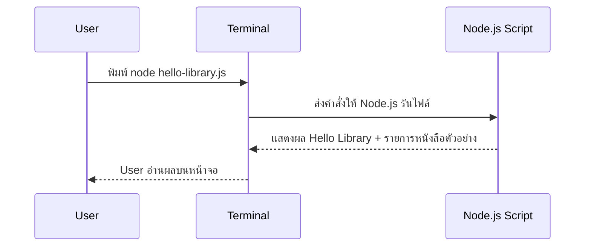

id: nodejs-zero-to-hero/day-1-introduction/system-flow-diagrams
title: Part 4 — System & Flow Diagrams
sidebar_label: Part 4 — System & Flow
description: Diagram อธิบายวงจร Request → Process → Output ของ Hello Library Script

# Part 4 — System & Flow Diagram

## API Sequence Diagram

> ยังไม่มีการสื่อสารกับ Browser หรือ Database เน้นให้ผู้เรียนรู้จักวงจร Request → Process → Output ผ่าน Terminal ก่อน

## UI Flow Diagram

- วันนี้ยังไม่มี UI บนเว็บไซต์
- ผู้เรียนโต้ตอบกับโปรแกรมผ่าน Terminal เท่านั้น → ช่วยโฟกัสที่ logic และข้อความเอาต์พุต

> ขีดเส้นใต้ Flow ง่าย ๆ นี้ไว้ในสมุด หากเข้าใจภาพรวมนี้ Part 5 ที่เป็น Labs จะลื่นขึ้นมาก
