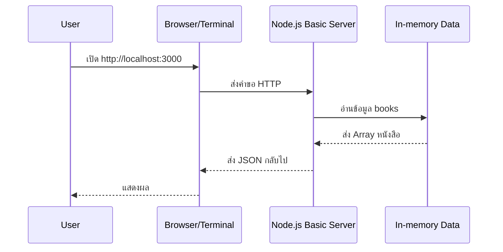

# Part 1 — Core Concepts

## เรากำลังเตรียมตัวไป Express (ทำไมต้องเรียนเรื่องโครงสร้าง)

ในโปรเจกต์จริง เราไม่ได้มีแค่ไฟล์เดียวแล้วจบ เพราะจะมี:

- โค้ดที่ “รัน server” (entrypoint)
- โค้ดที่ “เก็บ/จัดการข้อมูล” (data/service)
- โค้ดที่ “ช่วยเหลือซ้ำ ๆ” (utils)
- การตั้งค่า (config/environment)

Day 2 เลยโฟกัสที่ **จัดระเบียบ** และ **รันได้แบบทีม** ก่อน (ผ่าน `npm scripts`) มากกว่าการทำ API หลาย ๆ อัน

## Node.js Runtime (รัน JavaScript ฝั่ง Server)

- **Node.js** คือ runtime ที่ทำให้เราเขียน JavaScript แล้วรันนอก Browser ได้ (เช่นใน Terminal/Server)
- สิ่งที่ต่างจาก Browser: Node มี API อย่าง `fs` (อ่าน/เขียนไฟล์), `http` (ทำ server), `process` (ตัวแปรแวดล้อม) เป็นต้น
- แนวคิดสำคัญ: **Event Loop** (อธิบายแบบคิวงาน)
  - Node รับงานเข้าคิว → ทำงานที่ทำได้ทันที → งานที่ต้องรอ (เช่น I/O) จะไปทำแบบไม่บล็อก → พอเสร็จค่อยกลับมาส่งผล
  - เป้าหมายคือ “รับหลายคำขอได้” โดยไม่ต้องสร้าง thread ใหม่ทุกครั้ง (ในระดับพื้นฐานให้จำภาพคิวงานไว้ก่อน)

### Browser vs Node (จำง่าย ๆ)

- **Browser**: มี `document`, `window`, DOM, Fetch API เป็นหลัก (เน้น UI)
- **Node**: ไม่มี DOM แต่มี `fs`, `http`, `path`, `process` (เน้น server/CLI)

### สรุป: “วันนี้เราเขียนโปรแกรมประเภทไหน?”

- เป็น **HTTP Server** ที่รันด้วย Node
- Client คือ Browser/Terminal (`curl`) ส่ง HTTP request มาให้เรา
- เราจะตอบ JSON กลับไปเหมือน “API แบบเริ่มต้น”

## npm และ `package.json`

- `package.json` คือ “บัตรประชาชนของโปรเจกต์” เก็บชื่อโปรเจกต์, เวอร์ชัน, dependencies, และ scripts
- `npm install <pkg>` ใช้ติดตั้งไลบรารีจากชุมชน
- `npm run <script>` ช่วยย่อคำสั่งยาว ๆ ให้เหลือคำสั้น ๆ ที่ทีมใช้ร่วมกันได้

ตัวอย่างที่ใช้บ่อย:

- `npm run start` → รันโปรแกรมจริง
- `npm run dev` → โหมดพัฒนา (มักใช้ `nodemon` เพื่อรีรันอัตโนมัติ)

### dependencies vs devDependencies

- `dependencies`: โค้ดที่ “ตอนรันจริงต้องใช้” (เช่น `express`, `dotenv`)
- `devDependencies`: โค้ดช่วยตอนพัฒนา (เช่น `nodemon`, `eslint`)

### `npm run` ทำอะไรให้เรา

- ทำให้ทุกคนในทีมรันคำสั่งได้เหมือนกัน (ไม่ต้องจำคำสั่งยาว)
- ลดปัญหา “เครื่องใครเครื่องมัน” เพราะ entrypoint ถูกกำหนดไว้ชัดเจน

### ชุด scripts ที่แนะนำให้มีในโปรเจกต์จริง

- `start`: รันแบบ production-ish (ไม่ต้อง auto reload)
- `dev`: รันแบบ dev (auto reload)
- (optional) `test`: ใช้กับวันถัด ๆ ไป

## โครงสร้างโปรเจกต์ (Project Structure)

เป้าหมายคือ “แยกไฟล์ตามหน้าที่” เพื่อให้ขยายต่อเป็น Express ได้ง่าย:

```
library-system/
  package.json
  src/
    server-basic.js
    data/
      books.js
    utils/
      logger.js
```

- `src/server-basic.js`: จุดเริ่มต้นของ server
- `src/data/books.js`: ข้อมูลจำลองแบบ in-memory (ยังไม่ต่อ DB)
- `src/utils/logger.js`: utility เล็ก ๆ ที่ใช้ซ้ำ

### แนวทางการตั้งชื่อไฟล์/โฟลเดอร์ (แนะนำ)

- `server-*.js` หรือ `index.js` ไว้เป็น entrypoint ชัด ๆ
- `data/` เก็บ dataset จำลอง หรือ “repository แบบง่าย”
- `utils/` เก็บฟังก์ชันที่ใช้ซ้ำ และ “ไม่ควรรู้เรื่อง business มาก”
- ถ้ามีการตั้งค่า ให้แยก `config/` (เช่นอ่าน env, constants)

### โครงสร้างที่ “เหมือนโปรเจกต์จริงขึ้น” (สำหรับช่วงบ่าย)

ถ้าฟีเจอร์เริ่มเยอะ ให้เริ่มแยกเพิ่ม:

```
src/
  server.js           # entrypoint
  config/
    env.js            # อ่าน env + default
  routes/
    index.js          # dispatch ตาม path/method
  handlers/
    health.js
    books.js
  data/
    books.json        # persistence
  repositories/
    books-repo.js     # read/write data
  utils/
    logger.js
    response.js       # sendJson/sendError
```

แนวคิดสำคัญ: handler “ไม่ควรรู้ว่าเก็บข้อมูลในไฟล์ยังไง” ให้ repository ดูแล

## Module System (CommonJS vs ESM) แบบพื้นฐาน

Node.js เจอ 2 แบบหลัก:

- **CommonJS (CJS)**: `require()` / `module.exports` (เจอบ่อยในตัวอย่าง Node รุ่นเดิม)
- **ES Modules (ESM)**: `import` / `export` (สไตล์สมัยใหม่)

วันนี้ให้ “เลือกใช้แบบเดียวทั้งโปรเจกต์” เพื่อไม่งง (ใน prompt นี้ใช้ CJS)

## พื้นฐาน HTTP Module (ก่อนเข้า Express)

- วันนี้เราจะใช้ `http.createServer((req, res) => { ... })`
- แนวคิดเดียวกับ Express:
  - `req` = request (method, url, headers)
  - `res` = response (กำหนด header/status และส่งข้อมูลกลับ)

### ของที่ควรรู้เวลาทำ HTTP แบบง่าย

- `req.method`: เช่น `GET`, `POST`
- `req.url`: เช่น `/books`, `/health`
- `res.statusCode`: ตั้ง status เช่น `200`, `404`
- `res.setHeader('Content-Type', 'application/json')`: บอกว่าเราส่ง JSON
- `res.end(...)`: ส่งข้อมูลและจบ response

### เรื่องสำคัญ: 404 vs 405

- `404 Not Found`: ไม่มี route นี้เลย
- `405 Method Not Allowed`: มี route แต่ method ไม่รองรับ (ควรส่ง header `Allow`)

### เรื่องสำคัญ: อย่าให้ server crash จาก input แปลก ๆ

- `JSON.parse` ต้องอยู่ใน `try/catch`
- ถ้า handler โยน error แล้ว process ตาย แปลว่าผู้ใช้ “ทำให้ระบบล่ม” ได้ง่ายเกินไป

ตัวอย่าง flow แบบง่าย:



## Environment Variables (PORT, .env)

เวลา deploy หรือรันบนเครื่องอื่น เราไม่ควร hardcode ค่าบางอย่าง (เช่น port)

- อ่านค่า: `process.env.PORT`
- ตั้งค่า fallback: `const port = process.env.PORT ?? 3000`
- ในโปรเจกต์จริงนิยมใช้ `.env` + ไลบรารี `dotenv` เพื่อโหลดค่าตอน dev

## Persistence แบบง่าย: เก็บข้อมูลลงไฟล์ JSON

วันนี้เรายังไม่มี database แต่เราสามารถทำ persistence แบบง่ายด้วย `fs`

แนวคิด:

- อ่านไฟล์ `data/books.json` ตอนเริ่มโปรแกรม (หรืออ่านทุกครั้งที่ request มาก็ได้ในเวอร์ชันง่าย)
- เวลา `POST /books` ให้เขียนกลับลงไฟล์

ข้อควรระวัง:

- concurrent writes (วันนี้ยังทำแบบง่ายได้ แต่ให้รู้ว่า “มีเรื่องนี้อยู่”)
- ต้อง validate ข้อมูลก่อนเขียนลงไฟล์เสมอ

## Git Hygiene สำหรับโปรเจกต์ Node

- อย่า commit `node_modules/` (ใหญ่และสร้างใหม่ได้จาก `npm install`)
- อย่า commit `.env` (มีความลับ) แต่ควรมี `.env.example` ให้ทีมรู้ว่าต้องตั้งค่าอะไร
- commit ให้ถี่พอ (เล็ก ๆ) และมีความหมาย เช่น “setup scripts”, “add basic server”

## Logger ที่ควรมีตั้งแต่ต้น

สิ่งที่ช่วยมากเวลาสอน/ดีบัก:

- log ทุก request: method/path/status/duration
- มี `requestId` เพื่อไล่ log ข้ามหลายบรรทัดได้
- แยกระดับ `info/warn/error` เพื่อให้เวลาเจอปัญหาไม่จมกับ log

## Checklist (ก่อนเริ่ม Lab)

- แยกให้ออกว่า “ไฟล์ไหนเป็น entrypoint” และ “ไฟล์ไหนเป็น data/util”
- เข้าใจว่าทำไมต้องมี `scripts` ใน `package.json`
- พออธิบายได้ว่า `req`/`res` คืออะไร (ไม่ต้องลึก)

> Call-to-action: ลองอธิบายด้วยภาษาของตัวเองว่า “ทำไมต้องมี `npm run dev`” และ “ถ้าทีมมี 5 คน มันช่วยอะไร”
