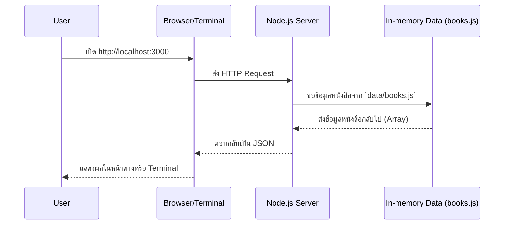

# Day 2: Building Your First Node.js API

ยินดีต้อนรับสู่ Day 2! วันนี้ไม่ใช่แค่การเรียนรู้ แต่เป็น Workshop ที่เราจะเปลี่ยนโฟลเดอร์ว่างๆ ให้กลายเป็น API Server ที่ทำงานได้จริงและมีโครงสร้างที่แข็งแรง เราจะลงลึกในทุกขั้นตอน ตั้งแต่การตั้งค่าโปรเจกต์, การสร้างเซิร์ฟเวอร์, การจัดการข้อมูล, ไปจนถึงการจัดระเบียบโค้ดเพื่อเตรียมพร้อมสำหรับโลกการทำงานจริง

## Part Breakdown

- **Part 1** — [Core Concepts](./1-core-concepts.md): สรุปแนวคิดทฤษฎี Node.js, npm, และโครงสร้างโปรเจกต์
- **Part 2** — [HTTP Routing & Response](./2-http-routing-and-response.md): เจาะลึกเรื่องการจัดการ URL, Status Codes, และ Response Design
- **Part 3** — [Hands-on Labs](./labs/1-project-foundation.md): **(เริ่มลงมือทำที่นี่)** Lab 1–8 (มีโจทย์ optional เติมเวลา)
- **Part 4** — [Debugging Checklist](./4-debugging-checklist.md): คู่มือ "ปฐมพยาบาล" เมื่อโค้ดของคุณเกิดปัญหา
- **Part 5** — [Mini Project](./5-mini-project.md): โปรเจกต์ท้าทายความเข้าใจส่งท้ายวัน

## เป้าหมายหลักของวันนี้ (Learning Outcomes)

เมื่อจบ Workshop นี้ คุณจะสามารถ:

- **สร้างและกำหนดค่าโปรเจกต์ Node.js** ด้วย `npm` และ `git` ได้อย่างถูกต้อง
- **สร้าง HTTP Server** ด้วย `http` module และเข้าใจการทำงานของ `request` และ `response`
- **พัฒนาระบบการทำงานอย่างมืออาชีพ** โดยใช้ `nodemon` และจัดการ Environment Variables ผ่าน `.env`
- **จัดการ Routing และ Response** ได้อย่างมีประสิทธิภาพ รวมถึงการจัดการ Query String และ HTTP Status Code
- **รับและประมวลผลข้อมูลจาก Client (`POST` request)** พร้อมกับการตรวจสอบความถูกต้องของข้อมูล (Validation)
- **ทำให้ข้อมูลคงอยู่ (Persistence)** โดยการอ่านและเขียนข้อมูลลงไฟล์ JSON ด้วย `fs` module
- **Refactor โค้ด** จากไฟล์เดียวให้มีโครงสร้างที่เป็นระบบ (Handlers, Routes, Repositories, Utils)
- **สร้างและใช้งาน Logger** ที่มีประสิทธิภาพเพื่อช่วยในการดีบัก

---

## ตารางเวลาแนะนำ (8 ชั่วโมง)

> ปรับเวลาได้ตามความเร็วของห้องเรียน (เป้าคือ “ผู้เรียนได้ลงมือทำจริง” เป็นหลัก)

**ช่วงเช้า (4 ชม.)**
- 09:00–09:15 — Setup/Checklist + อธิบายเป้าหมายของวัน
- 09:15–10:05 — Part 1: Core Concepts (lecture + mini quiz)
- 10:05–10:15 — Break
- 10:15–11:15 — Lab 1–2 (code-along) + Checkpoint review
- 11:15–12:00 — Part 2 (Routing/Response) + โจทย์ย่อย “ออกแบบ response”

**ช่วงบ่าย (4 ชม.)**
- 13:00–14:10 — Lab 3–4 (workflow + routing helpers) + pair debugging
- 14:10–14:20 — Break
- 14:20–15:40 — Lab 5–7 (persistence + POST/validation + refactor structure)
- 15:40–16:10 — Debugging checklist drills (จำลอง error จริง 3–5 เคส)
- 16:10–17:00 — Mini Project (เริ่มทำ + ส่งงาน/เดโม + retro)

---

## ก่อนเริ่ม (Pre-work / Setup Checklist)

- ติดตั้ง `node`, `npm`, `git` ให้เรียบร้อย (`node -v`, `npm -v`, `git --version`)
- แนะนำให้มีเครื่องมือทดสอบ API อย่างน้อย 1 อย่าง: `curl` หรือ Postman/Insomnia
- แนะนำให้เปิด auto-format ใน editor (ช่วยลด syntax error ที่เสียเวลา)

---

## ชุดโจทย์เสริม (ใช้เติมเวลา/ปรับระดับ)

เลือกทำตามเวลาที่มี (หรือแจกเป็นการบ้าน):

1. **Response Contract**: ให้ทุก endpoint ตอบเป็นรูปแบบเดียวกัน `{ ok, data, error }` และกำหนด error codes เช่น `NOT_FOUND`, `BAD_REQUEST`
2. **Request Logging ระดับทีม**: เพิ่ม `requestId` ในทุก request (เช่น `X-Request-Id`) แล้ว log ให้ตาม trace ได้
3. **Payload Size Limit**: จำกัดขนาด `POST` body (เช่น 50kb) และตอบ `413 Payload Too Large`
4. **Route เพิ่มเติม**: `GET /books/:id`, `DELETE /books/:id`
5. **Refactor Sprint**: แยก `server` → `router` → `handlers` → `repositories` → `utils` พร้อมตั้งกติกาการ import
6. **API Usability**: เพิ่ม query `?search=` และ `?limit=` ให้ `/books`
7. **Hardening**: ตรวจ `Content-Type` เป็น `application/json` ก่อน parse body (ผิดให้ตอบ `415 Unsupported Media Type`)

---

## System & Flow Diagram
### API Sequence Diagram

### UI Flow
- ในวันนี้เราจะยังไม่มีส่วนติดต่อผู้ใช้ (UI) ที่สวยงาม แต่จะใช้เบราว์เซอร์หรือ Terminal ในการแสดงผลข้อมูลแบบ JSON ไปก่อน
