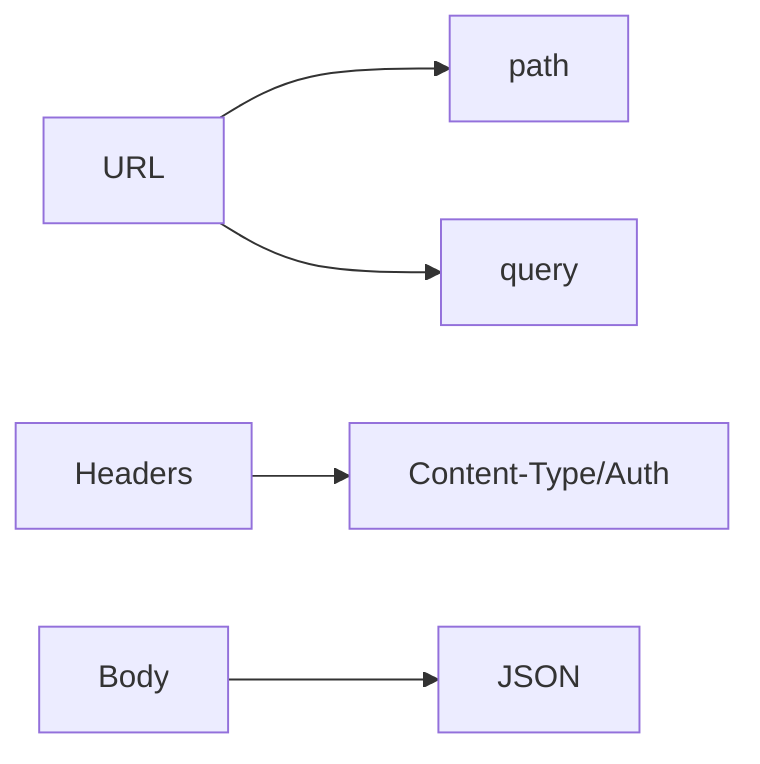

# Day 3 — Lecture Notes (สอนจริง 8 ชั่วโมง)

หน้านี้ออกแบบให้ครูใช้ “พูด + เดโม” ได้ทันที (ไม่ใช่แค่ให้ผู้เรียนอ่าน/ทำตาม Lab)

## สิ่งที่ครูควร “ย้ำ” ทั้งวัน (3 ประโยคทอง)

1) **URL = resource**, method = action, status = outcome  
2) **Express = middleware chain + router matching** (order matters)  
3) **API ที่ดี = predictable** (response contract + status codes + error shape)

## เป้าหมายของวัน (พูดให้ชัดตั้งแต่ต้น)

วันนี้เราไม่ได้ “เรียน Express เพื่อ Express”
แต่เรียนเพื่อ:
- ทำให้ API เขียนง่ายขึ้นจาก Day 2
- ทำให้โค้ด **โตต่อได้** (แยกไฟล์/แยกชั้น)
- ทำให้การ debug ง่าย (middleware + response contract + status codes)

**Output ที่ต้องได้ก่อนเลิกเรียน**
- `GET /api/health`
- `GET /api/books`
- `GET /api/books/:id`
- `GET /api/books?search=&limit=`
- 404 handler + error middleware

---

## Warm-up (10–15 นาที): HTTP refresher (เอาไว้ set vocabulary)

ให้ผู้เรียนตอบ (ยกมือ/พิมพ์ในแชต) ว่าแต่ละอันคืออะไร:
- `GET /api/books/1` → method? path? param? status ที่คาดหวัง?
- `GET /api/books?limit=2` → query คืออะไร ใช้ทำอะไร?
- `Content-Type: application/json` สำคัญยังไง?

สรุปให้ชัดก่อนเริ่ม:
- **params** = ระบุ “ตัวเดียว”
- **query** = ปรับผลลัพธ์
- **body** = payload (ใช้กับ POST/PUT)

---

## Lecture 1 (40–60 นาที): จาก HTTP module → Express (Framework mindset)

### Key message
“Express คือชุดเครื่องมือที่ทำให้เรื่องเดิมง่ายขึ้น + เป็นมาตรฐาน”

### เปรียบเทียบให้เห็นภาพ (concept)
- Day 2: เราต้องทำเองเกือบทั้งหมด (routing, parsing, error patterns)
- Day 3: Express ให้ “โครง” ที่ทุกทีมใช้ร่วมกันได้

### เดโม 1: Routing แบบเดิม vs แบบ Express

ให้เขียนบนกระดาน:
- เป้าหมายเดียวกัน: `GET /api/health` และ `GET /api/books`
- ความต่าง: Express ใช้ `app.get("/path", handler)` เลย

สิ่งที่อยากให้ผู้เรียนสังเกต:
- อ่านแล้วเข้าใจทันทีว่ารับ path ไหน
- แยกความรับผิดชอบได้ง่าย (routes/controllers)

### Checkpoint questions (ถามเร็ว ๆ)
1. ทำไมทีมส่วนใหญ่เลือกใช้ framework แทน built-in `http`?
2. ถ้าเราเพิ่ม endpoint เยอะ ๆ การใช้ if/else routing จะมีปัญหาอะไร?

---

## Lecture 2 (45–75 นาที): Request anatomy (params/query/body/headers)

วาดรูป 1 รูป:



### สคริปต์อธิบาย
- **path** บอก “resource” (เช่น `/api/books`)
- **params** บอก “resource ตัวเดียว” (เช่น `/api/books/:id`)
- **query** บอก “ปรับผลลัพธ์” (search/limit/sort)
- **body** บอก “ข้อมูลที่ส่งมาเพื่อสร้าง/แก้ไข” (วันนี้ปูไว้เพื่อ Day 5)

### เดโม 2: ให้ผู้เรียนเดาว่าอะไรอยู่ในไหน
ให้ตัวอย่าง 3 อัน แล้วถามว่าอ่านจาก `req.params`/`req.query`/`req.body`:
- `/api/books/10`
- `/api/books?search=node&limit=2`
- `POST /api/books` body `{ "title": "..." }`

### Pitfall ที่ต้องย้ำ
- `req.params.id` เป็น string เสมอ → ต้อง `Number(...)`
- `req.body` จะเป็น `undefined` ถ้าไม่มี `express.json()` หรือไม่ส่ง `Content-Type: application/json`

### Micro-exercise (5 นาที)
ให้ผู้เรียนเติม code ให้ครบ:
1) แปลง `id` เป็น number และถ้า `NaN` ให้ตอบ 400  
2) ถ้าไม่พบ book ให้ตอบ 404  
3) ถ้าพบให้ตอบ 200

---

## Lecture 3 (45–75 นาที): Middleware chain + “order matters”

### Key message
“Express ทำงานแบบเรียงตามลำดับที่เรา `app.use/app.get`”

อธิบายด้วย flow:
1) request เข้า
2) ผ่าน middleware ทีละตัว
3) เจอ route ที่ match แล้วจบ
4) ถ้าไม่ match ไป 404 handler
5) ถ้า error ส่งไป error middleware

### เดโม 3: Logger
ให้ใส่ logger แล้วลองเรียก 2 URL เพื่อดูว่า log ออกเหมือนกัน

### Checkpoint questions
1. ถ้าเอา 404 handler ไปไว้ก่อน routes จะเกิดอะไรขึ้น?
2. ถ้าเอา `express.json()` ไปไว้หลัง routes แล้ว `POST` จะเป็นยังไง?

---

## Lecture 3.1 (20–30 นาที): Router vs Controller (Separation of Concerns)

สคริปต์สอน:
- Router = “ประกาศเส้นทาง” (เหมือนแผนที่)
- Controller = “งานของเส้นทางนั้น” (อ่าน req → ตอบ res)

เดโมสั้น:
1) เริ่มจาก `app.get("/api/books", ...)` ใน `index.js`
2) ย้ายไป `routes/books-route.js`
3) ย้าย logic ไป `controllers/books-controller.js`

Checkpoint:
- ถ้า controller เริ่มยาวมาก เราควรย้ายอะไรไปชั้นไหนต่อ (preview Day 5: service layer)?

---

## Lecture 4 (30–60 นาที): Status codes + response contract (ทำให้ API ใช้งานง่าย)

### Key message
“สถานะ (status) บอก outcome, body บอกรายละเอียด”

คู่มือแบบสั้นที่ใช้บ่อย:
- invalid input → `400`
- not found → `404`
- success GET → `200`
- unexpected error → `500`

### Response contract ที่แนะนำให้ทั้งคลาสใช้เหมือนกัน

```js
// success
{ ok: true, data: ... }

// error
{ ok: false, error: { code, message } }
```

เหตุผลที่ควรทำตั้งแต่ Day 3:
- Day 5–10 จะเร็วขึ้นมาก
- debug ง่าย (เห็น `code` ชัด)

### Anti-pattern ที่เจอบ่อย (เตือนให้รู้ก่อน)

- **ตอบ 200 ทุกอย่าง** แล้วบอก error ใน body อย่างเดียว → client แยกเคสยาก
- **ตอบ error คนละ shape** ในแต่ละ endpoint → frontend ต้องเขียน if/else เยอะ
- **404 กับ 400 สลับกัน** → debug ยาก (invalid id ไม่ใช่ not found)

---

## Lecture 5 (30–60 นาที): โครงสร้างโปรเจกต์แบบที่ “ทีมรับช่วงต่อได้”

### แยก role ให้ชัด
- `index.js` = wiring (mount, middleware, start server)
- `routes/` = map URL → handler
- `controllers/` = logic ของ endpoint
- `data/` = data source (วันนี้ in-memory)

### เดโม 4: ให้ผู้เรียนช่วยกัน “ย้ายโค้ด”
เริ่มจาก endpoint ที่อยู่ใน `index.js` แล้ว refactor ไป router/controller

สิ่งที่ควรถามระหว่างทำ:
- อะไรคือ “หน้าที่” ของ router?
- อะไรคือ “หน้าที่” ของ controller?

---

## Lecture 6 (30–45 นาที): Error handling แบบที่ไม่ทำให้ server เด้ง

Key message:
- error ที่คาดการณ์ได้ (invalid input / not found) → ตอบ 400/404 ใน controller ได้เลย
- error ที่ไม่คาดการณ์ได้ (exception) → ให้ error middleware จัดการรูปแบบเดียวกัน

เดโม:
- ทำ 404 handler ให้ทุก route ที่ไม่ match ตอบ JSON shape เดียวกัน
- เพิ่ม error middleware แล้วลอง `next(new Error("boom"))` (ชั่วคราว) เพื่อดู 500

Pitfall:
- วาง 404 handler ก่อน routes → ทุกอย่างกลายเป็น 404
- ไม่มี error middleware → error บางชนิดหลุดจน process เด้ง (ขึ้นอยู่กับการเขียนโค้ด)

---

## ปิดวัน: Retro + Preview

### Retro prompt (ถาม 3 ข้อ)
1. วันนี้ส่วนไหนยากสุด และแก้ยังไง?
2. อะไรคือ 1 อย่างที่ Express ทำให้ชีวิตง่ายขึ้นจริง ๆ?
3. ถ้าพรุ่งนี้ต้องทำ CRUD คุณคิดว่า endpoint ใหม่จะต้องมีอะไรเพิ่มบ้าง?

### Preview Day 4
- ทำหน้า `/books` ด้วย EJS (SSR)
- เริ่มคิดเรื่อง “API vs UI routes” ให้แยกชัด
