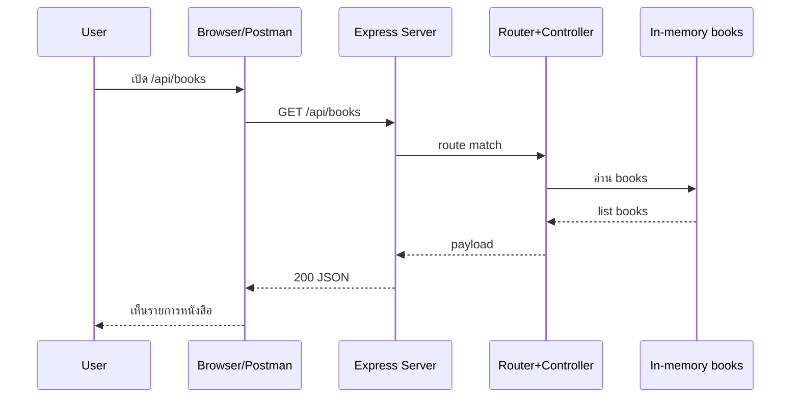

# Day 3: Express.js Core (Hello Express + Routing + Middleware)

Day 3 คือวันที่เราจะ “เปลี่ยนเซิร์ฟเวอร์จาก HTTP module” ใน Day 2 ให้กลายเป็น **Express API** ที่เขียนง่ายกว่า จัดระเบียบง่ายกว่า และต่อยอดเป็น REST API ได้เร็วขึ้น

## Part Breakdown

- **Warm-up** — [HTTP Refresher](./0-http-refresher.md): ทวน method/path/params/query/status ที่ต้องใช้ทั้งวัน
- **Instructor** — [Lecture Notes](./0-lecture-notes.md): สคริปต์สอน+เดโมสำหรับครู
- **Part 1** — [Core Concepts](./1-core-concepts.md): ทำความเข้าใจ Express, routing, middleware แบบ beginner-friendly
- **Part 2** — [Routing + Middleware](./2-routing-and-middleware.md): แยก route/controller, จัด response ให้เป็นมาตรฐาน, และใส่ middleware ที่จำเป็น
- **Part 2.1** — [Params + Query + Status Codes](./3-params-query-and-status-codes.md): ใช้ `:id`, `?search=`, และ `res.status(...)` ให้ถูกต้อง
- **Part 2.2** — [Error Handling + 404](./3-error-handling-and-404.md): ทำ not found handler + error middleware แบบมืออาชีพ
- **Part 3** — [Hands-on Labs](./labs/1-express-foundation.md): **(เริ่มลงมือทำที่นี่)** Lab 1–5
- **Part 4** — [Debugging Checklist](./4-debugging-checklist.md): รวมปัญหาที่เจอบ่อย + วิธีแก้แบบไว
- **Part 5** — [Mini Project](./5-mini-project.md): ทำให้ API พร้อมใช้จริง (health, logging, response contract)

---

## เป้าหมายหลักของวันนี้ (Learning Outcomes)

เมื่อจบวันนี้ คุณจะสามารถ:

- สร้าง Express server และจัดการ lifecycle การรับ/ตอบ request ได้
- แยกโค้ดเป็น `routes/` และ `controllers/` แบบอ่านง่าย
- สร้าง endpoint แรกของโปรเจกต์: `GET /api/health` และ `GET /api/books`
- ใช้ middleware สำหรับ `express.json()` และ request logging
- ออกแบบ response ให้ consistent (เช่น `{ ok, data, error }`)

---

## ตารางสอนแนะนำ (8 ชั่วโมง)

> ปรับเวลาได้ตามความเร็วของห้อง เป้าหมายคือ “ผู้เรียนลงมือทำ + อธิบายเหตุผลได้”

**ช่วงเช้า (4 ชม.)**
- 09:00–09:20 — Recap Day 2 + เป้าหมายของ Day 3 (HTTP → Express)
- 09:20–10:10 — Lecture: Express routing, middleware, `req/res` (Part 1)
- 10:10–10:20 — Break
- 10:20–11:30 — Lab 1–2: สร้าง Express server + `GET /api/health` + `GET /api/books`
- 11:30–12:00 — Review: response contract + status codes (เริ่ม Part 2)

**ช่วงบ่าย (4 ชม.)**
- 13:00–14:10 — Lab 3–4: แยก router/controller + ใส่ middleware + logger
- 14:10–14:20 — Break
- 14:20–15:20 — Lab 6–7: `GET /api/books/:id` + query search/limit (Part 2.1)
- 15:20–16:10 — Lab 8–9: 404 handler + error middleware + status codes (Part 2.2)
- 16:10–17:00 — Lab 5 + Mini Project: API testing drills + Git checkpoint + retro

---

## ก่อนเริ่ม (Pre-work / Setup Checklist)

- มีโปรเจกต์ `library-system` จาก Day 2 (มี `src/data/books.js` และ `src/utils/logger.js` จะยิ่งดี)
- ติดตั้ง `node` และ `npm` แล้ว (`node -v`, `npm -v`)
- มีเครื่องมือทดสอบ API อย่างน้อย 1 อย่าง: Browser, `curl`, หรือ Postman/Thunder Client

---

## System & Flow Diagram

### API Sequence Diagram

### UI Flow
- วันนี้ยังเน้น API (JSON) เป็นหลัก ยังไม่ทำหน้า UI
