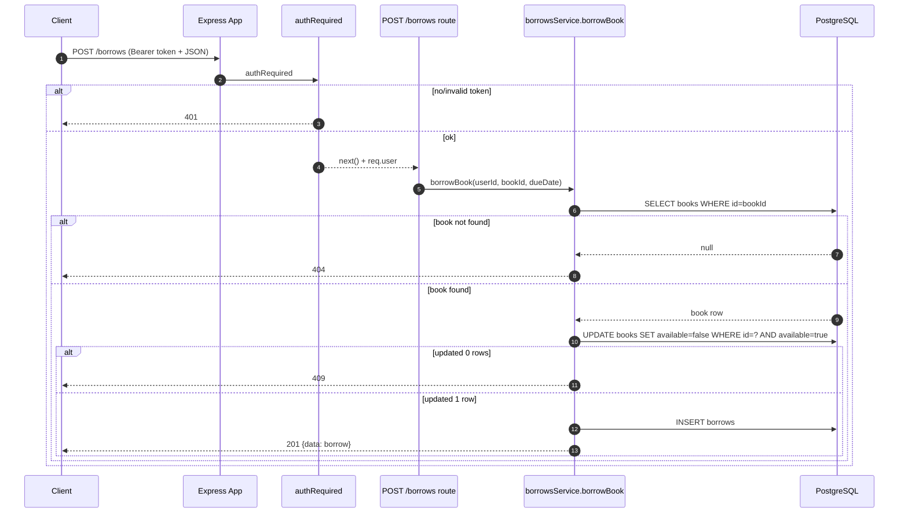

<p align="center">

</p>

ต่อจากของเดิมที่มี `login` และ `me` แล้ว เพิ่มเส้น “ยืมหนังสือ” แบบที่: ต้องล็อกอินก่อน, เช็คสถานะหนังสือ, และทำงานแบบ transaction เพื่อไม่ให้ยืมซ้ำกันได้

เป้าหมาย: สร้าง `POST /borrows` ให้ยืมหนังสือได้

---

- ใน SQL มีตาราง `app.borrows` อยู่แล้ว (จาก `sql/001_init.sql`)
- ในโค้ดมี `authRequired` และ route `POST /auth/login` แล้ว
- ในโค้ดมี `books` table และมี endpoint `GET /books` ให้ดูรายการ

---

## Github

```text
https://github.com/kkpanuwat/day-5-ws-1
```

## 1) สเปกของ `POST /borrows`

**Method:** `POST`  
**Path:** `/borrows`  
**Auth:** ต้องแนบ `Authorization: Bearer <token>`  

**Body (JSON):**

```json
{
  "bookId": 1,
  "dueDate": "2026-03-30"
}
```

เงื่อนไข:

- `bookId` ต้องเป็นตัวเลข
- `dueDate` ต้องเป็นรูปแบบ `YYYY-MM-DD`
- หนังสือต้องมีอยู่จริง
- หนังสือต้อง `available=true` ถึงจะยืมได้

**Response:**

- สำเร็จ: `201`
- ไม่ล็อกอิน: `401`
- ข้อมูลไม่ครบ/ไม่ถูก: `400`
- ไม่เจอหนังสือ: `404`
- หนังสือไม่ว่าง: `409`

---

## 2) ออกแบบการยืมให้ “ยืมซ้ำไม่ได้”

ปัญหาที่เกิดบ่อยเวลาเขียนระบบยืมหนังสือคือ “สองคนกดยืมพร้อมกัน” แล้วทั้งสองคนผ่านได้ ถ้าเราเช็คแบบนี้:

1) อ่านค่า `available`  
2) ถ้า `available=true` ค่อย `UPDATE`  

เพราะทั้งสอง request สามารถ “อ่านทันกัน” ว่า `available=true` ได้เหมือนกัน

วิธีที่เราใช้ใน workshop นี้คือให้ DB เป็นคนตัดสินด้วยการ “จองหนังสือ” ก่อน:

```sql
UPDATE app.books
SET available = false
WHERE id = $1 AND available = true;
```

แปลผล:

- ถ้า update แล้วกระทบ **1 แถว** → จองสำเร็จ (เล่มนี้เพิ่งถูกเปลี่ยนจาก `true` เป็น `false`) → ค่อย insert ลง `borrows`
- ถ้า update แล้วกระทบ **0 แถว** → มีสองกรณี
  - ไม่เจอหนังสือ (ไม่มี id นี้)
  - หรือเจอแต่ไม่ว่างแล้ว (`available=false`) เพราะมีคนอื่นจองไปก่อน

เพื่อแยก `404` กับ `409` เราเลยเช็ค “มีหนังสือจริงไหม” ก่อน 1 ครั้ง (`bookExists`)

สุดท้ายเพื่อให้ขั้นตอน “จอง + insert” ติดกัน เราจะทำเป็น SQL เดียวด้วย CTE (ดูที่ฟังก์ชัน `borrowBook()` ใน repo)

---

## Sequence Diagram



---

## 3) เพิ่ม repo สำหรับ borrows

สร้างไฟล์ `src/repositories/borrows.repo.js`

สิ่งที่ควรมี:

- `bookExists(bookId)` → ใช้แยกเคส 404
- `borrowBook({ userId, bookId, dueDate })` → ทำ “claim + insert” ให้จบในคำสั่งเดียว

ตัวอย่างโค้ด:

```js
const pool = require('../db/pool');
const env = require('../config/env');

function qualify(table) {
  return `${env.dbSchema}.${table}`;
}

async function bookExists(bookId) {
  const sql = `SELECT 1 AS ok FROM ${qualify('books')} WHERE id = $1`;
  const result = await pool.query(sql, [bookId]);
  return result.rowCount > 0;
}

async function borrowBook({ userId, bookId, dueDate }) {
  const sql = `
    WITH claimed AS (
      UPDATE ${qualify('books')}
      SET available = false
      WHERE id = $1 AND available = true
      RETURNING id
    ), inserted AS (
      INSERT INTO ${qualify('borrows')} (user_id, book_id, due_date)
      SELECT $2, id, $3
      FROM claimed
      RETURNING id, user_id, book_id, borrowed_at, due_date, returned_at
    )
    SELECT *
    FROM inserted
  `;
  const result = await pool.query(sql, [bookId, userId, dueDate]);
  return result.rows[0] || null;
}

module.exports = { bookExists, borrowBook };
```

---

## 4) เพิ่ม service สำหรับ borrow

สร้างไฟล์ `src/services/borrows.service.js`

ไอเดีย: service เป็นคนเช็คเงื่อนไขและเรียก repo ให้ยืม

```js
const borrowsRepo = require('../repositories/borrows.repo');

function badRequest(message) {
  const err = new Error(message);
  err.status = 400;
  return err;
}

function conflict(message) {
  const err = new Error(message);
  err.status = 409;
  return err;
}

function notFound(message) {
  const err = new Error(message);
  err.status = 404;
  return err;
}

async function borrowBook({ userId, bookId, dueDate }) {
  if (!Number.isFinite(bookId)) throw badRequest('bookId is required');
  if (typeof dueDate !== 'string' || !/^\d{4}-\d{2}-\d{2}$/.test(dueDate)) {
    throw badRequest('dueDate must be YYYY-MM-DD');
  }

  const exists = await borrowsRepo.bookExists(bookId);
  if (!exists) throw notFound('Book not found');

  const borrow = await borrowsRepo.borrowBook({ userId, bookId, dueDate });
  if (!borrow) throw conflict('Book is not available');
  return borrow;
}

module.exports = { borrowBook };
```

---

## 5) เพิ่ม route `POST /borrows`

สร้างไฟล์ `src/routes/borrows.routes.js`

```js
const express = require('express');
const authRequired = require('../middlewares/authRequired');
const borrowsService = require('../services/borrows.service');

const router = express.Router();

router.post('/', authRequired, async (req, res, next) => {
  try {
    const bookId = Number(req.body?.bookId);
    const dueDate = req.body?.dueDate;

    const borrow = await borrowsService.borrowBook({
      userId: Number(req.user.sub),
      bookId,
      dueDate,
    });

    res.status(201).json({ data: borrow });
  } catch (err) {
    if (err && err.status) return res.status(err.status).json({ message: err.message });
    next(err);
  }
});

module.exports = router;
```

จากนั้น mount ใน `src/app.js`:

```js
const borrowsRouter = require('./routes/borrows.routes');
app.use('/borrows', borrowsRouter);
```

---

## 6) ทดสอบด้วย curl

1) login เอา token:

```bash
curl -sS -X POST http://localhost:3000/auth/login \
  -H 'Content-Type: application/json' \
  --data '{"email":"alice@example.com","password":"P@ssw0rd1234"}'
```

2) ยืมหนังสือ:

```bash
TOKEN="PUT_TOKEN_HERE"
curl -i -X POST http://localhost:3000/borrows \
  -H 'Content-Type: application/json' \
  -H "Authorization: Bearer $TOKEN" \
  --data '{"bookId":1,"dueDate":"2026-03-30"}'
```

3) ยืมซ้ำเล่มเดิม ต้องได้ `409`

---

- ไม่มี token ต้องได้ `401`
- bookId ไม่ใช่ตัวเลขต้องได้ `400`
- book ไม่เจอต้องได้ `404`
- book ไม่ว่างต้องได้ `409`
- ยืมสำเร็จแล้ว `books.available` ต้องกลายเป็น `false`
