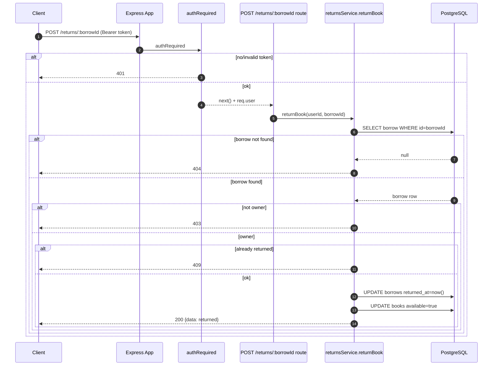

<p align="center">

</p>

workshop นี้ต่อจาก Workshop 1 (มี `POST /borrows` แล้ว) เราจะทำเส้น “คืนหนังสือ” ให้ครบ

เป้าหมาย: สร้าง `POST /returns/:borrowId`

---

```text
https://github.com/kkpanuwat/day-5-ws-1
```

## 1) สเปกของ `POST /returns/:borrowId`

**Method:** `POST`  
**Path:** `/returns/:borrowId`  
**Auth:** ต้องแนบ `Authorization: Bearer <token>`

เงื่อนไข:

- `borrowId` ต้องเป็นตัวเลข
- คืนได้เฉพาะคนที่เป็นเจ้าของ borrow (`borrow.user_id` ต้องตรงกับ `req.user.sub`)
- ถ้าคืนไปแล้ว (`returned_at` ไม่เป็น null) ให้ตอบ `409`

**Response:**

- สำเร็จ: `200` (หรือ `201` ก็ได้ แต่แนะนำ `200`)
- ไม่ล็อกอิน: `401`
- borrowId ไม่ถูก: `400`
- ไม่เจอ borrow: `404`
- ไม่ใช่เจ้าของ: `403`
- คืนซ้ำ: `409`

---

## Sequence Diagram



---

## 2) เพิ่ม repo สำหรับคืนหนังสือ

เพิ่มไฟล์ `src/repositories/returns.repo.js`

สิ่งที่ควรมี:

- `getBorrowById(borrowId)` → ใช้เช็ค 404/403/409
- `returnBorrow({ borrowId, userId })` → update returned_at และ set หนังสือ available กลับ (ทำเป็นชุดเดียว)

ตัวอย่าง:

```js
const pool = require('../db/pool');
const env = require('../config/env');

function qualify(table) {
  return `${env.dbSchema}.${table}`;
}

async function getBorrowById(borrowId) {
  const sql = `
    SELECT id, user_id, book_id, returned_at
    FROM ${qualify('borrows')}
    WHERE id = $1
    LIMIT 1
  `;
  const result = await pool.query(sql, [borrowId]);
  return result.rows[0] || null;
}

async function returnBorrow({ borrowId, userId }) {
  const sql = `
    WITH updated AS (
      UPDATE ${qualify('borrows')}
      SET returned_at = now()
      WHERE id = $1 AND user_id = $2 AND returned_at IS NULL
      RETURNING id, user_id, book_id, borrowed_at, due_date, returned_at
    ), book AS (
      UPDATE ${qualify('books')}
      SET available = true
      WHERE id = (SELECT book_id FROM updated)
    )
    SELECT *
    FROM updated
  `;
  const result = await pool.query(sql, [borrowId, userId]);
  return result.rows[0] || null;
}

module.exports = { getBorrowById, returnBorrow };
```

---

## 3) เพิ่ม service: return (มี authorization)

สร้าง `src/services/returns.service.js`

```js
const returnsRepo = require('../repositories/returns.repo');

function badRequest(message) {
  const err = new Error(message);
  err.status = 400;
  return err;
}

function forbidden(message) {
  const err = new Error(message);
  err.status = 403;
  return err;
}

function conflict(message) {
  const err = new Error(message);
  err.status = 409;
  return err;
}

function notFound(message) {
  const err = new Error(message);
  err.status = 404;
  return err;
}

async function returnBook({ userId, borrowId }) {
  if (!Number.isFinite(borrowId)) throw badRequest('borrowId is required');

  const borrow = await returnsRepo.getBorrowById(borrowId);
  if (!borrow) throw notFound('Borrow not found');
  if (Number(borrow.user_id) !== Number(userId)) throw forbidden('Forbidden');
  if (borrow.returned_at) throw conflict('Already returned');

  const updated = await returnsRepo.returnBorrow({ borrowId, userId });
  if (!updated) throw conflict('Already returned');
  return updated;
}

module.exports = { returnBook };
```

---

## 4) เพิ่ม route `POST /returns/:borrowId`

สร้าง `src/routes/returns.routes.js`

```js
const express = require('express');
const authRequired = require('../middlewares/authRequired');
const returnsService = require('../services/returns.service');

const router = express.Router();

router.post('/:borrowId', authRequired, async (req, res, next) => {
  try {
    const borrowId = Number(req.params.borrowId);
    const returned = await returnsService.returnBook({
      userId: Number(req.user.sub),
      borrowId,
    });
    res.json({ data: returned });
  } catch (err) {
    if (err && err.status) return res.status(err.status).json({ message: err.message });
    next(err);
  }
});

module.exports = router;
```

mount ใน `src/app.js`:

```js
const returnsRouter = require('./routes/returns.routes');
app.use('/returns', returnsRouter);
```

---

## 5) ทดสอบ

1) ไปยืมหนังสือให้ได้ borrow id มาก่อน (จาก Workshop 1)

2) คืน:

```bash
TOKEN="PUT_TOKEN_HERE"
curl -i -X POST http://localhost:3000/returns/1 \
  -H "Authorization: Bearer $TOKEN"
```

3) คืนซ้ำ ต้องได้ `409`

4) ลองใช้ token ของ user คนอื่นมาคืน ต้องได้ `403`

---

## 6) การบ้าน

- ทำ `GET /borrows/me` ให้ดูรายการยืมของตัวเอง (ต้อง auth)
