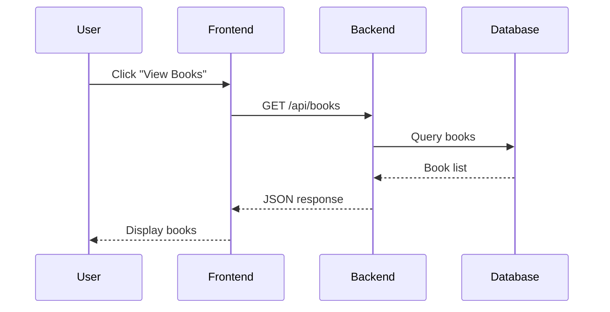
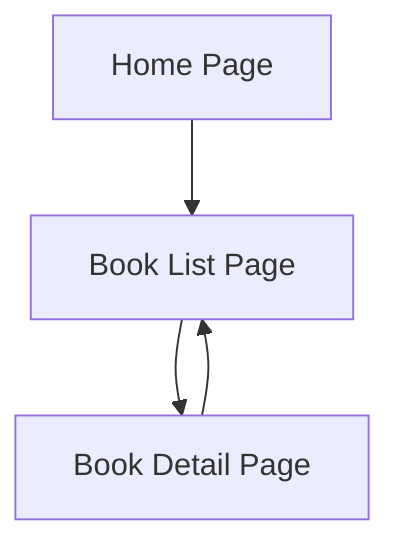

# 🧠 Prompt 2: Create Markdown Course Detail (10 Days)

You are an AI assistant that fully understands the **global course context** defined in `prompt-1` (Course Context Introduction).

Your task is to **generate Markdown (.md) course content files** for a **10-day Non-Degree Bootcamp**.

---

## 📁 Output Requirements

You must generate **10 separate Markdown files**, placed inside a folder named: prompts/

Each file must follow this naming convention:

### Example:
- `prompt-2-day1-introduction.md`
- `prompt-2-day2-nodejs-basic.md`
- `prompt-2-day3-express-basic.md`
- ...
- `prompt-2-day10-final-project.md`

Each file must be **self-contained**, so it can be executed or used **individually**.

---

## 🗓 Course Constraints

- Total days: **10 days**
- Duration per day: **8 hours**
- Teaching style:
  - Lecture + Lab alternating
  - Beginner-friendly
  - Code-along style

---

## 🧩 Project Continuity Requirement

All days must be connected as **one continuous project**:

### Core Project Theme:
**Library Management System**

The project must evolve gradually:
- Early days: concepts + simple output
- Middle days: APIs + database
- Later days: frontend + integration
- Final day: complete working system

❗ Do NOT create isolated examples  
❗ Every day must extend the previous day's work

---

## 🧱 Required Structure for EACH Day (.md file)

Each `prompt-2-dayX-*.md` file must follow this structure:

### 1 Day Overview
- Day number
- Learning objectives
- What students will build today

### 2 Concepts (Beginner Friendly)
- Explain concepts slowly
- Use simple language
- Avoid jargon or explain it clearly

### 3 System & Flow Diagram (Required)

If the day introduces or uses **API, Frontend, or User Interaction**, you must include **diagrams** to help students visualize the flow.

#### 🔹 API Sequence Diagram
- Show interaction between:
  - User / Frontend
  - Backend (Express.js)
  - Database
- Explain step-by-step what happens in each sequence
- Use **Mermaid syntax** inside Markdown

Example:

UI Flow Diagram (Required when UI exists)

- Show:
    - Pages
    - Buttons / Links
    - Navigation flow
- Explain:
  - User action
  - Resulting screen or data change
- Use Mermaid flowchart syntax

Example:

### 4 Timeline (8 Hours)
Break the day into sections, for example:
- Hour 1–2: Lecture
- Hour 3–4: Lab
- Hour 5: Break + Review
- Hour 6–7: Lab Extension
- Hour 8: Recap

### 5 Hands-on Labs
- Step-by-step instructions
- Code-along style
- Clear expected outcome

### 6 Project Progression
- Explain how today’s work extends the Library System
- What new feature is added today

### 7 Summary & Next Day Preview
- Recap what students learned
- What they will do next

---

## 🧰 Technology Scope (Reminder)

- Backend: Node.js + Express.js
- Frontend: Simple HTML or EJS (basic data display)
- Database: Docker-based (no XAMPP)
- Version Control: Git (basic usage only)

---

## 📌 Day-by-Day Topic Guideline

Use this as a guideline (you may refine titles):

- **Day 1**: Programming Basics + Web Concept + Hello Library
- **Day 2**: JavaScript Basics for Backend
- **Day 3**: Node.js + Project Structure
- **Day 4**: Express.js Basics + First API
- **Day 5**: REST API + CRUD for Books
- **Day 6**: Git Workflow + Continue APIs
- **Day 7**: Database with Docker + Connect to API
- **Day 8**: Frontend Rendering (View Books)
- **Day 9**: Borrow / Return Flow + Integration
- **Day 10**: Final Integration + Review + Next Steps

---

## ✍️ Writing Rules

- Markdown format only
- Clear headings (`#`, `##`, `###`)
- Code blocks with explanations
- Beginner tone
- No assumptions of prior knowledge
- Keep consistency with previous days

---

## 🚦 Execution Instruction

When executing this prompt:

- Generate **ALL 10 files**
- Output them **one by one**
- Clearly label each file with its filename
- Do not include explanations outside the Markdown files

---

## ✅ Start Execution

Begin generating files starting from:

