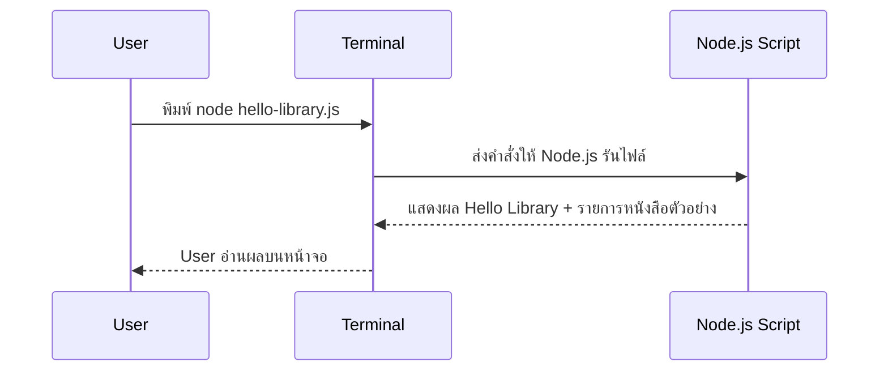

# Day 1: Programming Basics + Hello Library

Day 1 คือการปูพื้นฐานทุกอย่างที่ผู้เรียนต้องรู้ก่อนเริ่มสร้าง Library Management System ตั้งแต่แนวคิดโปรแกรมมิ่ง การใช้ Terminal ไปจนถึง Git commit แรก

## วิธีอ่าน
- อ่านเรียงตามลำดับเพื่อไล่ตั้งแต่ภาพรวม → คอนเซ็ปต์ → แบบฝึกหัด
- แต่ละช่วงควรจบด้วยการ “ลองทำจริง” หรือจดสรุปสั้น ๆ ใน `README.md`

## Part Breakdown (สรุปหัวข้อทั้งวัน)
- Part 1 — Overview & Objectives
- Part 2 — Core Concepts for Beginners
- Part 3 — JavaScript Fundamentals (พื้นฐานที่จำเป็นสำหรับแล็บ)
- Part 4 — System & Flow Diagrams
- Part 5 — Git Basics
- Part 6 — Hands-on Labs
- Part 7 — Progress & Summary

## 1. Day Overview
- วัน: Day 1 (เริ่มต้นค่าย Non-Degree Node.js + Express.js Bootcamp)
- โฟกัสหลัก:
  - เข้าใจหลักการทำงานของโปรแกรม (Input → Process → Output)
  - แนวคิดพื้นฐานของ Web: Request / Response
  - การใช้งาน Terminal
  - การรัน JavaScript ด้วย Node.js
- Output ที่ต้องได้เมื่อจบวัน:
  - โฟลเดอร์โปรเจกต์ `library-system`
  - สคริปต์ `hello-library.js`
  - บันทึกสิ่งที่เรียนใน `README.md`
  - Git commit แรก
- วัตถุประสงค์การเรียนรู้ (Learning Objectives):
  1. อธิบายการทำงานของ “โปรแกรม”
  2. เข้าใจภาพรวม User → Terminal → Node.js → Output ในมุม Request / Response
  3. ใช้ Terminal เบื้องต้นได้ (เช่น `pwd`, `ls`, `mkdir`, `cd`, `node file.js`)
  4. สร้างโครงสร้างโปรเจกต์พร้อม `package.json`, `README.md`, `hello-library.js`
  5. เขียน JavaScript พื้นฐาน: `console.log`, Array, `forEach`
  6. ทำ Git commit เพื่อเก็บ snapshot งาน

> Checklist: ถ้าตอบตัวเองได้ครบทุกข้อ แปลว่าพร้อมเข้าสู่แล็บได้ลื่นขึ้น

## 2. Concepts (Beginner Friendly)
### โปรแกรมคืออะไร
- เปรียบเทียบกับสูตรทำอาหาร: เราเขียนชุดคำสั่งให้คอมพิวเตอร์ทำทีละขั้น
- โครงสร้างคิดแบบง่าย: **Input → Process → Output**
  - Input: ข้อมูลที่รับเข้ามา (เช่น รายชื่อหนังสือ)
  - Process: การประมวลผล (เช่น นับจำนวน, วนลูปแสดงผล)
  - Output: ผลลัพธ์ที่แสดงให้ผู้ใช้ (เช่น ข้อความใน Terminal)
- Node.js คือโปรแกรมที่ “รัน JavaScript” ฝั่ง Backend (นอก Browser)

### Web Overview
- User/Client (เช่น Browser/Terminal) ส่งคำขอ (Request) ไปยัง Server
- Server (Node.js + Express ในวันถัด ๆ ไป) ประมวลผล แล้วส่งผลลัพธ์ (Response) กลับมา
- โปรเจกต์ Library Management System จะมี Client, Backend, Database, Frontend ทำงานร่วมกัน
- Flow ที่เราทำใน Day 1 (แบบง่ายสุด):
  1. User พิมพ์ `node hello-library.js` ใน Terminal
  2. Node.js รันโค้ดและสร้าง Output
  3. Terminal แสดงผลให้ User อ่าน

### Terminal เบื้องต้น
- Terminal คือหน้าต่างที่พิมพ์คำสั่งได้ทีละบรรทัด
- คำสั่งพื้นฐาน: `pwd`, `ls`, `mkdir`, `cd`, `node file.js`, `git status`
- ใช้คำสั่ง `node hello-library.js` เพื่อรันไฟล์ JS

### โครงสร้างไฟล์เบื้องต้น
- สร้างโฟลเดอร์ `library-system` แล้วได้โครงสร้างประมาณนี้:
  ```
  library-system/
  ├─ README.md
  ├─ package.json
  └─ hello-library.js
  ```
- ทุกวันถัดไปจะต่อยอดจากโฟลเดอร์นี้

## 3. System & Flow Diagram
### API Sequence Diagram


### UI Flow Diagram
วันนี้ยังไม่มี UI บนหน้าเว็บ จึงเน้นการโต้ตอบผ่าน Terminal เท่านั้น

## 4. Timeline (8 Hours)
- ชั่วโมง 1: แนะนำค่าย + เป้าหมาย Library System
- ชั่วโมง 2: เล่าแนวคิดโปรแกรมและ Web Request/Response
- ชั่วโมง 3: Workshop ใช้ Terminal, ติดตั้ง Node.js (หากยังไม่ได้)
- ชั่วโมง 4: สร้างโฟลเดอร์ project, อธิบายโครงสร้างไฟล์
- ชั่วโมง 5: Lecture JavaScript ตัวแปร, Array, การแสดงผลด้วย `console.log`
- ชั่วโมง 6: Lab เขียน `hello-library.js` และรัน
- ชั่วโมง 7: Review + เพิ่มฟังก์ชันเล็ก ๆ เช่นนับจำนวนหนังสือ
- ชั่วโมง 8: Recap + เขียนบันทึกสิ่งที่ได้เรียน + Preview Day 2

## 5. Hands-on Labs
### ก่อนเริ่ม (Prerequisites)
เช็กเครื่องมือให้พร้อม:
```bash
node -v
npm -v
git --version
code .
```

### Lab 1: ตั้งค่าโฟลเดอร์ Library System
1. เปิด Terminal พิมพ์ `mkdir library-system && cd library-system`
2. พิมพ์ `npm init -y` เพื่อสร้างไฟล์ `package.json` (อธิบายว่าเก็บข้อมูล project)
3. สร้างไฟล์ `.gitignore` และใส่:
   ```
   node_modules/
   ```
4. สร้างไฟล์ `README.md` แล้วให้ผู้เรียนจด bullet “สิ่งที่ได้เรียนวันนี้”
5. สร้างไฟล์ `hello-library.js`
6. เปิดโฟลเดอร์ใน VS Code (`code .`)

### Lab 2: เขียนโค้ด Hello Library
```javascript
// hello-library.js
const libraryName = "My Awesome Library";
const books = [
  "Clean Code",
  "Designing Data-Intensive Applications",
  "Node.js in Action",
  "The Pragmatic Programmer",
];

console.log("สวัสดีจาก", libraryName);
console.log("วันนี้มีหนังสือในระบบ", books.length, "เล่ม");
console.log("--- รายการหนังสือทั้งหมด ---");
books.forEach((book, index) => {
  console.log(index + 1 + ". " + book);
});
```
4. รัน `node hello-library.js`
5. ให้ผู้เรียนลองเพิ่มหนังสืออีก 1 รายการแล้วรันใหม่

### Mini Challenges (โยงกับ Conditional Logic)
1. ถ้า `books.length === 0` ให้แสดง `"ยังไม่มีหนังสือในระบบ"`
2. ถ้ามีหนังสือมากกว่า 3 เล่ม ให้แสดง `"หนังสือเยอะมาก! เลือกอ่านได้เลย"`
3. (ท้าทาย) ให้แสดงเฉพาะหนังสือที่ชื่อยาวเกิน 15 ตัวอักษร (ใช้ `if` ใน `forEach`)

### Lab 3: สรุปผ่าน Git เบื้องต้น
1. พิมพ์ `git init`
2. `git status` (อธิบายไฟล์ที่ยังไม่ถูก track / staged)
3. `git diff` (ดูว่าแก้อะไรไปก่อนถ่าย snapshot)
4. `git add .`
5. `git status` อีกรอบเพื่อเช็กว่า staged แล้ว
6. `git commit -m "feat: add hello-library script"`
7. `git log --oneline` เพื่อยืนยันว่า commit ถูกบันทึกแล้ว
8. จดสรุปลง `README.md` ว่า commit คือการ “ถ่ายรูป” งานเก็บไว้ย้อนกลับได้

### Troubleshooting (ปัญหาที่พบบ่อย)
- `code: command not found`: VS Code → `Cmd+Shift+P` → `Shell Command: Install 'code' command in PATH`
- `git commit` แล้วขึ้นให้ตั้งค่า user:
  ```bash
  git config --global user.name "Your Name"
  git config --global user.email "you@example.com"
  ```
- `node: command not found`: ติดตั้ง/อัปเดต Node.js แล้วเปิด Terminal ใหม่ จากนั้นเช็ก `node -v`

## 6. Project Progression
- วันนี้ตั้งรากฐานโปรเจกต์: โฟลเดอร์หลัก, รัน Node.js ได้, มีข้อมูลหนังสือใน Array
- ทุกวันถัดไปจะค่อย ๆ ต่อจาก “สคริปต์ในเครื่อง” → “Server” → “API” → “Database” → “Frontend”

## 7. Summary & Next Day Preview
- ผู้เรียนเข้าใจความสัมพันธ์ User -> Server แบบง่าย และรู้จัก Terminal + Node.js
- ได้ลองสร้างไฟล์ JavaScript แรกและรันจริง
- วันพรุ่งนี้ (Day 2) จะเรียน JavaScript ลึกขึ้น เช่นตัวดำเนินการ, ฟังก์ชัน, การจัดโครงสร้างข้อมูล เพื่อเตรียมสร้าง logic เพิ่มในระบบห้องสมุด
