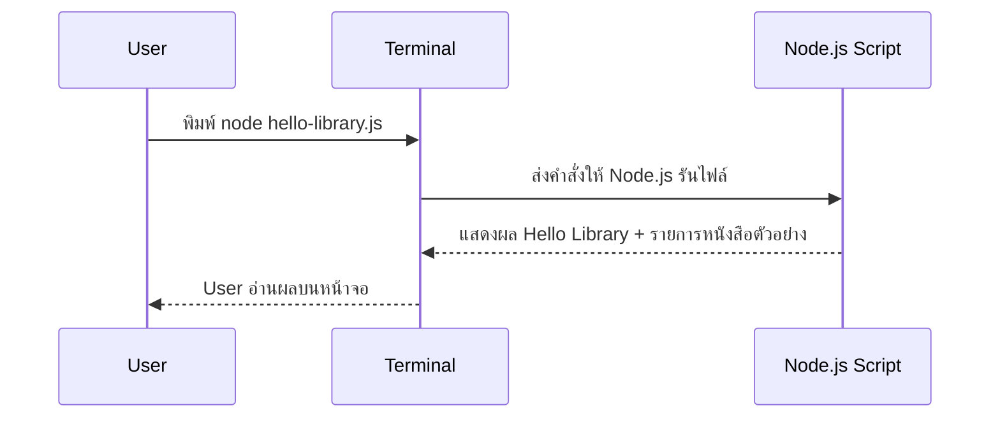

# Day 1: Programming Basics + Hello Library

## 1. Day Overview
- วัน: Day 1 (เริ่มต้นค่าย Non-Degree Node.js + Express.js Bootcamp)
- วัตถุประสงค์การเรียนรู้: เข้าใจแนวคิดพื้นฐานของโปรแกรม, การทำงานของเว็บอย่างง่าย, ทดลองใช้ Terminal, รันโค้ด JavaScript แรก
- สิ่งที่จะสร้างวันนี้: สคริปต์ Node.js ชื่อ `hello-library.js` ที่พิมพ์ข้อความทักทายระบบห้องสมุดแบบง่าย พร้อมแสดงรายการหนังสือตัวอย่างจากตัวแปรในหน่วยความจำ

## 2. Concepts (Beginner Friendly)
### โปรแกรมคืออะไร
- เปรียบเทียบกับสูตรทำอาหาร: เราเขียนชุดคำสั่งให้คอมพิวเตอร์ทำทีละขั้น
- Node.js คือโปรแกรมที่อ่าน JavaScript แล้วทำตามคำสั่งของเราในฝั่ง Backend

### Web Overview
- User ใช้ Browser หรือ Terminal ส่งคำขอ (Request) ไปยัง Server
- Server รันโค้ด Node.js เพื่อประมวลผลแล้วส่งผลลัพธ์ (Response) กลับมา
- Project Library Management System จะมี User, Backend, Database, Frontend ทำงานร่วมกัน

### Terminal เบื้องต้น
- Terminal คือหน้าต่างที่พิมพ์คำสั่งได้ทีละบรรทัด
- ใช้คำสั่ง `node hello-library.js` เพื่อรันไฟล์ JS

### โครงสร้างไฟล์เบื้องต้น
- สร้างโฟลเดอร์ `library-system`
- ภายในมีไฟล์ `hello-library.js` และไฟล์ README สำหรับจดบันทึก

## 3. System & Flow Diagram
### API Sequence Diagram


### UI Flow Diagram
วันนี้ยังไม่มี UI บนหน้าเว็บ จึงเน้นการโต้ตอบผ่าน Terminal เท่านั้น

## 4. Timeline (8 Hours)
- ชั่วโมง 1: แนะนำค่าย + เป้าหมาย Library System
- ชั่วโมง 2: เล่าแนวคิดโปรแกรมและ Web Request/Response
- ชั่วโมง 3: Workshop ใช้ Terminal, ติดตั้ง Node.js (หากยังไม่ได้)
- ชั่วโมง 4: สร้างโฟลเดอร์ project, อธิบายโครงสร้างไฟล์
- ชั่วโมง 5: Lecture JavaScript ตัวแปร, Array, การแสดงผลด้วย `console.log`
- ชั่วโมง 6: Lab เขียน `hello-library.js` และรัน
- ชั่วโมง 7: Review + เพิ่มฟังก์ชันเล็ก ๆ เช่นนับจำนวนหนังสือ
- ชั่วโมง 8: Recap + เขียนบันทึกสิ่งที่ได้เรียน + Preview Day 2

## 5. Hands-on Labs
### Lab 1: ตั้งค่าโฟลเดอร์ Library System
1. เปิด Terminal พิมพ์ `mkdir library-system && cd library-system`
2. พิมพ์ `npm init -y` เพื่อสร้างไฟล์ `package.json` (อธิบายว่าเก็บข้อมูล project)
3. สร้างไฟล์ `hello-library.js`

### Lab 2: เขียนโค้ด Hello Library
```javascript
// hello-library.js
const libraryName = "Library Management System"; // เก็บชื่อระบบ
const books = ["Clean Code", "Designing Data-Intensive Applications", "Node.js in Action"]; // รายการหนังสือทดลอง

console.log("สวัสดีจาก", libraryName);
console.log("วันนี้มีหนังสือในระบบ", books.length, "เล่ม");
console.log("รายการหนังสือ:");
books.forEach((book, index) => {
  console.log(index + 1 + ".", book);
});
```
4. รัน `node hello-library.js`
5. ให้ผู้เรียนลองเพิ่มหนังสืออีก 1 รายการแล้วรันใหม่

### Lab 3: สรุปผ่าน Git เบื้องต้น
1. พิมพ์ `git init`
2. ใช้ `git add .` และ `git commit -m "feat: hello library"`
3. อธิบายว่าการ Commit คือการบันทึกเวอร์ชันงานไว้ย้อนกลับได้

## 6. Project Progression
- วันนี้ตั้งรากฐาน project: โฟลเดอร์หลัก, รัน Node.js ได้, มีข้อมูลหนังสือใน Array
- วางภาพรวม Library System ให้ทุกคนเข้าใจว่าวันถัดไปจะต่อยอดจากไฟล์นี้ให้ฉลาดขึ้นทีละขั้น

## 7. Summary & Next Day Preview
- ผู้เรียนเข้าใจความสัมพันธ์ User -> Server แบบง่าย และรู้จัก Terminal + Node.js
- ได้ลองสร้างไฟล์ JavaScript แรกและรันจริง
- วันพรุ่งนี้ (Day 2) จะเรียน JavaScript ลึกขึ้น เช่นตัวดำเนินการ, ฟังก์ชัน, การจัดโครงสร้างข้อมูล เพื่อเตรียมสร้าง logic เพิ่มในระบบห้องสมุด
