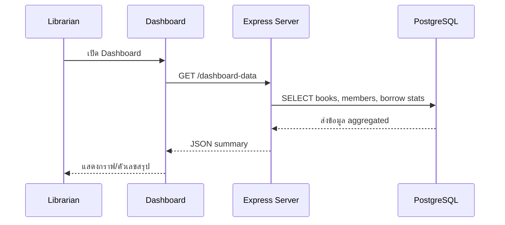
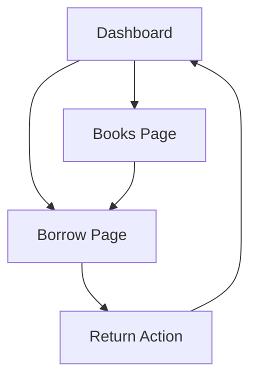

# Day 10: Final Integration + Review + Next Steps

## 1. Day Overview
- วัน: Day 10
- วัตถุประสงค์: รวมทุกส่วนของ Library Management System, เขียนเอกสาร API/Frontend สั้น ๆ, เตรียม Demo, สรุปแนวทางต่อยอด
- สิ่งที่จะสร้าง: หน้า Dashboard รวมสถานะ, เอกสาร API Markdown, Checklist Deployment เบื้องต้น

## 2. Concepts (Beginner Friendly)
### Final Integration Checklist
- Backend API ทำงานครบ (Books, Members, Borrow/Return)
- Frontend มีหน้า Books + Borrow + Dashboard
- Database ผ่าน Docker พร้อม script seed

### Documentation & Demo
- README/เอกสารอธิบายวิธีรัน project
- API Table ระบุ method, path, body, response
- เตรียมสคริปต์การ Demo ให้ไหลลื่น (ใครบอกอะไรบ้าง)

### Basic Deployment Idea
- ใช้คำสั่ง `docker compose up` ในเครื่องจริงหรือ VM
- ใช้ `npm run start` ด้วย PM2 (อธิบายแนวคิด ไม่ต้องลงรายละเอียด)

## 3. System & Flow Diagram
### API Sequence Diagram


### UI Flow Diagram


## 4. Timeline (8 Hours)
- ชั่วโมง 1: Recap Day 1-9 แบบเร็ว + ตอบคำถามที่ค้าง
- ชั่วโมง 2: วางแผน Demo + Checklist การ integrate
- ชั่วโมง 3: Lab สร้าง endpoint `/dashboard-data`
- ชั่วโมง 4: Lab สร้าง view Dashboard + card แสดงตัวเลข
- ชั่วโมง 5: พัก + เตรียม script demo ทีมละกลุ่ม
- ชั่วโมง 6: Lab เขียน Markdown API doc + README update
- ชั่วโมง 7: ซ้อม Demo + feedback
- ชั่วโมง 8: Final presentation + แบ่งปัน next steps

## 5. Hands-on Labs
### Lab 1: Dashboard Endpoint
```javascript
// src/controllers/dashboard-controller.js
const bookRepo = require("../repositories/book-repository");
const memberRepo = require("../repositories/member-repository");
const borrowRepo = require("../repositories/borrow-repository");

async function getDashboardData(req, res) {
  const [books, members, activeBorrows] = await Promise.all([
    bookRepo.listBooks(),
    memberRepo.listMembers(),
    borrowRepo.listActiveBorrows(),
  ]);
  res.json({
    booksTotal: books.length,
    membersTotal: members.length,
    activeBorrows: activeBorrows.length,
  });
}

module.exports = { getDashboardData };
```
- Route: `app.get("/dashboard-data", getDashboardData);`

### Lab 2: Dashboard View
```html
<% layout('layout') %>
<section>
  <h2>Dashboard</h2>
  <div class="stats">
    <article>
      <h3>Books</h3>
      <p><%= booksTotal %></p>
    </article>
    <article>
      <h3>Members</h3>
      <p><%= membersTotal %></p>
    </article>
    <article>
      <h3>Active Borrows</h3>
      <p><%= activeBorrows %></p>
    </article>
  </div>
</section>
```
- Route frontend: เรียก `/dashboard-data` แล้วส่งค่าลง render หรือใช้ fetch ใน script

### Lab 3: API Documentation Markdown
สร้างไฟล์ `docs/api-library.md`
```markdown
# Library API
| Method | Path | Body | Description |
|--------|------|------|-------------|
| GET | /api/books | - | ดึงรายการหนังสือ |
| POST | /api/books | { title, author } | เพิ่มหนังสือ |
| PUT | /api/books/:id | { title?, author? } | แก้ไขข้อมูล |
| DELETE | /api/books/:id | - | ลบหนังสือ |
| POST | /api/borrow | { memberId, bookId } | สร้างรายการยืม |
| POST | /api/return | { recordId } | คืนหนังสือ |
```
- ให้นักเรียนเติมรายละเอียดเพิ่มเติม เช่น response sample

### Lab 4: README Update + Demo Script
1. เพิ่มส่วน วิธีรัน project (Docker, npm)
2. เขียนขั้นตอน Demo: เปิด Dashboard -> แสดง Books -> ยืมหนังสือ -> คืน -> ดู Dashboard update
3. ฝึกพูดภายในกลุ่ม 2-3 รอบ

## 6. Project Progression
- ระบบสมบูรณ์พร้อมสาธิต: API + DB + Frontend + Document
- นักเรียนเห็นภาพการทำงานเป็นทีม ตั้งแต่ commit แรกถึง demo สุดท้าย

## 7. Summary & Next Day Preview
- ปิดค่ายด้วยการทบทวนสิ่งที่เรียนทั้งหมด, รับ feedback, บอกช่องทางเรียนต่อ (เช่น Node.js ขั้นสูง, React)
- แนะนำขั้นตอนถัดไป: เพิ่ม authentication, deploy ขึ้น cloud, เขียน test, ใช้ CI/CD
