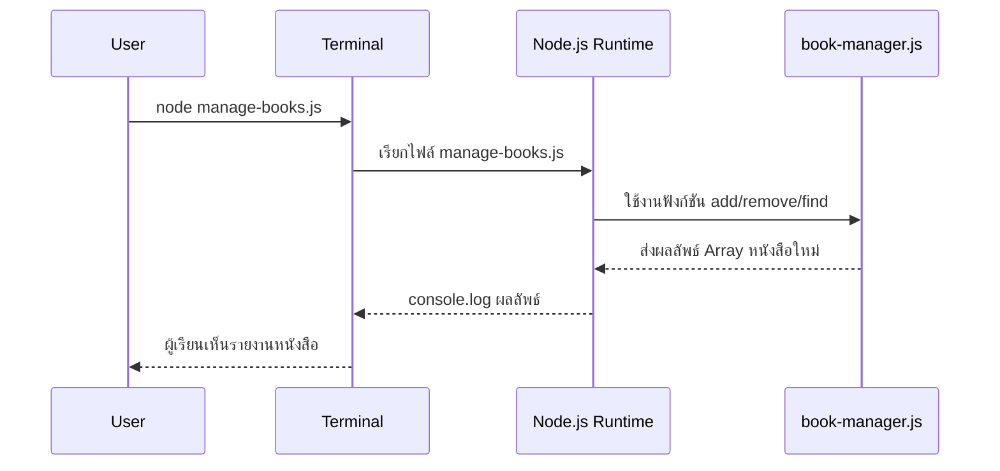

# Day 2: JavaScript Basics for Backend

## 1. Day Overview
- วัน: Day 2
- วัตถุประสงค์: เข้าใจตัวแปร, เงื่อนไข, ฟังก์ชัน, Obect และ Array ใน JavaScript สำหรับใช้งานฝั่ง Backend
- สิ่งที่จะสร้างวันนี้: โมดูล `book-manager.js` ที่สามารถเพิ่ม, ลบ, และค้นหาหนังสือใน Array พร้อมการทดสอบผ่านสคริปต์หลัก

## 2. Concepts (Beginner Friendly)
### ตัวแปรและชนิดข้อมูล
- ใช้ `const` และ `let` เพื่อเก็บข้อมูลที่เปลี่ยนหรือไม่เปลี่ยน
- ชนิดข้อมูลที่ใช้บ่อย: Number, String, Boolean, Array, Object

### เงื่อนไขและการเปรียบเทียบ
- `if`, `else if`, `else` ใช้ตัดสินใจ
- ตัวอย่าง: เช็กว่าหนังสือในระบบหรือไม่

### ฟังก์ชัน
- ฟังก์ชันคือชุดคำสั่งที่เรียกซ้ำได้
- ใช้สร้างฟังก์ชัน `addBook`, `removeBook`, `findBook`

### การแยกไฟล์ (Module)
- ใช้ `module.exports` และ `require` เพื่อแยก logic ออกจากไฟล์หลัก ช่วยให้โค้ดอ่านง่ายและดูแลได้

## 3. System & Flow Diagram
### API Sequence Diagram


### UI Flow Diagram
ยังไม่มีหน้า UI จึงยังไม่ต้องใช้ flowchart

## 4. Timeline (8 Hours)
- ชั่วโมง 1: ทบทวน Day 1 + แนะนำ JS Syntax เพิ่มเติม
- ชั่วโมง 2: Lecture ตัวแปร, เงื่อนไข, loop
- ชั่วโมง 3: Demo ฟังก์ชัน + ตัวอย่าง Array
- ชั่วโมง 4: Lab สร้าง `book-manager.js`
- ชั่วโมง 5: พัก + Q&A
- ชั่วโมง 6: Lab เขียน `manage-books.js` เพื่อทดสอบฟังก์ชัน
- ชั่วโมง 7: เพิ่มเคสผิดพลาด (หนังสือซ้ำ, ไม่มีหนังสือ)
- ชั่วโมง 8: Recap + Preview Day 3

## 5. Hands-on Labs
### Lab 1: สร้างไฟล์ book-manager.js
```javascript
// book-manager.js
const books = [];

function addBook(title, author) {
  const isExists = books.some((book) => book.title === title);
  if (isExists) {
    return { ok: false, message: "หนังสือนี้มีอยู่แล้ว" };
  }
  const newBook = { id: books.length + 1, title, author };
  books.push(newBook);
  return { ok: true, data: newBook };
}

function removeBook(title) {
  const index = books.findIndex((book) => book.title === title);
  if (index === -1) {
    return { ok: false, message: "ไม่พบหนังสือ" };
  }
  const removed = books.splice(index, 1)[0];
  return { ok: true, data: removed };
}

function listBooks() {
  return books;
}

module.exports = { addBook, removeBook, listBooks };
```

### Lab 2: เขียนสคริปต์ทดสอบ manage-books.js
```javascript
// manage-books.js
const manager = require("./book-manager");

console.log("เพิ่มหนังสือเล่มแรก:", manager.addBook("JavaScript for Beginners", "Alice"));
console.log("เพิ่มหนังสือซ้ำ:", manager.addBook("JavaScript for Beginners", "Alice"));
console.log("รายการปัจจุบัน:", manager.listBooks());
console.log("ลบหนังสือ:", manager.removeBook("JavaScript for Beginners"));
console.log("รายการหลังลบ:", manager.listBooks());
```
1. รัน `node manage-books.js`
2. ให้ผู้เรียนลองเพิ่ม `author` ใหม่ และพิมพ์ผลให้สวยขึ้นด้วย `console.table`

### Lab 3: Git Commit
- `git add .`
- `git commit -m "feat: basic book manager"`
- บอกให้นักเรียนเขียนบันทึกสิ่งที่เข้าใจยากเพื่อถามวันต่อไป

## 6. Project Progression
- วันนี้ระบบเริ่มมี logic จัดการหนังสือจริง ๆ (เพิ่ม/ลบ/แสดงผล)
- โค้ดถูกจัดระเบียบเป็นโมดูล เตรียมพร้อมสำหรับการย้าย logic เข้า Express ในวันถัดไป

## 7. Summary & Next Day Preview
- ผู้เรียนเข้าใจพื้นฐาน JavaScript สำหรับ Backend มากขึ้น
- มีฟังก์ชันจัดการข้อมูลหนังสือที่เรียกใช้ซ้ำได้
- Day 3 จะสร้างโครงสร้างโปรเจ็กต์ Node.js + จัดการสคริปต์ npm เพื่อเตรียมรัน Server จริง
