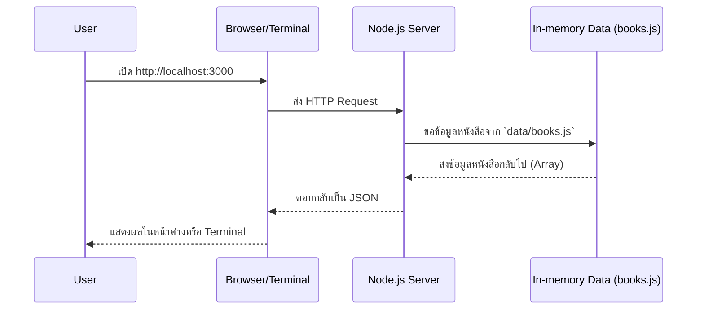

# Day 2: Node.js และการวางโครงสร้างโปรเจกต์

## 1. ภาพรวมของ Day 2
- **เป้าหมายหลัก:** วันนี้เราจะเรียนรู้วิธีการสร้างและจัดระเบียบโปรเจกต์ Node.js อย่างมืออาชีพ ตั้งแต่การตั้งค่าโปรเจกต์, การใช้ npm scripts, ไปจนถึงการแบ่งสัดส่วนโค้ดด้วยโครงสร้าง `src`, `data`, และ `utils`
- **ผลลัพธ์:** เมื่อจบวัน เราจะได้โครงสร้างโปรเจกต์ `library-system` ที่พร้อมต่อยอด พร้อมกับสคริปต์ `npm run dev` สำหรับรันเซิร์ฟเวอร์พื้นฐานด้วย `src/server-basic.js`

## 2. Core Concepts: ปูพื้นฐานให้แน่น
### Node.js Runtime คืออะไร?
- Node.js คือสภาพแวดล้อมที่ทำให้เราสามารถรันโค้ด JavaScript นอกเบราว์เซอร์ได้ หรือที่เรียกกันว่า "ฝั่งเซิร์ฟเวอร์"
- จุดเด่นคือ **Event Loop** ที่เปรียบเหมือนพนักงานจัดคิว ทำให้จัดการคำขอ (Request) จำนวนมากพร้อมกันได้อย่างรวดเร็วและไม่ติดขัด

### npm: ผู้ช่วยจัดการโปรเจกต์
- **`package.json`**: คือหัวใจของโปรเจกต์ที่เก็บข้อมูลสำคัญทั้งหมด เช่น ชื่อโปรเจกต์, เวอร์ชั่น, และรายชื่อไลบรารีที่ใช้
- **`npm install`**: คำสั่งสำหรับติดตั้งไลบรารีเสริมจากชุมชนนักพัฒนาทั่วโลก
- **npm scripts**: ใช้สร้างคำสั่งย่อ เช่น `npm run dev` เพื่อให้เราเรียกใช้คำสั่งที่ซับซ้อนได้ง่ายขึ้น

### การวางโครงสร้างโปรเจกต์ที่ดี
```
library-system/
  package.json
  src/
    server-basic.js
    data/
      books.js
    utils/
      logger.js
```
- เราจะแยกไฟล์ตามหน้าที่และความรับผิดชอบ เพื่อให้โค้ดสะอาด อ่านง่าย และเตรียมพร้อมสำหรับการนำ Express.js เข้ามาใช้ในอนาคต

### พื้นฐาน HTTP Module
- วันนี้เราจะลองสร้างเซิร์ฟเวอร์แบบง่ายๆ ด้วย `http.createServer` เพื่อทำความเข้าใจการรับ-ส่งข้อมูล (Request/Response) ก่อนที่จะไปใช้เครื่องมือที่ทรงพลังกว่าอย่าง Express

## 3. System & Flow Diagram
### API Sequence Diagram


### UI Flow
- ในวันนี้เราจะยังไม่มีส่วนติดต่อผู้ใช้ (UI) ที่สวยงาม แต่จะใช้เบราว์เซอร์หรือ Terminal ในการแสดงผลข้อมูลแบบ JSON ไปก่อน

## 4. Timeline (8 ชั่วโมง)
- **ชั่วโมงที่ 1:** ทบทวน Day 1 และทำความรู้จักความแตกต่างระหว่าง Node.js Runtime กับ Browser
- **ชั่วโมงที่ 2:** เจาะลึก `npm` และไฟล์ `package.json`
- **ชั่วโมงที่ 3:** Workshop: ลงมือสร้างโครงสร้างโฟลเดอร์และไฟล์เบื้องต้น
- **ชั่วโมงที่ 4:** Lab: ตั้งค่า `npm scripts` (`start`, `dev`)
- **ชั่วโมงที่ 5:** พักเบรก และช่วงถาม-ตอบปัญหา (Debug session)
- **ชั่วโมงที่ 6:** Lab: สร้างเซิร์ฟเวอร์แรกด้วย `http.createServer` เพื่อส่งข้อมูลหนังสือในรูปแบบ JSON
- **ชั่วโมงที่ 7:** Code Review: ตรวจสอบโครงสร้างโปรเจกต์ และเพิ่ม `logger` สำหรับติดตามการทำงาน
- **ชั่วโมงที่ 8:** สรุปเนื้อหา และพรีวิว Day 3 (Express.js)

## 5. Hands-on Labs: ลงมือทำจริง
### Lab 1: จัดโครงสร้างโปรเจกต์
1. ที่โฟลเดอร์โปรเจกต์, รัน `npm init -y` เพื่อสร้างไฟล์ `package.json`
2. สร้างโฟลเดอร์และไฟล์ต่างๆ ตามโครงสร้างที่เราได้วางแผนไว้
3. เพิ่มไฟล์ `src/data/books.js` เพื่อจำลองฐานข้อมูลของเรา
```javascript
// src/data/books.js
const books = [
  { id: 1, title: "JavaScript for Beginners", author: "Alice" },
  { id: 2, title: "Node.js Essentials", author: "Bob" },
];

module.exports = { books };
```

### Lab 2: สร้าง Logger Utility
สร้างฟังก์ชันสำหรับช่วยบันทึกการทำงานของเซิร์ฟเวอร์
```javascript
// src/utils/logger.js
function log(message) {
  const stamp = new Date().toISOString();
  console.log(`[${stamp}]`, message);
}

module.exports = { log };
```

### Lab 3: สร้าง HTTP Server พื้นฐาน
1. เขียนโค้ดในไฟล์ `src/server-basic.js` เพื่อสร้างเซิร์ฟเวอร์
```javascript
// src/server-basic.js
const http = require("http");
const { books } = require("./data/books");
const { log } = require("./utils/logger");

const server = http.createServer((req, res) => {
  log(`Request Received: ${req.method} ${req.url}`);
  res.setHeader("Content-Type", "application/json");
  res.end(JSON.stringify({ message: "Welcome to our Library", books }));
});

server.listen(3000, () => {
  log("Server is running at http://localhost:3000");
});
```
2. เพิ่ม `scripts` ใน `package.json` สำหรับรันเซิร์ฟเวอร์
```json
"scripts": {
  "start": "node src/server-basic.js",
  "dev": "nodemon src/server-basic.js"
}
```
3. ลองรันเซิร์ฟเวอร์ด้วยคำสั่ง `npm run start` หรือ `npm run dev` (หากติดตั้ง nodemon แล้ว)

## 6. ความคืบหน้าของโปรเจกต์
- เราได้วางรากฐานโครงสร้างโปรเจกต์ที่แข็งแรงและพร้อมสำหรับ Express.js
- เซิร์ฟเวอร์ของเราสามารถตอบข้อมูลในรูปแบบ JSON ผ่าน HTTP ได้แล้ว
- มี `logger` ที่ช่วยให้เราติดตามและดีบักการทำงานของแอปพลิเคชันได้ง่ายขึ้น

## 7. สรุปและสิ่งที่จะเจอในวันถัดไป
- วันนี้ทุกคนได้เข้าใจกระบวนการตั้งค่าโปรเจกต์ `npm` และการสร้างเซิร์ฟเวอร์เบื้องต้นแล้ว
- ในวันพรุ่งนี้ เราจะนำ **Express.js** เข้ามาใช้แทน `http` module เพื่อสร้าง API ที่มีความสามารถสูงขึ้น จัดการ Routing ได้อย่างเป็นระบบ และเตรียมพร้อมสำหรับการสร้าง REST API ที่สมบูรณ์
