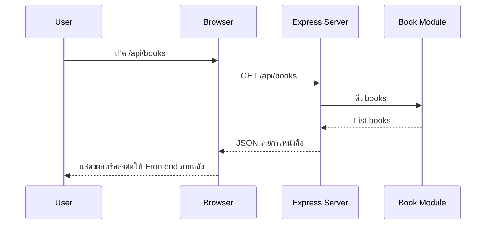

# Day 3: Express.js Basics + First API

## 1. Day Overview
- วัน: Day 3
- วัตถุประสงค์: เข้าใจ Express.js, การสร้าง Router แรก, วิธีตอบ JSON, การจัดการ Middleware พื้นฐาน
- สิ่งที่จะสร้าง: Express server ในไฟล์ `src/index.js` พร้อม endpoint `GET /api/books` ที่อ่านข้อมูลจากโมดูล

## 2. Concepts (Beginner Friendly)
### ทำไมต้อง Express.js
- ลดความซับซ้อนของ HTTP module ด้วย Router และ Middleware
- ช่วยให้โค้ดสั้นลง อ่านง่าย และต่อยอด REST API ได้เร็ว

### Express.js คืออะไร?
- Express.js คือ Framework สำหรับพัฒนา Web Application และ REST API บน Node.js
- พูดง่าย ๆ คือเป็น “เครื่องมือช่วย” ที่ทำให้การสร้างเว็บเซิร์ฟเวอร์ด้วย Node.js ง่ายขึ้น เป็นระบบระเบียบมากขึ้น และเขียนโค้ดน้อยลง

### ทำไมต้องมี Express.js ในเมื่อมี Node.js อยู่แล้ว?
- Node.js ทำ Web Server ได้เองก็จริง แต่ถ้าใช้แค่ `http` module จะต้องเขียนโค้ดจัดการหลายอย่างเอง เช่น:
  - การจัดการ URL (Routing)
  - การอ่านค่า request / response
  - การจัดการ Middleware
  - การจัดการ Error
  - การรับข้อมูลจาก form หรือ JSON
- Express.js เข้ามาช่วยจัดการเรื่องเหล่านี้ให้เป็นโครงสร้างที่ชัดเจน พร้อมใช้งานทันที

### ทบทวน HTTP ที่ต้องใช้ (Refresher)
- Method: `GET` = อ่านข้อมูล
- Path/Params: `/api/books/:id` → `req.params.id`
- Query: `/api/books?search=node&limit=2` → `req.query.search`, `req.query.limit`
- Status codes: 200/400/404/500 (ใช้ให้ถูกเคส)
- Header สำคัญ: `Content-Type: application/json` (จำเป็นเมื่อเริ่มใช้ `req.body`)

### Express ทำงานยังไง (Mental Model)
- Express คือ “ท่อ” ที่ request ไหลผ่าน middleware ทีละตัว แล้วไปจบที่ route handler
- ลำดับการประกาศสำคัญมาก (order matters)
- ภาพจำ: `express.json()` → logger → routes → 404 handler → error middleware

### Request & Response ใน Express
- `app.get(path, handler)` รับคำขอแบบ GET
- handler รับ `req` (ข้อมูลจากผู้ใช้) และ `res` (ใช้ตอบกลับ)

#### ที่มาของข้อมูลใน `req` (จำให้ขึ้นใจ)
- `req.params` → จาก `:id` เช่น `/api/books/:id`
- `req.query` → จาก `?search=` เช่น `/api/books?search=node`
- `req.body` → จาก JSON body (ต้องมี `express.json()`)

### Status Codes ที่ใช้บ่อย
- 200 OK: GET สำเร็จ
- 400 Bad Request: ข้อมูลไม่ถูกต้อง (เช่น id ไม่ใช่ตัวเลข, limit <= 0)
- 404 Not Found: ไม่พบ resource (เช่น book id ไม่มี)
- 500 Internal Server Error: server ผิดพลาด (bug/exception)

### Response Contract (ทำให้ debug/test ง่าย)
- แนะนำให้ตอบรูปแบบเดียวกันเสมอ:
  - สำเร็จ: `{ ok: true, data: ... }`
  - ผิดพลาด: `{ ok: false, error: { code, message } }`

### Pitfalls ที่เจอบ่อย (ภาคทฤษฎีที่ควรอธิบายก่อนเริ่ม Lab)
- `req.params.id` เป็น string เสมอ → ต้องแปลงเป็น number และเช็ก `NaN`
- invalid id (เช่น `abc`) = 400, แต่ id เป็นเลขแต่ไม่พบ = 404
- ถ้า middleware ไม่เรียก `next()` และไม่ตอบ `res...` → request จะค้าง
- ถ้าเอา 404 handler ไปไว้ก่อน routes → ทุก route จะกลายเป็น 404

### Middleware
- เป็นฟังก์ชันที่รันก่อน handler เช่น logging, JSON parsing

#### กติกาของ middleware ที่ต้องจำ
- ถ้า middleware ไม่เรียก `next()` และไม่ส่ง response → request จะค้าง
- ถ้าส่ง response แล้ว โดยทั่วไปไม่ต้อง `next()`

### โครงสร้างเพิ่มเติม
```
src/
  index.js
  routes/
    books-route.js
  controllers/
    books-controller.js
```

### แยก Router vs Controller (ให้เด็กเข้าใจ role)
- Router: “แผนที่” ว่า URL ไหนเรียกฟังก์ชันไหน
- Controller: “คนทำงาน” ที่อ่าน `req` แล้วตอบ `res`

## 3. System & Flow Diagram
### API Sequence Diagram


### UI Flow Diagram
ยังไม่มีหน้า UI แสดงผลโดยตรง จึงไม่มี flowchart UI

## 4. Timeline (8 Hours)
- ชั่วโมง 1: Recap Node server + แนะนำ Express
- ชั่วโมง 2: Setup Express + อธิบาย Routing/Middleware + response contract
- ชั่วโมง 3: Lab ติดตั้ง `express` + สร้าง `GET /api/health`
- ชั่วโมง 4: Lab สร้าง `GET /api/books` + แยก routes/controllers
- ชั่วโมง 5: พัก + Debug session (404, params, middleware order)
- ชั่วโมง 6: Lab เพิ่ม `GET /api/books/:id` (params) + status code 400/404
- ชั่วโมง 7: Lab เพิ่ม query `?search=`/`?limit=` + เพิ่ม 404 handler + error middleware + API testing drills
- ชั่วโมง 8: Recap Day 3 + Preview Day 4 (Express Advance + Templates)

## 5. Hands-on Labs
### Lab 1: ติดตั้งและตั้งค่า Express
1. `npm install express`
2. สร้างไฟล์ `src/index.js`
```javascript
const express = require("express");
const { log } = require("./utils/logger");
const bookRoutes = require("./routes/books-route");

const app = express();
const PORT = 4000;

app.use(express.json());
app.use((req, res, next) => {
  log(`${req.method} ${req.url}`);
  next();
});

app.get("/api/health", (req, res) => {
  res.json({ status: "ok", message: "Library API ready" });
});

app.use("/api/books", bookRoutes);

app.listen(PORT, () => log(`Express server on http://localhost:${PORT}`));
```

### Lab 2: Books Route + Controller
```javascript
// src/routes/books-route.js
const express = require("express");
const { getBooks } = require("../controllers/books-controller");

const router = express.Router();
router.get("/", getBooks);

module.exports = router;
```

```javascript
// src/controllers/books-controller.js
const { books } = require("../data/books");

function getBooks(req, res) {
  res.json({ total: books.length, data: books });
}

module.exports = { getBooks };
```
3. รัน `node src/index.js` หรือ `npm run dev` ถ้าตั้ง nodemon
4. เปิด `http://localhost:4000/api/books`

### Lab 3: เพิ่ม `GET /api/books/:id` + status code
1. เพิ่ม route `GET /api/books/:id`
2. แปลง `req.params.id` เป็นตัวเลข และเช็กกรณี `NaN` → ตอบ `400`
3. ถ้าไม่พบหนังสือ → ตอบ `404`
4. ถ้าพบ → ตอบ `200` พร้อม `{ ok: true, data: { book } }`

### Lab 4: เพิ่ม query `?search=` และ `?limit=`
1. ปรับ `GET /api/books` ให้รองรับ query สำหรับ filter/limit
2. เช็ก `limit` ถ้าไม่ใช่ตัวเลขหรือ <= 0 → ตอบ `400`

### Lab 5: 404 handler + error middleware + API Testing + Git
- เพิ่ม 404 handler เพื่อให้ route ที่ไม่พบตอบ JSON แบบมาตรฐาน
- เพิ่ม error middleware (500) เพื่อรวมการตอบ error ให้อยู่จุดเดียว
- ทดสอบด้วย Browser/Postman/`curl`:
  - `GET /api/health`
  - `GET /api/books`
  - `GET /api/books/1`
  - `GET /api/books/9999` (ต้องได้ 404)
  - `GET /api/books/abc` (ต้องได้ 400)
- Git checkpoint: `git commit -m "feat: express core endpoints"`

## 6. Project Progression
- ระบบจาก Day 2 ถูกอัปเกรดเป็น Express เต็มรูปแบบ
- มี API route แรกที่สามารถใช้งานได้จริง เป็นฐานสำหรับ CRUD ในวันถัดไป

## 7. Summary & Next Day Preview
- นักเรียนรู้จัก Express, Router, Controller และ Middleware
- Day 4 จะต่อยอด Express ให้ “เป็นเว็บแอป” ด้วยการ render หน้า (เช่น EJS) และเตรียมพื้นสำหรับ CRUD ในวันถัดไป
