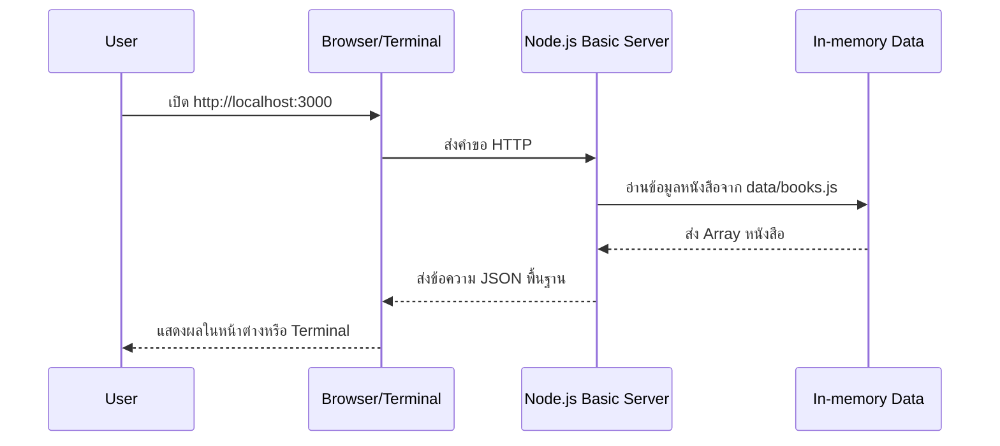

# Day 3: Node.js + Project Structure

## 1. Day Overview
- วัน: Day 3
- วัตถุประสงค์: เรียนรู้การสร้างโปรเจ็กต์ Node.js อย่างเป็นระบบ, การใช้ npm scripts, การแยกโฟลเดอร์ src/config/utils
- สิ่งที่จะสร้าง: โครงสร้างโปรเจ็กต์ `library-system` พร้อมสคริปต์ `npm run dev` ที่รันไฟล์ `src/server-basic.js`

## 2. Concepts (Beginner Friendly)
### Node.js Runtime
- Node.js คือโปรแกรมที่เปิดโอกาสให้เราใช้ JavaScript ฝั่ง Server
- Event Loop ช่วยให้จัดการคำขอหลาย ๆ อันพร้อมกัน (อธิบายเป็นคิวงาน)

### npm (Node Package Manager)
- เก็บ metadata ใน `package.json`
- `npm install` เพิ่ม library จาก community
- npm scripts เช่น `npm run dev` ทำให้คำสั่งซับซ้อนสั้นลง

### โครงสร้างโปรเจ็กต์
```
library-system/
  package.json
  src/
    server-basic.js
    data/
      books.js
    utils/
      logger.js
```
- แยกไฟล์ตามหน้าที่ เพื่อเตรียมต่อกับ Express ได้ง่าย

### พื้นฐาน HTTP Module
- ใช้ `http.createServer` รับ Request/Response แบบง่าย ก่อนเข้า Express

## 3. System & Flow Diagram
### API Sequence Diagram


### UI Flow Diagram
วันนี้ยังใช้ Browser/Terminal แสดง JSON จึงยังไม่มี UI แยกต่างหาก

## 4. Timeline (8 Hours)
- ชั่วโมง 1: Recap Day 2 + แนะนำ Node.js Runtime vs Browser
- ชั่วโมง 2: อธิบาย npm และ package.json
- ชั่วโมง 3: สร้างโครงสร้างโฟลเดอร์พร้อมไฟล์ตัวอย่าง
- ชั่วโมง 4: Lab ตั้งค่า npm scripts (`start`, `dev`)
- ชั่วโมง 5: พัก + Debug session สั้น ๆ
- ชั่วโมง 6: Lab เขียน `http.createServer` ที่ตอบ JSON รายการหนังสือ
- ชั่วโมง 7: Review code structure, เพิ่ม logger
- ชั่วโมง 8: Recap + Preview Day 4 (Express.js)

## 5. Hands-on Labs
### Lab 1: จัดโครงสร้างโปรเจ็กต์
1. ที่ root รัน `npm init -y`
2. สร้างโฟลเดอร์ตามแผนในหัวข้อ Concepts
3. เพิ่มไฟล์ `src/data/books.js`
```javascript
// src/data/books.js
const books = [
  { id: 1, title: "JavaScript for Beginners", author: "Alice" },
  { id: 2, title: "Node.js Essentials", author: "Bob" },
];

module.exports = { books };
```

### Lab 2: logger utility
```javascript
// src/utils/logger.js
function log(message) {
  const stamp = new Date().toISOString();
  console.log(`[${stamp}]`, message);
}

module.exports = { log };
```

### Lab 3: Basic HTTP Server
```javascript
// src/server-basic.js
const http = require("http");
const { books } = require("./data/books");
const { log } = require("./utils/logger");

const server = http.createServer((req, res) => {
  log(`Request: ${req.method} ${req.url}`);
  res.setHeader("Content-Type", "application/json");
  res.end(JSON.stringify({ message: "Library System", books }));
});

server.listen(3000, () => {
  log("Server running at http://localhost:3000");
});
```
4. เพิ่ม scripts ใน `package.json`
```json
"scripts": {
  "start": "node src/server-basic.js",
  "dev": "nodemon src/server-basic.js"
}
```
5. รัน `npm run start`

## 6. Project Progression
- ได้โครงสร้างโปรเจ็กต์ที่พร้อมรองรับ Express.js
- สามารถตอบ JSON ผ่าน HTTP แล้ว แม้ยังไม่เป็น REST เต็มรูปแบบ
- Utility logger ทำให้เห็นการเรียกใช้งานชัดเจน

## 7. Summary & Next Day Preview
- ผู้เรียนเข้าใจการตั้งค่า npm และการสร้าง server ขั้นต้น
- วันพรุ่งนี้จะนำ Express.js มาแทน HTTP module เพื่อสร้าง Routing ที่จัดการง่ายขึ้นและเริ่ม API จริง
