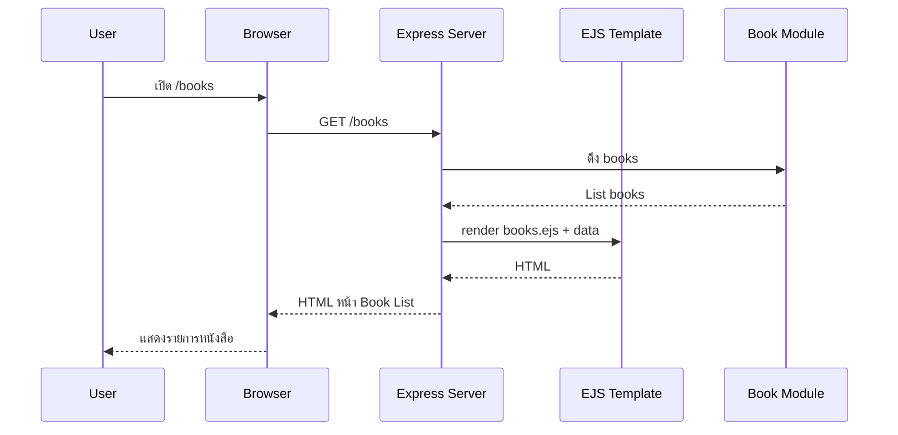

# Day 4: Express Advance + Templates (EJS) + Basic UI

## 1. Day Overview
- วัน: Day 4
- วัตถุประสงค์: เข้าใจการ render หน้าเว็บด้วย EJS, การเสิร์ฟ static files, และการทำหน้า “Book List” แบบง่าย ๆ ที่เรียกข้อมูลจากฝั่ง server
- สิ่งที่จะสร้าง: หน้าเว็บ `/books` ที่แสดงรายการหนังสือ (server-side rendering) และปรับโครงสร้าง Express ให้รองรับทั้ง API และ UI

## 2. Concepts (Beginner Friendly)
### Template Engine (EJS) คืออะไร?
- ถ้า API คือ “ตอบ JSON” → Template คือ “ตอบ HTML”
- EJS ช่วยให้เราเขียน HTML แล้วฝังตัวแปร/ลูปจาก JavaScript ได้

### Server-side Rendering (SSR) แบบพื้นฐาน
- Browser ขอหน้าเว็บ: `GET /books`
- Server สร้าง HTML ด้วยข้อมูลหนังสือ แล้วส่งกลับไปให้ Browser

### Static Files
- ไฟล์ CSS/รูปภาพ จะถูกเสิร์ฟผ่าน `express.static(...)`

### โครงสร้างโปรเจกต์ (แนะนำ)
```
src/
  index.js
  data/
    books.js
  routes/
    books-route.js
    pages-route.js
  controllers/
    books-controller.js
    pages-controller.js
  views/
    books.ejs
  public/
    styles.css
```

## 3. System & Flow Diagram
### UI Sequence Diagram


### UI Flow Diagram
```mermaid
flowchart TD
  A[Home] --> B[/books Book List]
  B --> C[/api/books JSON]
```

## 4. Timeline (8 Hours)
- ชั่วโมง 1: Recap Day 3 (Express API) + อธิบาย SSR vs API
- ชั่วโมง 2: ติดตั้งและตั้งค่า EJS + โครงสร้าง `views/`
- ชั่วโมง 3: Lab สร้าง route `/books` และ render หน้าแรก
- ชั่วโมง 4: Lab ออกแบบ `books.ejs` + loop แสดงรายการ
- ชั่วโมง 5: พัก + Debug session เรื่อง path, view engine, static
- ชั่วโมง 6: เพิ่ม `public/styles.css` + เสิร์ฟ static files
- ชั่วโมง 7: แยก routes/controllers สำหรับ “pages”
- ชั่วโมง 8: Recap Day 4 + Preview Day 5 (REST CRUD Books)

## 5. Hands-on Labs
### Lab 1: ติดตั้ง EJS และตั้งค่า View Engine
1. `npm install ejs`
2. ใน `src/index.js` เพิ่ม:
```javascript
app.set("view engine", "ejs");
app.set("views", "src/views");
app.use(express.static("src/public"));
```

### Lab 2: สร้างหน้า `/books` (SSR)
```javascript
// src/controllers/pages-controller.js
const { books } = require("../data/books");

function renderBooksPage(req, res) {
  res.render("books", { total: books.length, books });
}

module.exports = { renderBooksPage };
```

```javascript
// src/routes/pages-route.js
const express = require("express");
const { renderBooksPage } = require("../controllers/pages-controller");

const router = express.Router();
router.get("/books", renderBooksPage);

module.exports = router;
```

### Lab 3: สร้าง `books.ejs` + CSS
- `src/views/books.ejs` ทำ loop แสดง `books`
- `src/public/styles.css` ใส่ styling เบื้องต้น

## 6. Project Progression
- จาก “API ตอบ JSON” → กลายเป็น “แอปที่มีหน้า UI” แบบง่าย ๆ
- แยก route สำหรับ API (`/api/...`) และหน้าเว็บ (`/books`) ให้ชัดเจน

## 7. Summary & Next Day Preview
- เข้าใจ SSR ด้วย EJS, static files, และการจัดโครงสร้าง views/public
- Day 5 จะสร้าง REST CRUD สำหรับหนังสือ (POST/PUT/DELETE/GET by id) พร้อม validation เบื้องต้น
