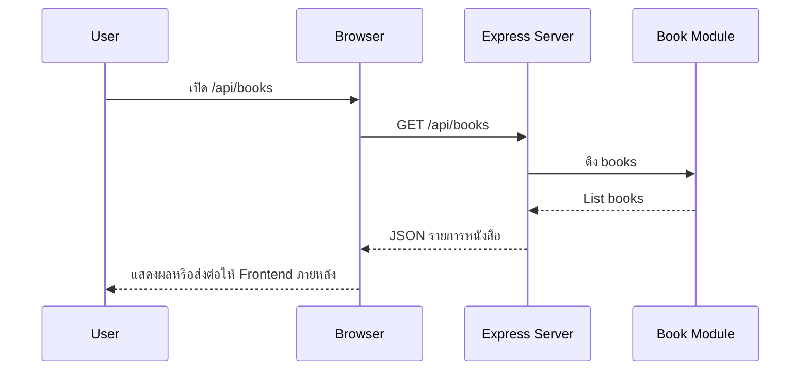

# Day 4: Express.js Basics + First API

## 1. Day Overview
- วัน: Day 4
- วัตถุประสงค์: เข้าใจ Express.js, การสร้าง Router แรก, วิธีตอบ JSON, การจัดการ Middleware พื้นฐาน
- สิ่งที่จะสร้าง: Express server ในไฟล์ `src/index.js` พร้อม endpoint `GET /api/books` ที่อ่านข้อมูลจากโมดูล

## 2. Concepts (Beginner Friendly)
### ทำไมต้อง Express.js
- ลดความซับซ้อนของ HTTP module ด้วย Router และ Middleware
- ช่วยให้โค้ดสั้นลง อ่านง่าย และต่อยอด REST API ได้เร็ว

### Request & Response ใน Express
- `app.get(path, handler)` รับคำขอแบบ GET
- handler รับ `req` (ข้อมูลจากผู้ใช้) และ `res` (ใช้ตอบกลับ)

### Middleware
- เป็นฟังก์ชันที่รันก่อน handler เช่น logging, JSON parsing

### โครงสร้างเพิ่มเติม
```
src/
  index.js
  routes/
    books-route.js
  controllers/
    books-controller.js
```

## 3. System & Flow Diagram
### API Sequence Diagram


### UI Flow Diagram
ยังไม่มีหน้า UI แสดงผลโดยตรง จึงไม่มี flowchart UI

## 4. Timeline (8 Hours)
- ชั่วโมง 1: Recap Node server + แนะนำ Express
- ชั่วโมง 2: Setup Express, อธิบาย Middleware
- ชั่วโมง 3: Lab ติดตั้ง `express` + จัดไฟล์ `index.js`
- ชั่วโมง 4: Lab สร้าง routes/controllers
- ชั่วโมง 5: พัก + Debug session เรื่อง status code
- ชั่วโมง 6: เพิ่ม endpoint `GET /api/health` และ `GET /api/books`
- ชั่วโมง 7: ทดสอบผ่าน Postman หรือ Browser + Git commit
- ชั่วโมง 8: Recap Day 4 + Preview Day 5 (CRUD)

## 5. Hands-on Labs
### Lab 1: ติดตั้งและตั้งค่า Express
1. `npm install express`
2. สร้างไฟล์ `src/index.js`
```javascript
const express = require("express");
const { log } = require("./utils/logger");
const bookRoutes = require("./routes/books-route");

const app = express();
const PORT = 4000;

app.use(express.json());
app.use((req, res, next) => {
  log(`${req.method} ${req.url}`);
  next();
});

app.get("/api/health", (req, res) => {
  res.json({ status: "ok", message: "Library API ready" });
});

app.use("/api/books", bookRoutes);

app.listen(PORT, () => log(`Express server on http://localhost:${PORT}`));
```

### Lab 2: Books Route + Controller
```javascript
// src/routes/books-route.js
const express = require("express");
const { getBooks } = require("../controllers/books-controller");

const router = express.Router();
router.get("/", getBooks);

module.exports = router;
```

```javascript
// src/controllers/books-controller.js
const { books } = require("../data/books");

function getBooks(req, res) {
  res.json({ total: books.length, data: books });
}

module.exports = { getBooks };
```
3. รัน `node src/index.js` หรือ `npm run dev` ถ้าตั้ง nodemon
4. เปิด `http://localhost:4000/api/books`

### Lab 3: Git Commit + ทดสอบ Postman
- ใช้ Postman/Thunder Client ส่ง GET
- `git commit -m "feat: express basic api"`

## 6. Project Progression
- ระบบจาก Day 3 ถูกอัปเกรดเป็น Express เต็มรูปแบบ
- มี API route แรกที่สามารถใช้งานได้จริง เป็นฐานสำหรับ CRUD ในวันถัดไป

## 7. Summary & Next Day Preview
- นักเรียนรู้จัก Express, Router, Controller และ Middleware
- Day 5 จะสร้าง CRUD API เต็มรูปแบบสำหรับหนังสือ (POST, PUT, DELETE) พร้อม validation ง่าย ๆ
