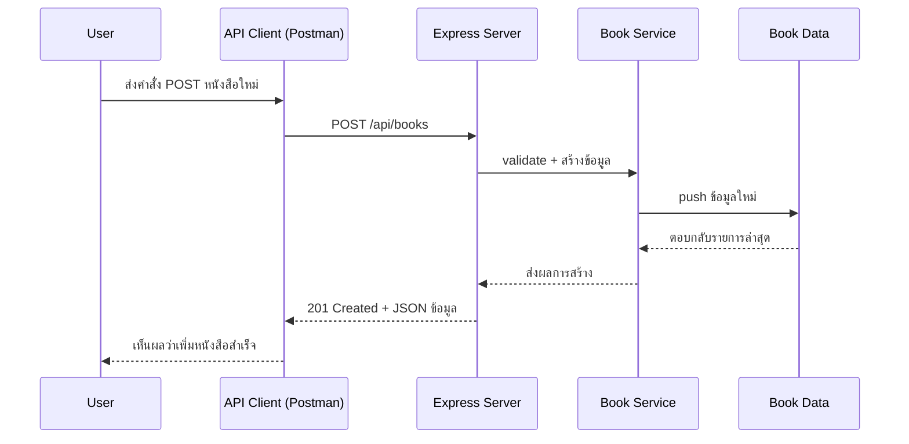

# Day 5: REST API + CRUD for Books

## 1. Day Overview
- วัน: Day 5
- วัตถุประสงค์: สร้าง REST API ครบ 4 คำสั่ง (Create, Read, Update, Delete) สำหรับหนังสือ พร้อมสถานะ HTTP ที่ถูกต้อง
- สิ่งที่จะสร้าง: Controller + Service ที่จัดการข้อมูลหนังสือ, Endpoint `POST /api/books`, `PUT /api/books/:id`, `DELETE /api/books/:id`, `GET /api/books/:id`

## 2. Concepts (Beginner Friendly)
### REST API หลักการ
- ใช้ HTTP Method แทน Action: GET=อ่าน, POST=สร้าง, PUT=แก้ไข, DELETE=ลบ
- ใช้ URL บอก resource เช่น `/api/books/1`

### Status Code พื้นฐาน
- 200 OK: สำเร็จ
- 201 Created: สร้างข้อมูลใหม่
- 400 Bad Request: ข้อมูลไม่ครบ
- 404 Not Found: ไม่พบข้อมูล

### แยก Service Layer
- Controller รับ Request/Response
- Service จัดการ logic เช่น validate, อัปเดตข้อมูล
- การแยกชั้นช่วยให้ทดสอบง่ายขึ้น

## 3. System & Flow Diagram
### API Sequence Diagram


### UI Flow Diagram
ยังไม่มี UI บนเว็บ จึงยังไม่ต้องทำ flowchart

## 4. Timeline (8 Hours)
- ชั่วโมง 1: Recap Day 4 + แนวคิด REST
- ชั่วโมง 2: Lecture status code + error handling
- ชั่วโมง 3: Lab สร้าง Service layer (`src/services/book-service.js`)
- ชั่วโมง 4: Lab เขียน Controller CRUD
- ชั่วโมง 5: พัก + Workshop ทดลองยิง API หลายเคส
- ชั่วโมง 6: เขียน Validation ง่าย ๆ (title/author ต้องไม่ว่าง)
- ชั่วโมง 7: เรียนรู้ Response format + Git commit
- ชั่วโมง 8: Recap + Preview Day 6 (Git workflow + เพิ่ม endpoint)

## 5. Hands-on Labs
### Lab 1: Book Service
```javascript
// src/services/book-service.js
const { books } = require("../data/books");

function listBooks() {
  return books;
}

function findBook(id) {
  return books.find((book) => book.id === Number(id));
}

function createBook(payload) {
  const { title, author } = payload;
  if (!title || !author) {
    return { ok: false, message: "title และ author ต้องไม่ว่าง" };
  }
  const newBook = { id: books.length + 1, title, author };
  books.push(newBook);
  return { ok: true, data: newBook };
}

function updateBook(id, payload) {
  const target = findBook(id);
  if (!target) return { ok: false, message: "ไม่พบหนังสือ" };
  target.title = payload.title || target.title;
  target.author = payload.author || target.author;
  return { ok: true, data: target };
}

function deleteBook(id) {
  const index = books.findIndex((book) => book.id === Number(id));
  if (index === -1) return { ok: false, message: "ไม่พบหนังสือ" };
  const removed = books.splice(index, 1)[0];
  return { ok: true, data: removed };
}

module.exports = { listBooks, findBook, createBook, updateBook, deleteBook };
```

### Lab 2: Controller CRUD
```javascript
// src/controllers/books-controller.js
const service = require("../services/book-service");

function getBooks(req, res) {
  res.json({ data: service.listBooks() });
}

function getBookById(req, res) {
  const book = service.findBook(req.params.id);
  if (!book) return res.status(404).json({ message: "ไม่พบหนังสือ" });
  res.json({ data: book });
}

function createBook(req, res) {
  const result = service.createBook(req.body);
  if (!result.ok) return res.status(400).json({ message: result.message });
  res.status(201).json({ data: result.data });
}

function updateBook(req, res) {
  const result = service.updateBook(req.params.id, req.body);
  if (!result.ok) return res.status(404).json({ message: result.message });
  res.json({ data: result.data });
}

function deleteBook(req, res) {
  const result = service.deleteBook(req.params.id);
  if (!result.ok) return res.status(404).json({ message: result.message });
  res.json({ data: result.data });
}

module.exports = { getBooks, getBookById, createBook, updateBook, deleteBook };
```
- อัปเดต routes ให้มีทุก method

### Lab 3: ทดสอบด้วย Postman
1. ส่ง POST /api/books ด้วย body `{ "title": "Clean Architecture", "author": "Martin" }`
2. ส่ง GET /api/books ตรวจสอบว่ามีข้อมูลใหม่
3. PUT /api/books/1 เพื่อแก้ไขชื่อ
4. DELETE /api/books/2 เพื่อลบ
5. จดบันทึก status code ที่ตอบกลับ

## 6. Project Progression
- ระบบหนังสือกลายเป็น REST API ครบชุด ขยายต่อได้ง่าย
- โครงสร้าง Controller/Service พร้อมสำหรับเพิ่ม resource ใหม่ เช่น members

## 7. Summary & Next Day Preview
- ผู้เรียนสร้าง CRUD ได้จริงและเข้าใจ status code
- Day 6 จะเน้น Git workflow และเพิ่ม API ใหม่ (members) พร้อมฝึกทำงานกลุ่มผ่าน Branch
