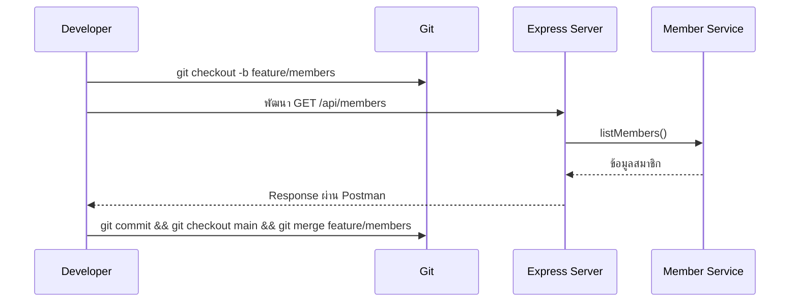

# Day 6: Git Workflow + Continue APIs

## 1. Day Overview
- วัน: Day 6
- วัตถุประสงค์: เข้าใจ Git workflow พื้นฐาน (branch, pull, merge), เพิ่ม resource ใหม่ `members` และ endpoint `borrow-preview`
- สิ่งที่จะสร้าง: Branch แยกสำหรับฟีเจอร์, Controller + Service สำหรับ Members, Endpoint ตัวอย่าง `GET /api/borrow/preview` ที่รวมข้อมูลหนังสือ+สมาชิก

## 2. Concepts (Beginner Friendly)
### Git Workflow สำหรับทีมเล็ก
- Main branch เก็บโค้ดที่เสถียร
- เมื่อทำฟีเจอร์สร้าง branch ใหม่ `git checkout -b feature/members`
- เมื่อเสร็จให้ `git merge` กลับ main หลังจากทดสอบ

### Pull + Push
- `git pull` ดึงงานเพื่อน
- `git push origin feature/members` แชร์ branch (อธิบาย concept แม้ยังไม่ใช้ remote จริง)

### สมาชิก (Members) Resource
- โครงสร้างคล้าย Books มี id, name, email
- ใช้ Service/Controller เหมือนเดิมเพื่อ reinforce ความเข้าใจ

### Endpoint รวมข้อมูล
- `borrow-preview` แสดงว่าหากสมาชิกต้องการยืมหนังสือ ระบบจะรวมข้อมูลอย่างไร (ยังไม่มี database)

## 3. System & Flow Diagram
### API Sequence Diagram


### UI Flow Diagram
ยังไม่มีหน้าจอใหม่ จึงไม่ต้องใช้ UI flow

## 4. Timeline (8 Hours)
- ชั่วโมง 1: Recap REST + ทบทวนโครงสร้าง
- ชั่วโมง 2: Lecture Git branch, merge, conflict concept
- ชั่วโมง 3: Lab แยก branch และเพิ่ม `members-data`
- ชั่วโมง 4: Lab สร้าง Service/Controller members
- ชั่วโมง 5: พัก + ทำ workshop สลับ branch (ซ้อมทีม)
- ชั่วโมง 6: Lab เขียน `GET /api/borrow/preview?memberId=1&bookId=2`
- ชั่วโมง 7: ทดสอบ API ทั้งหมด + Merge branch
- ชั่วโมง 8: Recap + Preview Day 7 (Database with Docker)

## 5. Hands-on Labs
### Lab 1: Git Branch
1. `git checkout -b feature/members`
2. สร้างไฟล์ `src/data/members.js`
```javascript
const members = [
  { id: 1, name: "Nina", email: "nina@example.com" },
  { id: 2, name: "Bank", email: "bank@example.com" },
];
module.exports = { members };
```

### Lab 2: Member Service + Controller
```javascript
// src/services/member-service.js
const { members } = require("../data/members");

function listMembers() {
  return members;
}

function findMember(id) {
  return members.find((member) => member.id === Number(id));
}

module.exports = { listMembers, findMember };
```

```javascript
// src/controllers/members-controller.js
const service = require("../services/member-service");

function getMembers(req, res) {
  res.json({ data: service.listMembers() });
}

function getMemberById(req, res) {
  const member = service.findMember(req.params.id);
  if (!member) return res.status(404).json({ message: "ไม่พบสมาชิก" });
  res.json({ data: member });
}

module.exports = { getMembers, getMemberById };
```
- เพิ่ม route `/api/members`

### Lab 3: Borrow Preview Endpoint
```javascript
// src/controllers/borrow-controller.js
const bookService = require("../services/book-service");
const memberService = require("../services/member-service");

function previewBorrow(req, res) {
  const { memberId, bookId } = req.query;
  const member = memberService.findMember(memberId);
  const book = bookService.findBook(bookId);

  if (!member || !book) {
    return res.status(404).json({ message: "member หรือ book ไม่ถูกต้อง" });
  }

  res.json({
    member,
    book,
    note: "นี่คือข้อมูลตัวอย่างก่อนสร้าง borrow จริงในวันถัดไป",
  });
}

module.exports = { previewBorrow };
```
- Route: `app.get("/api/borrow/preview", previewBorrow);

### Lab 4: Merge
1. `git add . && git commit -m "feat: member resource"`
2. `git checkout main`
3. `git merge feature/members`
4. `git branch -d feature/members`

## 6. Project Progression
- ระบบมี resource สมาชิกครบ พร้อมข้อมูลสำหรับการยืมหนังสือในอนาคต
- ผู้เรียนซ้อม Git workflow เพื่อเตรียมทำงานร่วมกับ Database และฟีเจอร์ใหญ่

## 7. Summary & Next Day Preview
- เข้าใจ branch/merge และเพิ่ม API members
- Day 7 จะเริ่มใช้ Docker เพื่อรัน Database จริง และเชื่อม Express ให้บันทึกข้อมูลลงฐานข้อมูลแทน Array
