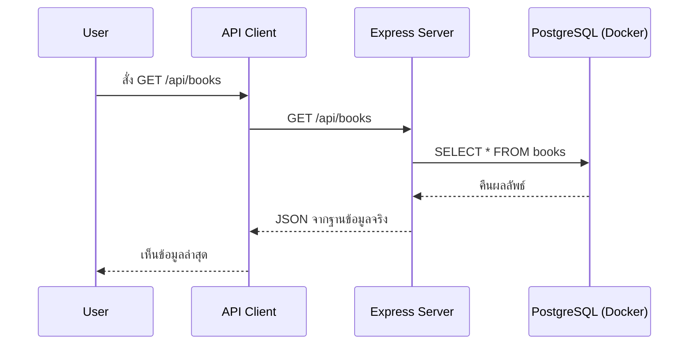

# Day 7: Database with Docker + Connect to API

## 1. Day Overview
- วัน: Day 7
- วัตถุประสงค์: เรียนรู้พื้นฐาน Docker, docker-compose, การติดตั้ง PostgreSQL (หรือ MySQL), การเชื่อมต่อ Express กับ Database ผ่าน Knex หรือ pg client
- สิ่งที่จะสร้าง: ไฟล์ `docker-compose.yml`, สคริปต์เชื่อมต่อฐานข้อมูล, Repository สำหรับ books/members ที่อ่านเขียนจาก Database จริง

## 2. Concepts (Beginner Friendly)
### ทำไมใช้ Docker
- ทุกคนใช้สภาพแวดล้อมเหมือนกัน ไม่ต้องติดตั้ง DB แยก
- สั่ง `docker compose up` เพื่อเปิด Database ได้ทันที

### docker-compose เบื้องต้น
- ไฟล์ YAML บอกรายละเอียด service เช่น image, port, environment
- คำสั่งหลัก: `docker compose up -d`, `docker compose down`

### Database Concept
- Table = ตารางข้อมูล เช่น `books`
- Row = แถวข้อมูลหนึ่งเล่ม
- Column = คุณสมบัติ เช่น title, author

### เชื่อมต่อจาก Node.js
- ใช้ไลบรารี `pg` (ถ้า PostgreSQL) หรือ `mysql2`
- สร้างไฟล์ `src/db/index.js` เก็บการเชื่อมต่อ

## 3. System & Flow Diagram
### API Sequence Diagram


### UI Flow Diagram
ยังไม่มี UI ใหม่ แต่สามารถอธิบายว่า Postman/Browser รับข้อมูลโดยตรงจาก API

## 4. Timeline (8 Hours)
- ชั่วโมง 1: Recap Git + API
- ชั่วโมง 2: Lecture Docker concept + สร้าง docker-compose
- ชั่วโมง 3: Lab รัน `docker compose up` และตรวจสอบฐานข้อมูล
- ชั่วโมง 4: Lecture โครงสร้างตาราง + สร้างไฟล์ SQL seed
- ชั่วโมง 5: พัก + ตอบคำถาม
- ชั่วโมง 6: Lab เขียน `src/db/index.js` + Repository book/member เชื่อม DB
- ชั่วโมง 7: ปรับ Controller ให้ใช้ Repository แทน Array
- ชั่วโมง 8: Recap + Preview Day 8 (Frontend rendering)

## 5. Hands-on Labs
### Lab 1: สร้าง docker-compose
ไฟล์ `docker-compose.yml`
```yaml
version: "3.8"
services:
  db:
    image: postgres:15
    restart: always
    environment:
      POSTGRES_USER: library
      POSTGRES_PASSWORD: librarypass
      POSTGRES_DB: library_db
    ports:
      - "5432:5432"
    volumes:
      - db_data:/var/lib/postgresql/data
volumes:
  db_data:
```
- รัน `docker compose up -d`

### Lab 2: สร้างตารางและ seed
ไฟล์ `scripts/init.sql`
```sql
CREATE TABLE books (
  id SERIAL PRIMARY KEY,
  title TEXT NOT NULL,
  author TEXT NOT NULL
);

INSERT INTO books (title, author) VALUES
('JavaScript for Beginners', 'Alice'),
('Node.js Essentials', 'Bob');
```
- ใช้ `docker exec -it <container> psql -U library -d library_db -f /scripts/init.sql` (อธิบายการคัดลอกไฟล์เข้า container หรือใช้ GUI ง่าย ๆ)

### Lab 3: เชื่อมต่อ Node.js กับ DB
1. `npm install pg`
2. `src/db/index.js`
```javascript
const { Pool } = require("pg");

const pool = new Pool({
  host: "localhost",
  port: 5432,
  user: "library",
  password: "librarypass",
  database: "library_db",
});

module.exports = { query: (text, params) => pool.query(text, params) };
```

### Lab 4: Book Repository
```javascript
// src/repositories/book-repository.js
const db = require("../db");

async function listBooks() {
  const result = await db.query("SELECT * FROM books ORDER BY id");
  return result.rows;
}

async function createBook({ title, author }) {
  const result = await db.query(
    "INSERT INTO books (title, author) VALUES ($1, $2) RETURNING *",
    [title, author]
  );
  return result.rows[0];
}

module.exports = { listBooks, createBook };
```
- ปรับ controller ให้เป็น async/await

### Lab 5: ทดสอบ
- ส่ง GET/POST แล้วตรวจสอบข้อมูลใน DB ผ่าน `psql`
- `git commit -m "feat: connect postgres with docker"`

## 6. Project Progression
- ข้อมูลย้ายจาก Array ไปอยู่ใน Database จริง ช่วยให้ระบบมีความน่าเชื่อถือและต่อยอดได้
- โค้ดถูกจัดให้มี Repository layer พร้อมสำหรับ feature borrow ในวันถัดไป

## 7. Summary & Next Day Preview
- นักเรียนใช้ Docker รันฐานข้อมูลและเชื่อมต่อ Express ได้สำเร็จ
- Day 8 จะเริ่มสร้าง Frontend แบบง่าย (EJS/HTML) เพื่อแสดงรายการหนังสือจาก API
