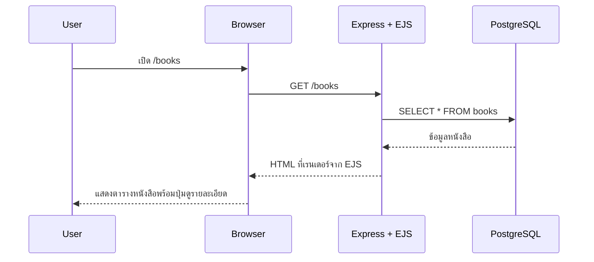

# Day 8: Frontend Rendering (View Books)

## 1. Day Overview
- วัน: Day 8
- วัตถุประสงค์: เรียนรู้การสร้าง Frontend แบบ Server-side Rendering ด้วย EJS, แสดงรายการหนังสือจาก API/Database, เข้าใจเส้นทาง `/books`
- สิ่งที่จะสร้าง: View template `views/books.ejs`, Route ฝั่ง Frontend (`app.get("/books")`), Static assets พื้นฐาน

## 2. Concepts (Beginner Friendly)
### ทำไมต้องมี Frontend
- ผู้ใช้ทั่วไปดู JSON ไม่สะดวก จึงต้องมีหน้าเว็บให้กดดูหนังสือ
- ใช้ EJS เพื่อฝังข้อมูลใน HTML อย่างง่าย

### Server-side Rendering
- Express ดึงข้อมูลจาก Database
- Render template EJS และส่ง HTML กลับไป

### โครงสร้างไฟล์ใหม่
```
src/
  views/
    layout.ejs
    books.ejs
  routes/
    web-route.js
```
- ตั้งค่า `app.set("view engine", "ejs")`

## 3. System & Flow Diagram
### API Sequence Diagram


### UI Flow Diagram
```mermaid
flowchart TD
  A[Books Page] --> B[Book Detail Modal (Day 9)]
  A --> C[Borrow Form (Day 9)]
```
(วันนี้แสดงเฉพาะหน้า Books แต่เตรียม flow สำหรับวันถัดไป)

## 4. Timeline (8 Hours)
- ชั่วโมง 1: Recap Database + API
- ชั่วโมง 2: Lecture Server-side Rendering, View engine
- ชั่วโมง 3: Lab ติดตั้ง EJS + ตั้งค่า view engine
- ชั่วโมง 4: Lab สร้าง layout + หน้า `/books`
- ชั่วโมง 5: พัก + สาธิต CSS เบื้องต้น
- ชั่วโมง 6: Lab ดึงข้อมูลจาก Repository มาส่งให้ View
- ชั่วโมง 7: Review UX + Git commit
- ชั่วโมง 8: Recap + Preview Day 9 (Borrow Flow)

## 5. Hands-on Labs
### Lab 1: ตั้งค่า EJS
1. `npm install ejs express-ejs-layouts`
2. ใน `src/index.js`
```javascript
const expressLayouts = require("express-ejs-layouts");

app.set("view engine", "ejs");
app.set("views", path.join(__dirname, "views"));
app.use(expressLayouts);
app.set("layout", "layout");
```

### Lab 2: Layout Template
ไฟล์ `src/views/layout.ejs`
```html
<!DOCTYPE html>
<html lang="th">
  <head>
    <meta charset="UTF-8" />
    <title><%= title %></title>
    <link rel="stylesheet" href="/styles/main.css" />
  </head>
  <body>
    <header>
      <h1>Library Management System</h1>
      <nav>
        <a href="/books">Books</a>
        <a href="/members">Members (เร็ว ๆ นี้)</a>
      </nav>
    </header>
    <main><%- body %></main>
  </body>
</html>
```

### Lab 3: Books View
ไฟล์ `src/views/books.ejs`
```html
<% layout('layout') %>
<h2>รายการหนังสือ</h2>
<table>
  <thead>
    <tr>
      <th>ID</th>
      <th>Title</th>
      <th>Author</th>
    </tr>
  </thead>
  <tbody>
    <% books.forEach((book) => { %>
      <tr>
        <td><%= book.id %></td>
        <td><%= book.title %></td>
        <td><%= book.author %></td>
      </tr>
    <% }) %>
  </tbody>
</table>
```

### Lab 4: Route ดึงข้อมูล
```javascript
// src/routes/web-route.js
const express = require("express");
const bookRepo = require("../repositories/book-repository");

const router = express.Router();
router.get("/books", async (req, res) => {
  const books = await bookRepo.listBooks();
  res.render("books", { title: "Books", books });
});

module.exports = router;
```
- ใน `index.js`: `app.use("/", webRoute);`

### Lab 5: Static Files
- สร้าง `public/styles/main.css` ใส่ style ง่าย ๆ
- `app.use(express.static(path.join(__dirname, "../public")));`

## 6. Project Progression
- ระบบเริ่มมีหน้าเว็บจริง ผู้ใช้เห็นข้อมูลจาก Database ผ่าน Browser ได้
- โครงสร้าง View เตรียมต่อยอดสำหรับ Borrow/Return และหน้าสรุปอื่น ๆ

## 7. Summary & Next Day Preview
- วันนี้เรียนรู้การแสดงผลข้อมูลผ่าน EJS และสร้างหน้า `/books`
- Day 9 จะเพิ่ม flow Borrow/Return, ฟอร์ม, และการสื่อสารระหว่าง Frontend/Backend ให้ครบวงจร
