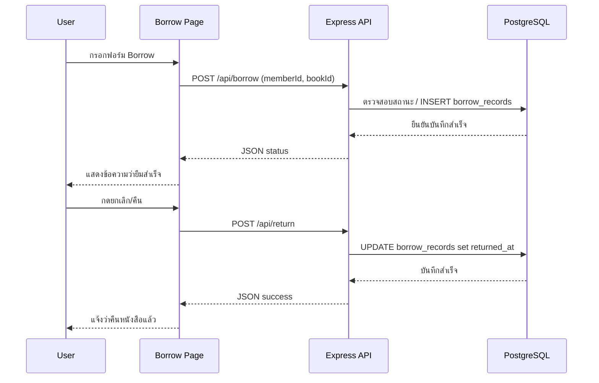
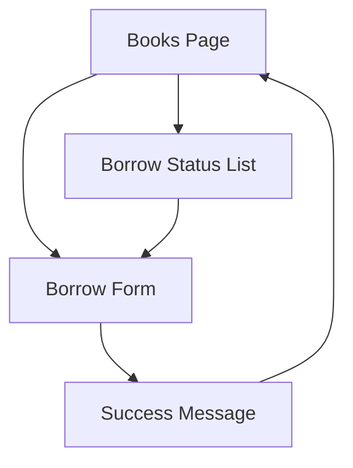

# Day 9: Borrow / Return Flow + Integration

## 1. Day Overview
- วัน: Day 9
- วัตถุประสงค์: ออกแบบและพัฒนา flow การยืม-คืนหนังสือ, รวม Frontend + Backend + Database ให้เห็นภาพครบ, ใช้ฟอร์มส่งข้อมูลผ่าน POST
- สิ่งที่จะสร้าง: ตาราง `borrow_records`, Endpoint `POST /api/borrow`, `POST /api/return`, หน้าเว็บ Borrow Form ที่เรียก API ผ่าน Fetch

## 2. Concepts (Beginner Friendly)
### Borrow/Return Flow
- สมาชิกเลือกหนังสือ -> กรอกแบบฟอร์มยืม -> ระบบบันทึกสถานะ -> คืนหนังสือเมื่อจบ
- จำเป็นต้องมีตารางที่เก็บ `member_id`, `book_id`, `borrowed_at`, `returned_at`

### Validation + Transaction ง่าย ๆ
- เช็กว่าหนังสือถูกยืมไปแล้วหรือไม่
- หากยืมอยู่ ห้ามยืมซ้ำ (ตอบ 400)

### Frontend Form + Fetch API
- ใช้ `<form>` หรือ Fetch ส่งข้อมูล JSON ไปที่ Backend
- ดัก response แล้วแสดงข้อความบนหน้าเว็บ

## 3. System & Flow Diagram
### API Sequence Diagram


### UI Flow Diagram


## 4. Timeline (8 Hours)
- ชั่วโมง 1: Recap EJS + API
- ชั่วโมง 2: Lecture การออกแบบตาราง borrow_records
- ชั่วโมง 3: Lab สร้างตาราง + seed ข้อมูลจำลอง
- ชั่วโมง 4: Lab เขียน Repository + Service borrow/return
- ชั่วโมง 5: พัก + คุยเรื่อง validation
- ชั่วโมง 6: Lab สร้างหน้า Borrow Form + fetch API
- ชั่วโมง 7: ทดสอบ End-to-End + Debug + Git commit
- ชั่วโมง 8: Recap + Preview Day 10 (Final Integration)

## 5. Hands-on Labs
### Lab 1: สร้างตาราง borrow_records
```sql
CREATE TABLE borrow_records (
  id SERIAL PRIMARY KEY,
  member_id INTEGER NOT NULL,
  book_id INTEGER NOT NULL,
  borrowed_at TIMESTAMP DEFAULT NOW(),
  returned_at TIMESTAMP
);
```
- เพิ่ม index พื้นฐานเพื่อค้นหาง่าย

### Lab 2: Borrow Repository
```javascript
// src/repositories/borrow-repository.js
const db = require("../db");

async function createBorrow(memberId, bookId) {
  const active = await db.query(
    "SELECT * FROM borrow_records WHERE book_id=$1 AND returned_at IS NULL",
    [bookId]
  );
  if (active.rowCount > 0) return { ok: false, message: "หนังสือกำลังถูกยืม" };

  const result = await db.query(
    "INSERT INTO borrow_records (member_id, book_id) VALUES ($1,$2) RETURNING *",
    [memberId, bookId]
  );
  return { ok: true, data: result.rows[0] };
}

async function returnBook(recordId) {
  const result = await db.query(
    "UPDATE borrow_records SET returned_at=NOW() WHERE id=$1 AND returned_at IS NULL RETURNING *",
    [recordId]
  );
  if (result.rowCount === 0) return { ok: false, message: "ไม่พบรายการที่ค้างอยู่" };
  return { ok: true, data: result.rows[0] };
}

async function listActiveBorrows() {
  const result = await db.query(
    `SELECT br.id, b.title, m.name, br.borrowed_at
     FROM borrow_records br
     JOIN books b ON br.book_id = b.id
     JOIN members m ON br.member_id = m.id
     WHERE br.returned_at IS NULL`
  );
  return result.rows;
}

module.exports = { createBorrow, returnBook, listActiveBorrows };
```

### Lab 3: Borrow Controller
```javascript
// src/controllers/borrow-controller.js
const repo = require("../repositories/borrow-repository");

async function borrowBook(req, res) {
  const { memberId, bookId } = req.body;
  const result = await repo.createBorrow(memberId, bookId);
  if (!result.ok) return res.status(400).json({ message: result.message });
  res.status(201).json({ data: result.data });
}

async function returnBook(req, res) {
  const { recordId } = req.body;
  const result = await repo.returnBook(recordId);
  if (!result.ok) return res.status(400).json({ message: result.message });
  res.json({ data: result.data });
}

async function getActiveBorrows(req, res) {
  const list = await repo.listActiveBorrows();
  res.json({ data: list });
}

module.exports = { borrowBook, returnBook, getActiveBorrows };
```
- เพิ่ม routes `/api/borrow` (POST), `/api/return` (POST), `/api/borrow/active` (GET)

### Lab 4: Borrow Form Frontend
```html
<!-- src/views/borrow.ejs -->
<% layout('layout') %>
<h2>Borrow Book</h2>
<form id="borrowForm">
  <label>Member ID</label>
  <input type="number" name="memberId" required />
  <label>Book ID</label>
  <input type="number" name="bookId" required />
  <button type="submit">Borrow</button>
</form>
<p id="message"></p>
<script>
  const form = document.getElementById("borrowForm");
  const message = document.getElementById("message");
  form.addEventListener("submit", async (event) => {
    event.preventDefault();
    const payload = {
      memberId: event.target.memberId.value,
      bookId: event.target.bookId.value,
    };
    const res = await fetch("/api/borrow", {
      method: "POST",
      headers: { "Content-Type": "application/json" },
      body: JSON.stringify(payload),
    });
    const data = await res.json();
    message.textContent = res.ok ? "ยืมสำเร็จ" : data.message;
    form.reset();
  });
</script>
```
- เพิ่ม route `router.get("/borrow", ...)` และ render view พร้อมรายการ active borrow

### Lab 5: ทดสอบ End-to-End
1. เปิด Docker database
2. รัน server
3. เปิด `/borrow` กรอกข้อมูล
4. ตรวจสอบในตาราง `borrow_records`
5. POST `/api/return` ผ่านหน้าเว็บหรือ Postman
6. `git commit -m "feat: borrow return flow"`

## 6. Project Progression
- ระบบมี business flow หลักของห้องสมุด (ยืม/คืน) แบบครบวงจรแล้ว
- Frontend, Backend, Database ประสานงานร่วมกัน ช่วยให้เห็นภาพจริงของระบบผลิต

## 7. Summary & Next Day Preview
- นักเรียนสร้างตาราง borrow_records, API, และหน้า Borrow สำเร็จ
- Day 10 จะรวมทุกส่วน เขียนเอกสาร API, สรุปโปรเจกต์, และเตรียมแนวทางพัฒนาต่อ
